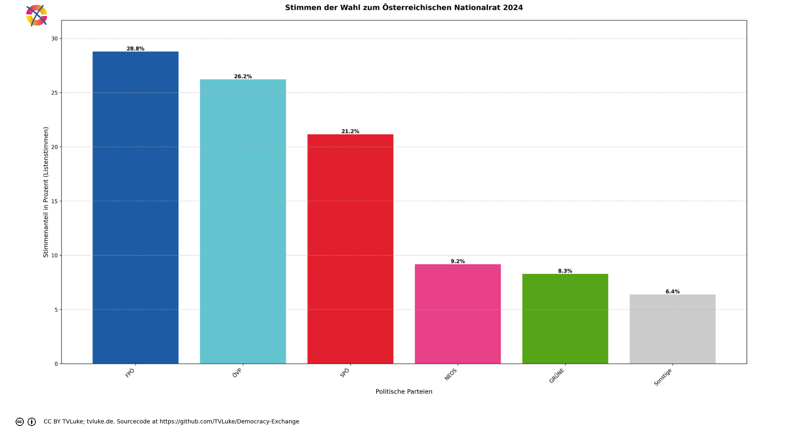

# Stimmen der Wahl zum Österreichischen Nationalrat 2024 nach Österreichischem Wahlrecht.
Year: 2024

## Election Statistics
- **Total Population**: 8,932,664
- **Eligible Voters**: 6,346,059
- **Total Votes Cast**: 4,910,197
- **Turnout**: 77.37%
- **Parliament Size**: 183 seats

### Vote Summary

A total of 4,910,197 votes were cast, representing a turnout of 77.4% of the electorate.

| Party | Votes | Percentage |
|-------|--------|------------|
| FPÖ | 1,413,593 | 28.8% |
| ÖVP | 1,287,623 | 26.2% |
| SPÖ | 1,038,829 | 21.2% |
| NEOS | 450,285 | 9.2% |
| GRÜNE | 406,578 | 8.3% |
| KPÖ | 118,088 | 2.4% |
| BIER | 98,989 | 2.0% |
| LMP | 28,762 | 0.6% |
| KEINE | 27,959 | 0.6% |
| MFG | 19,892 | 0.4% |
| GAZA | 19,443 | 0.4% |
| BGE | 156 | 0.0% |

**FPÖ** received the most votes with 1,413,593 votes (28.8% of total votes).

## Seat Calculation Process

## Austrian Electoral System Explanation

This election is calculated using the Austrian three-tier proportional representation system:

1. **Regional Constituency Level (Regionalwahlkreise)**
   - In this election: 39 regional constituencies across 9 states
     (The Austrian system typically has 39 constituencies across 9 states)
   - First distribution of seats using the Hare quota
   - Only parties that reach 4% nationally can receive seats
   - Direct mandates are awarded at this level

2. **State Level (Landeswahlkreise)**
   - States in this election:
     - Burgenland: 2 constituencies
     - Kärnten: 4 constituencies
     - Niederösterreich: 7 constituencies
     - Oberösterreich: 5 constituencies
     - Salzburg: 3 constituencies
     - Steiermark: 4 constituencies
     - Tirol: 5 constituencies
     - Vorarlberg: 2 constituencies
     - Wien: 7 constituencies
   - Second distribution using state-level electoral numbers
   - Remaining seats distributed using D'Hondt method
   - Takes into account seats already won at regional level

3. **Federal Level (Bundesebene)**
   - Final distribution of remaining seats
   - Uses Hare quota at national level
   - Ensures overall proportional representation
   - Compensates for any disproportions from lower levels

Key Features:
- 4% threshold nationally or one direct mandate required
- 183 total seats to be distributed (Austrian National Council has 183)
- Seats first allocated to states based on citizen population

## Vote Type Used for Calculation

Using list votes (Zweitstimmen) for calculations. 

## Initial Threshold Check

Total valid votes cast: 4,910,197
4% threshold: 196,408 votes

Party Results and Qualification Status:
- FPÖ: 1,413,593 votes (28.79%) - Qualified
  → Eligible for mandate distribution at all levels
- ÖVP: 1,287,623 votes (26.22%) - Qualified
  → Eligible for mandate distribution at all levels
- SPÖ: 1,038,829 votes (21.16%) - Qualified
  → Eligible for mandate distribution at all levels
- NEOS: 450,285 votes (9.17%) - Qualified
  → Eligible for mandate distribution at all levels
- GRÜNE: 406,578 votes (8.28%) - Qualified
  → Eligible for mandate distribution at all levels
- KPÖ: 118,088 votes (2.40%) - Did not qualify
  → Can only receive direct mandates in regional constituencies
- BIER: 98,989 votes (2.02%) - Did not qualify
  → Can only receive direct mandates in regional constituencies
- LMP: 28,762 votes (0.59%) - Did not qualify
  → Can only receive direct mandates in regional constituencies
- KEINE: 27,959 votes (0.57%) - Did not qualify
  → Can only receive direct mandates in regional constituencies
- MFG: 19,892 votes (0.41%) - Did not qualify
  → Can only receive direct mandates in regional constituencies
- GAZA: 19,443 votes (0.40%) - Did not qualify
  → Can only receive direct mandates in regional constituencies
- BGE: 156 votes (0.00%) - Did not qualify
  → Can only receive direct mandates in regional constituencies

## Example Regional Constituency: Burgenland Nord

This example shows how votes are counted at the regional constituency level:

Total votes cast: 102,327

Party Results:
- FPÖ: 28,903 votes (28.2%)
- ÖVP: 28,057 votes (27.4%)
- SPÖ: 27,636 votes (27.0%)
- NEOS: 7,480 votes (7.3%)
- GRÜNE: 5,329 votes (5.2%)
- BIER: 2,218 votes (2.2%)
- KPÖ: 1,375 votes (1.3%)
- KEINE: 517 votes (0.5%)
- LMP: 479 votes (0.5%)
- GAZA: 293 votes (0.3%)
- BGE: 40 votes (0.0%)
- MFG: 0 votes (0.0%)

The Hare quota is used to determine direct mandates.
Parties must either win a direct mandate or reach the 4% national threshold.

## Example Regional Constituency: Burgenland Süd

This example shows how votes are counted at the regional constituency level:

Total votes cast: 88,363

Party Results:
- ÖVP: 26,323 votes (29.8%)
- FPÖ: 25,955 votes (29.4%)
- SPÖ: 23,881 votes (27.0%)
- NEOS: 4,894 votes (5.5%)
- GRÜNE: 3,693 votes (4.2%)
- BIER: 1,613 votes (1.8%)
- KPÖ: 1,070 votes (1.2%)
- LMP: 384 votes (0.4%)
- KEINE: 381 votes (0.4%)
- BGE: 116 votes (0.1%)
- GAZA: 53 votes (0.1%)
- MFG: 0 votes (0.0%)

The Hare quota is used to determine direct mandates.
Parties must either win a direct mandate or reach the 4% national threshold.

## Example Regional Constituency: Klagenfurt

This example shows how votes are counted at the regional constituency level:

Total votes cast: 89,557

Party Results:
- FPÖ: 29,456 votes (32.9%)
- SPÖ: 21,275 votes (23.8%)
- ÖVP: 18,694 votes (20.9%)
- NEOS: 9,077 votes (10.1%)
- GRÜNE: 5,821 votes (6.5%)
- BIER: 2,005 votes (2.2%)
- KPÖ: 1,981 votes (2.2%)
- LMP: 679 votes (0.8%)
- KEINE: 569 votes (0.6%)
- MFG: 0 votes (0.0%)
- BGE: 0 votes (0.0%)
- GAZA: 0 votes (0.0%)

The Hare quota is used to determine direct mandates.
Parties must either win a direct mandate or reach the 4% national threshold.

## State Level Distribution

According to §1 of the Nationalrats-Wahlordnung, the 183 seats are distributed among the states based on their citizen population.

The process:
1. Calculate state-level electoral number (Wahlzahl)
   For each state, the Wahlzahl is calculated as: Total valid votes ÷ (Number of seats + 1)
   Example for a state with 100,000 votes and 4 seats:
   Wahlzahl = 100,000 ÷ (4 + 1) = 20,000

2. Calculate Verhältniszahl (proportional number)
   Total population value: 6,346,059
   Total seats: 183
   Verhältniszahl = 6,346,059 ÷ 183 = 34,677.92
   This number represents how many electorate one mandate represents.

3. Determine remaining seats after direct mandates
4. Use D'Hondt method for remaining seats
5. Take into account party threshold requirement

## Final Distribution Summary

After completing all three levels of calculation:
1. Regional constituency direct mandates
2. State-level D'Hondt distribution
3. Federal level compensation

Final Results:
- FPÖ: 57 seats (31.1%) from 1,413,593 votes (28.8%)
  → Qualified through 4% threshold
- ÖVP: 51 seats (27.9%) from 1,287,623 votes (26.2%)
  → Qualified through 4% threshold
- SPÖ: 41 seats (22.4%) from 1,038,829 votes (21.2%)
  → Qualified through 4% threshold
- NEOS: 18 seats (9.8%) from 450,285 votes (9.2%)
  → Qualified through 4% threshold
- GRÜNE: 16 seats (8.7%) from 406,578 votes (8.3%)
  → Qualified through 4% threshold

This distribution reflects the principles of proportional representation while accounting for:
- The 4% threshold requirement or direct mandate qualification
- Regional constituency direct mandates
- State-level proportionality using D'Hondt method
- Federal level compensation to ensure overall proportionality

## Visualizations
### Parliament Seating

### Coalition Possibilities
![Possible coalition combinations that form a majority, sorted by ideological distance (smaller distance means parties are closer on the left-right spectrum): ÖVP + FPÖ with 108 seats (59.0%, ideological distance: 1.0); SPÖ + FPÖ with 98 seats (53.6%, ideological distance: 4.0); SPÖ + GRÜNE + ÖVP with 108 seats (59.0%, ideological distance: 6.0); SPÖ + NEOS + ÖVP with 110 seats (60.1%, ideological distance: 6.0). Die "Ideologische Distanz": Für die Darstellung in korrekter Reihenfolge hat jede Partei einen left_to_right-Wert, mit 1 für die Partei, welche üblicherweise im Parlament ganz links sitzt, dann aufsteigend: Dieser Wert wird hier auch einfach als Distanzwert gewertet, um wahrscheinliche Koalitionen darzustellen. Diese Berechnung ist natürlich stark vereinfachend und in vielen Fällen einfach falsch.  Beispiel für die Koalition SPÖ-GRÜNE-ÖVP: SPÖ: left_to_right = 1 GRÜNE: left_to_right = 2 ÖVP: left_to_right = 4 Ideologische Distanz = |1-2| + |1-4| + |2-4| = 6](../plots/austria2024_austria_coalitions.png)

### Vote vs Seat Distribution

### Party Vote Distribution

## Detailed Results
| Party | Votes | Vote Share | Seats | Seat Share | Representation Gap |
|-------|--------|------------|-------|------------|-------------------|
| FPÖ | 1,413,593 | 28.79% | 57 | 31.15% | 2.36% |
| ÖVP | 1,287,623 | 26.22% | 51 | 27.87% | 1.65% |
| SPÖ | 1,038,829 | 21.16% | 41 | 22.40% | 1.25% |
| NEOS | 450,285 | 9.17% | 18 | 9.84% | 0.67% |
| GRÜNE | 406,578 | 8.28% | 16 | 8.74% | 0.46% |
| BIER | 98,989 | 2.02% | 0 | 0.00% | -2.02% |
| MFG | 19,892 | 0.41% | 0 | 0.00% | -0.41% |
| BGE | 156 | 0.00% | 0 | 0.00% | -0.00% |
| LMP | 28,762 | 0.59% | 0 | 0.00% | -0.59% |
| GAZA | 19,443 | 0.40% | 0 | 0.00% | -0.40% |
| KPÖ | 118,088 | 2.40% | 0 | 0.00% | -2.40% |
| KEINE | 27,959 | 0.57% | 0 | 0.00% | -0.57% |

## Analysis of Representation
### Most Over-represented Parties
- **FPÖ**: +2.36%
- **ÖVP**: +1.65%
- **SPÖ**: +1.25%

### Most Under-represented Parties
- **KPÖ**: -2.40%
- **BIER**: -2.02%
- **LMP**: -0.59%

## Sources

### About the Electoral System
- [parlament.gv.at](https://www.parlament.gv.at/verstehen/demokratie-wahlen/parlament-wahlen/wahlen-nr/)