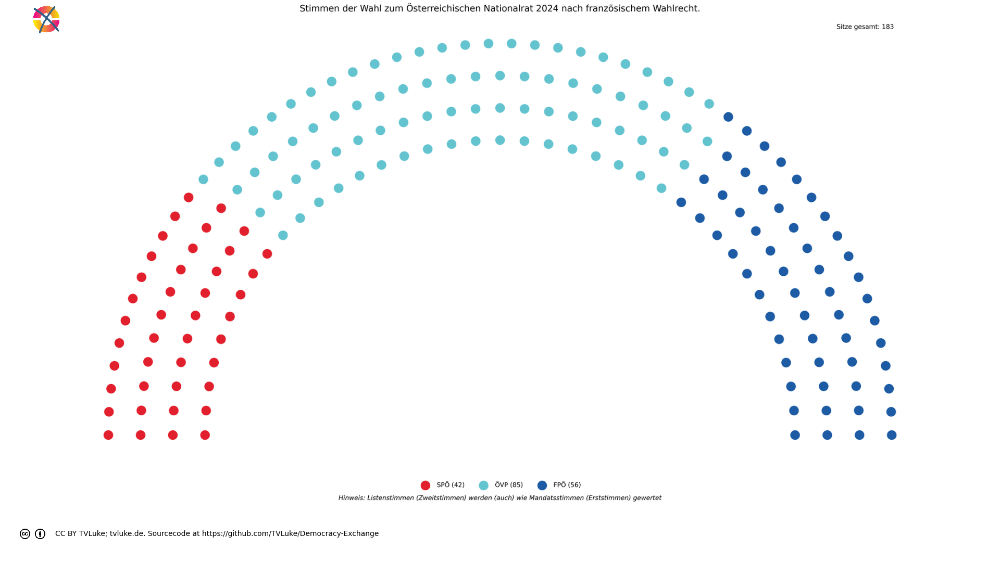
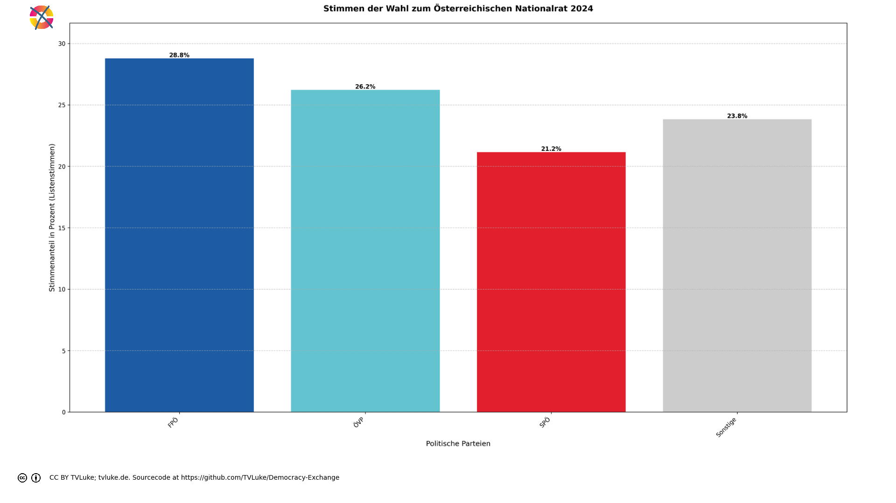

# Stimmen der Wahl zum Österreichischen Nationalrat 2024 nach französischem Wahlrecht.
Year: 2024

## Election Statistics
- **Total Population**: 8,932,664
- **Eligible Voters**: 6,346,059
- **Total Votes Cast**: 4,910,197
- **Turnout**: 77.37%
- **Parliament Size**: 183 seats

### Vote Summary

A total of 4,910,197 votes were cast, representing a turnout of 77.4% of the electorate.

| Party | Votes | Percentage |
|-------|--------|------------|
| FPÖ | 1,413,593 | 28.8% |
| ÖVP | 1,287,623 | 26.2% |
| SPÖ | 1,038,829 | 21.2% |
| NEOS | 450,285 | 9.2% |
| GRÜNE | 406,578 | 8.3% |
| KPÖ | 118,088 | 2.4% |
| BIER | 98,989 | 2.0% |
| LMP | 28,762 | 0.6% |
| KEINE | 27,959 | 0.6% |
| MFG | 19,892 | 0.4% |
| GAZA | 19,443 | 0.4% |
| BGE | 156 | 0.0% |

**FPÖ** received the most votes with 1,413,593 votes (28.8% of total votes).

## Seat Calculation Process

## French Electoral System Explanation

This election uses the French two-round voting system (scrutin uninominal majoritaire à deux tours):

1. **First Round**
   - All candidates can participate
   - If a candidate receives >50% of votes AND ≥25% of registered voters, they win immediately
   - Otherwise, qualified candidates proceed to second round

2. **Second Round Qualification**
   - Candidates need ≥12.5% of votes to qualify
   - If no candidates reach 12.5%, top two advance
   - When no second round data is provided, votes are simulated:
     * 80% of votes from eliminated parties go to parties with same left-right position
     * 30% of remaining votes go to parties within 1 position on left-right scale
     * Other votes are considered lost/abstentions

Key Features:
- 183 total seats to be distributed
- Single-member constituencies
- Two rounds if no absolute majority in first round

3. **Seat Scaling**
   When the required number of seats (183) differs from the number of districts (39),
   we use proportional scaling to maintain fair representation:
   - First calculate results for all districts
   - Then multiply each party's seats by (total_seats / number_of_districts)
   - Round to nearest whole number while preserving total seats
   - This maintains the proportional representation from the district results
   
   Example: If we have 100 districts but need 200 seats:
   - Party A wins 60 districts → scaled to 120 seats (60 * 200/100)
   - Party B wins 40 districts → scaled to 80 seats (40 * 200/100)
   The relative strength of each party remains the same.

## Example Districts

To illustrate how the French two-round system works in practice, here are three example districts:

### Example 1: Wien Nord

**First Round Results:**
- Total votes cast: 171,279
- Registered voters: 342,558

**Party Results:**
- SPÖ: 50,870 votes (29.7% of votes, 14.9% of registered)
- FPÖ: 48,651 votes (28.4% of votes, 14.2% of registered)
- ÖVP: 29,333 votes (17.1% of votes, 8.6% of registered)
- NEOS: 15,795 votes (9.2% of votes, 4.6% of registered)
- GRÜNE: 12,859 votes (7.5% of votes, 3.8% of registered)
- KPÖ: 5,269 votes (3.1% of votes, 1.5% of registered)
- BIER: 4,304 votes (2.5% of votes, 1.3% of registered)
- GAZA: 1,819 votes (1.1% of votes, 0.5% of registered)
- KEINE: 1,031 votes (0.6% of votes, 0.3% of registered)
- LMP: 950 votes (0.6% of votes, 0.3% of registered)
- MFG: 398 votes (0.2% of votes, 0.1% of registered)
- BGE: 0 votes (0.0% of votes, 0.0% of registered)

**Second Round:** Parties qualifying (≥12.5%):
- FPÖ: 48,651 votes (28.4%)
- ÖVP: 29,333 votes (17.1%)
- SPÖ: 50,870 votes (29.7%)

**Vote Redistribution Simulation:**
Vote Transfers:
- GRÜNE → SPÖ: 1,928 votes
- GRÜNE: 10,931 votes lost/abstained
- NEOS → ÖVP: 2,369 votes
- NEOS: 13,426 votes lost/abstained
- BIER: 4,304 votes lost/abstained
- MFG: 398 votes lost/abstained
- LMP: 950 votes lost/abstained
- GAZA: 1,819 votes lost/abstained
- KPÖ: 5,269 votes lost/abstained
- KEINE: 1,031 votes lost/abstained

**Final Second Round Result:**
- SPÖ: 52,798 votes (30.8%)
- FPÖ: 48,651 votes (28.4%)
- ÖVP: 31,702 votes (18.5%)

**Result:** SPÖ wins the simulated second round

### Example 2: Wien Nord

**First Round Results:**
- Total votes cast: 171,279
- Registered voters: 342,558

**Party Results:**
- SPÖ: 50,870 votes (29.7% of votes, 14.9% of registered)
- FPÖ: 48,651 votes (28.4% of votes, 14.2% of registered)
- ÖVP: 29,333 votes (17.1% of votes, 8.6% of registered)
- NEOS: 15,795 votes (9.2% of votes, 4.6% of registered)
- GRÜNE: 12,859 votes (7.5% of votes, 3.8% of registered)
- KPÖ: 5,269 votes (3.1% of votes, 1.5% of registered)
- BIER: 4,304 votes (2.5% of votes, 1.3% of registered)
- GAZA: 1,819 votes (1.1% of votes, 0.5% of registered)
- KEINE: 1,031 votes (0.6% of votes, 0.3% of registered)
- LMP: 950 votes (0.6% of votes, 0.3% of registered)
- MFG: 398 votes (0.2% of votes, 0.1% of registered)
- BGE: 0 votes (0.0% of votes, 0.0% of registered)

**Second Round:** Parties qualifying (≥12.5%):
- FPÖ: 48,651 votes (28.4%)
- ÖVP: 29,333 votes (17.1%)
- SPÖ: 50,870 votes (29.7%)

**Vote Redistribution Simulation:**
Vote Transfers:
- GRÜNE → SPÖ: 1,928 votes
- GRÜNE: 10,931 votes lost/abstained
- NEOS → ÖVP: 2,369 votes
- NEOS: 13,426 votes lost/abstained
- BIER: 4,304 votes lost/abstained
- MFG: 398 votes lost/abstained
- LMP: 950 votes lost/abstained
- GAZA: 1,819 votes lost/abstained
- KPÖ: 5,269 votes lost/abstained
- KEINE: 1,031 votes lost/abstained

**Final Second Round Result:**
- SPÖ: 52,798 votes (30.8%)
- FPÖ: 48,651 votes (28.4%)
- ÖVP: 31,702 votes (18.5%)

**Result:** SPÖ wins the simulated second round

### Example 3: Wien Nord

**First Round Results:**
- Total votes cast: 171,279
- Registered voters: 342,558

**Party Results:**
- SPÖ: 50,870 votes (29.7% of votes, 14.9% of registered)
- FPÖ: 48,651 votes (28.4% of votes, 14.2% of registered)
- ÖVP: 29,333 votes (17.1% of votes, 8.6% of registered)
- NEOS: 15,795 votes (9.2% of votes, 4.6% of registered)
- GRÜNE: 12,859 votes (7.5% of votes, 3.8% of registered)
- KPÖ: 5,269 votes (3.1% of votes, 1.5% of registered)
- BIER: 4,304 votes (2.5% of votes, 1.3% of registered)
- GAZA: 1,819 votes (1.1% of votes, 0.5% of registered)
- KEINE: 1,031 votes (0.6% of votes, 0.3% of registered)
- LMP: 950 votes (0.6% of votes, 0.3% of registered)
- MFG: 398 votes (0.2% of votes, 0.1% of registered)
- BGE: 0 votes (0.0% of votes, 0.0% of registered)

**Second Round:** Parties qualifying (≥12.5%):
- FPÖ: 48,651 votes (28.4%)
- ÖVP: 29,333 votes (17.1%)
- SPÖ: 50,870 votes (29.7%)

**Vote Redistribution Simulation:**
Vote Transfers:
- GRÜNE → SPÖ: 1,928 votes
- GRÜNE: 10,931 votes lost/abstained
- NEOS → ÖVP: 2,369 votes
- NEOS: 13,426 votes lost/abstained
- BIER: 4,304 votes lost/abstained
- MFG: 398 votes lost/abstained
- LMP: 950 votes lost/abstained
- GAZA: 1,819 votes lost/abstained
- KPÖ: 5,269 votes lost/abstained
- KEINE: 1,031 votes lost/abstained

**Final Second Round Result:**
- SPÖ: 52,798 votes (30.8%)
- FPÖ: 48,651 votes (28.4%)
- ÖVP: 31,702 votes (18.5%)

**Result:** SPÖ wins the simulated second round

## Seat Scaling Applied

Scaling from 39 districts to 183 total seats:

### Before Scaling (39 seats)
| Party | Seats | Percentage |
|-------|--------|------------|
| ÖVP | 18 | 46.2% |
| FPÖ | 12 | 30.8% |
| SPÖ | 9 | 23.1% |

### After Scaling (183 seats)
| Party | Seats | Percentage | Change |
|-------|--------|------------|---------|
| ÖVP | 85 | 46.4% | +0.3% |
| FPÖ | 56 | 30.6% | -0.2% |
| SPÖ | 42 | 23.0% | -0.1% |

Scaling Details:
- Scaling factor: 4.692
- Each party's seats multiplied by this factor and rounded
- Total seats preserved through rounding adjustments
- Percentages of total seats remain nearly identical

## Visualizations
### Parliament Seating

### Coalition Possibilities
![Possible coalition combinations that form a majority, sorted by ideological distance (smaller distance means parties are closer on the left-right spectrum): ÖVP + FPÖ with 141 seats (77.0%, ideological distance: 1.0); SPÖ + ÖVP with 127 seats (69.4%, ideological distance: 3.0); SPÖ + FPÖ with 98 seats (53.6%, ideological distance: 4.0). Die "Ideologische Distanz": Für die Darstellung in korrekter Reihenfolge hat jede Partei einen left_to_right-Wert, mit 1 für die Partei, welche üblicherweise im Parlament ganz links sitzt, dann aufsteigend: Dieser Wert wird hier auch einfach als Distanzwert gewertet, um wahrscheinliche Koalitionen darzustellen. Diese Berechnung ist natürlich stark vereinfachend und in vielen Fällen einfach falsch.  Beispiel für die Koalition ÖVP-FPÖ: ÖVP: left_to_right = 4 FPÖ: left_to_right = 5 Ideologische Distanz = |4-5| = 1](../plots/austria2024_france_coalitions.png)

### Vote vs Seat Distribution
![Bar chart comparing each party's vote percentage (darker bars) with their seat percentage (lighter bars). Parties with significant differences: FPÖ (28.8% votes vs 30.6% seats, Δ1.8%), ÖVP (26.2% votes vs 46.4% seats, Δ20.2%), SPÖ (21.2% votes vs 23.0% seats, Δ1.8%), NEOS (9.2% votes vs 0.0% seats, Δ9.2%), GRÜNE (8.3% votes vs 0.0% seats, Δ8.3%), KPÖ (2.4% votes vs 0.0% seats, Δ2.4%), BIER (2.0% votes vs 0.0% seats, Δ2.0%). Total vote-seat difference: 47.7%. (Listenstimmen werden wie Mandatsstimmen gewertet)](../plots/austria2024_france_vote_seat_distribution.png)

### Party Vote Distribution

## Detailed Results
| Party | Votes | Vote Share | Seats | Seat Share | Representation Gap |
|-------|--------|------------|-------|------------|-------------------|
| ÖVP | 1,287,623 | 26.22% | 85 | 46.45% | 20.22% |
| FPÖ | 1,413,593 | 28.79% | 56 | 30.60% | 1.81% |
| SPÖ | 1,038,829 | 21.16% | 42 | 22.95% | 1.79% |
| BIER | 98,989 | 2.02% | 0 | 0.00% | -2.02% |
| MFG | 19,892 | 0.41% | 0 | 0.00% | -0.41% |
| BGE | 156 | 0.00% | 0 | 0.00% | -0.00% |
| LMP | 28,762 | 0.59% | 0 | 0.00% | -0.59% |
| GAZA | 19,443 | 0.40% | 0 | 0.00% | -0.40% |
| KPÖ | 118,088 | 2.40% | 0 | 0.00% | -2.40% |
| KEINE | 27,959 | 0.57% | 0 | 0.00% | -0.57% |
| GRÜNE | 406,578 | 8.28% | 0 | 0.00% | -8.28% |
| NEOS | 450,285 | 9.17% | 0 | 0.00% | -9.17% |

## Analysis of Representation
### Most Over-represented Parties
- **ÖVP**: +20.22%
- **FPÖ**: +1.81%
- **SPÖ**: +1.79%

### Most Under-represented Parties
- **NEOS**: -9.17%
- **GRÜNE**: -8.28%
- **KPÖ**: -2.40%

## Sources

### About the Electoral System
- [Assemblée nationale (National Assembly) (http://archive.ipu.org/)](http://archive.ipu.org/parline/reports/2113_B.htm)