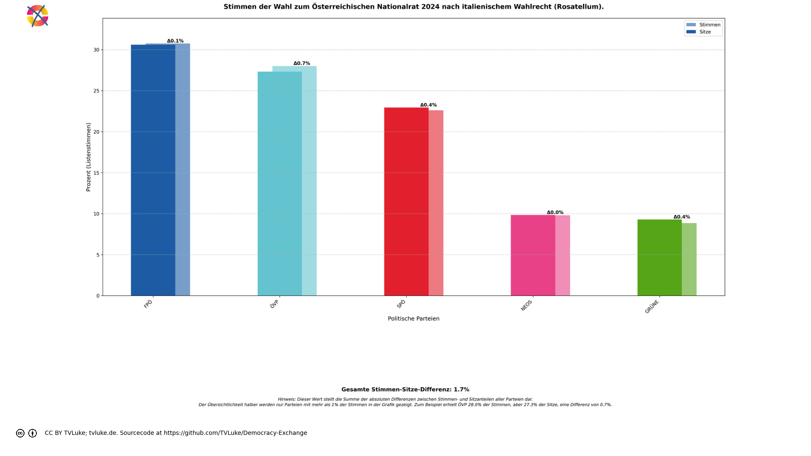
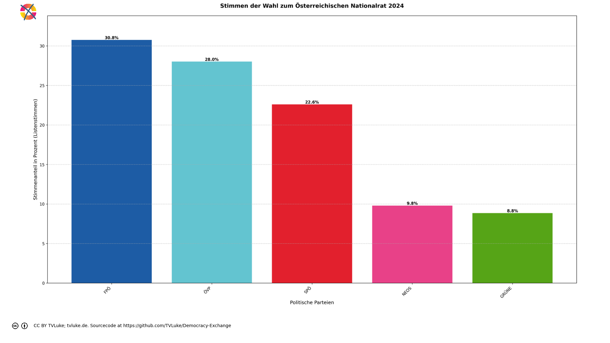

# Stimmen der Wahl zum Österreichischen Nationalrat 2024 nach italienischem Wahlrecht (Rosatellum).
Year: 2024

## Election Statistics
- **Total Population**: 8,932,664
- **Eligible Voters**: 6,346,059
- **Total Votes Cast**: 4,596,908
- **Turnout**: 72.44%
- **Parliament Size**: 183 seats

### Vote Summary

A total of 4,910,197 votes were cast, representing a turnout of 77.4% of the electorate.

| Party | Votes | Percentage |
|-------|--------|------------|
| FPÖ | 1,413,593 | 28.8% |
| ÖVP | 1,287,623 | 26.2% |
| SPÖ | 1,038,829 | 21.2% |
| NEOS | 450,285 | 9.2% |
| GRÜNE | 406,578 | 8.3% |
| KPÖ | 118,088 | 2.4% |
| BIER | 98,989 | 2.0% |
| LMP | 28,762 | 0.6% |
| KEINE | 27,959 | 0.6% |
| MFG | 19,892 | 0.4% |
| GAZA | 19,443 | 0.4% |
| BGE | 156 | 0.0% |

**FPÖ** received the most votes with 1,413,593 votes (28.8% of total votes).

## Seat Calculation Process
## Electoral System Description

Das italienische Wahlsystem 'Rosatellum' für die Abgeordnetenkammer (Camera dei deputati):

Grundsätze:
- Gemischtes Wahlsystem mit zwei Komponenten:
  * 36% der Sitze durch Mehrheitswahl in Einerwahlkreisen (FPTP)
  * 64% der Sitze durch Verhältniswahl mit Parteilisten (PR)

Sperrklauseln:
- Einzelne Parteien: 3% der Gesamtstimmen
- Wahlbündnisse (Koalitionen): 10% der Gesamtstimmen
  * Mindestens eine Partei im Bündnis muss 3% erreichen

Besonderheiten:
- Eine Stimme zählt sowohl für Direkt- als auch Listenmandat
- Stimmen von Parteien zwischen 1-3% werden auf Koalitionspartner über 3% verteilt
- Parteien müssen Koalitionszugehörigkeit vor der Wahl erklären
- Verteilung der Verhältniswahlsitze nach dem Hare-Niemeyer-Verfahren
- Insgesamt 630 Sitze in der Abgeordnetenkammer

Ablauf der Sitzverteilung:
1. Direktmandate (36%):
   - In jedem Wahlkreis gewinnt der Kandidat mit den meisten Stimmen
   - 36% der Sitze werden durch Direktmandate vergeben (bei 630 Sitzen: 226 Sitze)

2. Verhältniswahlmandate (64%):
   - Nur Parteien über der Sperrklausel werden berücksichtigt
   - 404 Sitze nach Verhältniswahl mit Hare-Niemeyer
   - Restmandate nach größten Dezimalstellen

Dieses System wurde 2017 eingeführt und nach seinem Autor Ettore Rosato benannt.

Seat allocation:

Direct allocation seats (36%): 65

Proportional seats (64%): 118

=== Example Districts ===
Here are three randomly selected districts showing how votes are counted and allocated:

## District: Mostviertel
This district demonstrates how votes are split between direct mandate (36%) and proportional representation (64%):

Total votes cast: 162,336
- ÖVP: 51,756 votes (31.9%)
- FPÖ: 49,804 votes (30.7%)
- SPÖ: 30,162 votes (18.6%)
- NEOS: 11,475 votes (7.1%)
- GRÜNE: 10,028 votes (6.2%)
- BIER: 3,256 votes (2.0%)
- KPÖ: 2,621 votes (1.6%)
- KEINE: 1,156 votes (0.7%)
- LMP: 1,000 votes (0.6%)
- MFG: 896 votes (0.6%)
- GAZA: 182 votes (0.1%)
- BGE: 0 votes (0.0%)

Direct mandate winner:
- ÖVP: 51,756 votes (31.9%)

Vote allocation:
- Direct votes (36%): 58,440 votes for FPTP allocation
- Proportional votes (64%): 103,895 votes for PR allocation

## District: Niederösterreich Süd
This district demonstrates how votes are split between direct mandate (36%) and proportional representation (64%):

Total votes cast: 126,523
- FPÖ: 42,270 votes (33.4%)
- ÖVP: 33,791 votes (26.7%)
- SPÖ: 27,344 votes (21.6%)
- NEOS: 8,953 votes (7.1%)
- GRÜNE: 6,319 votes (5.0%)
- BIER: 2,648 votes (2.1%)
- KPÖ: 2,117 votes (1.7%)
- GAZA: 995 votes (0.8%)
- LMP: 850 votes (0.7%)
- KEINE: 758 votes (0.6%)
- MFG: 478 votes (0.4%)
- BGE: 0 votes (0.0%)

Direct mandate winner:
- FPÖ: 42,270 votes (33.4%)

Vote allocation:
- Direct votes (36%): 45,548 votes for FPTP allocation
- Proportional votes (64%): 80,974 votes for PR allocation

## District: Wien Nord-West
This district demonstrates how votes are split between direct mandate (36%) and proportional representation (64%):

Total votes cast: 124,331
- SPÖ: 33,741 votes (27.1%)
- ÖVP: 24,716 votes (19.9%)
- FPÖ: 19,569 votes (15.7%)
- GRÜNE: 19,223 votes (15.5%)
- NEOS: 17,269 votes (13.9%)
- KPÖ: 5,072 votes (4.1%)
- BIER: 2,121 votes (1.7%)
- GAZA: 983 votes (0.8%)
- LMP: 957 votes (0.8%)
- KEINE: 463 votes (0.4%)
- MFG: 217 votes (0.2%)
- BGE: 0 votes (0.0%)

Direct mandate winner:
- SPÖ: 33,741 votes (27.1%)

Vote allocation:
- Direct votes (36%): 44,759 votes for FPTP allocation
- Proportional votes (64%): 79,571 votes for PR allocation

=== Party Vote Totals ===

ÖVP: 1,287,623 total votes
  - Direct votes (36%): 463,526
  - Proportional votes (64%): 824,060

SPÖ: 1,038,829 total votes
  - Direct votes (36%): 373,960
  - Proportional votes (64%): 664,832

FPÖ: 1,413,593 total votes
  - Direct votes (36%): 508,875
  - Proportional votes (64%): 904,682

GRÜNE: 406,578 total votes
  - Direct votes (36%): 146,349
  - Proportional votes (64%): 260,190

NEOS: 450,285 total votes
  - Direct votes (36%): 162,086
  - Proportional votes (64%): 288,163

BIER: 98,989 total votes
  - Direct votes (36%): 35,615
  - Proportional votes (64%): 63,336

MFG: 19,892 total votes
  - Direct votes (36%): 7,149
  - Proportional votes (64%): 12,711

BGE: 156 total votes
  - Direct votes (36%): 55
  - Proportional votes (64%): 99

LMP: 28,762 total votes
  - Direct votes (36%): 10,339
  - Proportional votes (64%): 18,389

GAZA: 19,443 total votes
  - Direct votes (36%): 6,986
  - Proportional votes (64%): 12,429

KPÖ: 118,088 total votes
  - Direct votes (36%): 42,494
  - Proportional votes (64%): 75,557

KEINE: 27,959 total votes
  - Direct votes (36%): 10,048
  - Proportional votes (64%): 17,873

Direct vote counts (36% of total votes):

FPÖ: 508,875 votes (28.8%)

ÖVP: 463,526 votes (26.2%)

SPÖ: 373,960 votes (21.2%)

NEOS: 162,086 votes (9.2%)

GRÜNE: 146,349 votes (8.3%)

KPÖ: 42,494 votes (2.4%)

BIER: 35,615 votes (2.0%)

LMP: 10,339 votes (0.6%)

KEINE: 10,048 votes (0.6%)

MFG: 7,149 votes (0.4%)

GAZA: 6,986 votes (0.4%)

BGE: 55 votes (0.0%)

=== DIRECT SEAT ALLOCATION (36% = 65 seats) ===

Using 36% of member votes (if available) or list votes

Direct votes (36% of total votes):

FPÖ: 508,875 votes (28.79%)

ÖVP: 463,526 votes (26.22%)

SPÖ: 373,960 votes (21.16%)

NEOS: 162,086 votes (9.17%)

GRÜNE: 146,349 votes (8.28%)

KPÖ: 42,494 votes (2.40%)

BIER: 35,615 votes (2.01%)

LMP: 10,339 votes (0.58%)

KEINE: 10,048 votes (0.57%)

MFG: 7,149 votes (0.40%)

GAZA: 6,986 votes (0.40%)

BGE: 55 votes (0.00%)

Initial direct seat allocation:

FPÖ: 18 seats (fair share: 18.712, remainder: 0.712)

ÖVP: 17 seats (fair share: 17.045, remainder: 0.045)

SPÖ: 13 seats (fair share: 13.751, remainder: 0.751)

NEOS: 5 seats (fair share: 5.960, remainder: 0.960)

GRÜNE: 5 seats (fair share: 5.382, remainder: 0.382)

KPÖ: 1 seats (fair share: 1.563, remainder: 0.563)

BIER: 1 seats (fair share: 1.310, remainder: 0.310)

LMP: 0 seats (fair share: 0.380, remainder: 0.380)

KEINE: 0 seats (fair share: 0.369, remainder: 0.369)

MFG: 0 seats (fair share: 0.263, remainder: 0.263)

GAZA: 0 seats (fair share: 0.257, remainder: 0.257)

BGE: 0 seats (fair share: 0.002, remainder: 0.002)

Distributing 5 remaining direct seats by largest remainder:

NEOS: +1 seat (remainder was 0.960)

SPÖ: +1 seat (remainder was 0.751)

FPÖ: +1 seat (remainder was 0.712)

KPÖ: +1 seat (remainder was 0.563)

GRÜNE: +1 seat (remainder was 0.382)

Final direct seat allocation:

FPÖ: 19 seats (29.23% of seats, 28.79% of direct votes)

ÖVP: 17 seats (26.15% of seats, 26.22% of direct votes)

SPÖ: 14 seats (21.54% of seats, 21.16% of direct votes)

NEOS: 6 seats (9.23% of seats, 9.17% of direct votes)

GRÜNE: 6 seats (9.23% of seats, 8.28% of direct votes)

KPÖ: 2 seats (3.08% of seats, 2.40% of direct votes)

BIER: 1 seats (1.54% of seats, 2.01% of direct votes)

Proportional vote counts (64% of total votes):

FPÖ: 904,682 votes (28.8%)

ÖVP: 824,060 votes (26.2%)

SPÖ: 664,832 votes (21.2%)

NEOS: 288,163 votes (9.2%)

GRÜNE: 260,190 votes (8.3%)

KPÖ: 75,557 votes (2.4%)

BIER: 63,336 votes (2.0%)

LMP: 18,389 votes (0.6%)

KEINE: 17,873 votes (0.6%)

MFG: 12,711 votes (0.4%)

GAZA: 12,429 votes (0.4%)

BGE: 99 votes (0.0%)

Vote shares and thresholds:

Total proportional votes: 3,142,509

ÖVP:

  Proportional votes: 824,060 (26.22%)

  ELIGIBLE: Above 3% threshold

SPÖ:

  Proportional votes: 664,832 (21.16%)

  ELIGIBLE: Above 3% threshold

FPÖ:

  Proportional votes: 904,682 (28.79%)

  ELIGIBLE: Above 3% threshold

GRÜNE:

  Proportional votes: 260,190 (8.28%)

  ELIGIBLE: Above 3% threshold

NEOS:

  Proportional votes: 288,163 (9.17%)

  ELIGIBLE: Above 3% threshold

BIER:

  Proportional votes: 63,336 (2.02%)

  NOT ELIGIBLE: Below 3% threshold

MFG:

  Proportional votes: 12,711 (0.40%)

  NOT ELIGIBLE: Below 3% threshold

BGE:

  Proportional votes: 99 (0.00%)

  NOT ELIGIBLE: Below 3% threshold

LMP:

  Proportional votes: 18,389 (0.59%)

  NOT ELIGIBLE: Below 3% threshold

GAZA:

  Proportional votes: 12,429 (0.40%)

  NOT ELIGIBLE: Below 3% threshold

KPÖ:

  Proportional votes: 75,557 (2.40%)

  NOT ELIGIBLE: Below 3% threshold

KEINE:

  Proportional votes: 17,873 (0.57%)

  NOT ELIGIBLE: Below 3% threshold

Eligible parties: ['ÖVP', 'SPÖ', 'FPÖ', 'GRÜNE', 'NEOS']

FPTP Seats (36%): 65
Proportional Seats (64%): 118

FPTP allocation (65 seats):

Total eligible votes: 2,941,927

ÖVP: 18 seats (28.0% of votes)

SPÖ: 14 seats (22.6% of votes)

FPÖ: 19 seats (30.8% of votes)

GRÜNE: 5 seats (8.8% of votes)

NEOS: 6 seats (9.8% of votes)

Distributing 3 remaining FPTP seats:

FPÖ: +1 seat (remainder was 0.988)

GRÜNE: +1 seat (remainder was 0.749)

SPÖ: +1 seat (remainder was 0.689)

Final FPTP allocation:

FPÖ: 20 seats (30.8% of seats, 30.8% of votes)

ÖVP: 18 seats (27.7% of seats, 28.0% of votes)

SPÖ: 15 seats (23.1% of seats, 22.6% of votes)

GRÜNE: 6 seats (9.2% of seats, 8.8% of votes)

NEOS: 6 seats (9.2% of seats, 9.8% of votes)

Total FPTP seats allocated: 65 of 65

=== PROPORTIONAL ALLOCATION (64% = 118 seats) ===

Proportional votes (64% of total votes):

FPÖ: 904,682 votes (28.79%)

ÖVP: 824,060 votes (26.22%)

SPÖ: 664,832 votes (21.16%)

NEOS: 288,163 votes (9.17%)

GRÜNE: 260,190 votes (8.28%)

Initial proportional seat allocation:

FPÖ: 33 seats (fair share: 33.970, remainder: 0.970)

ÖVP: 30 seats (fair share: 30.943, remainder: 0.943)

SPÖ: 24 seats (fair share: 24.964, remainder: 0.964)

NEOS: 10 seats (fair share: 10.820, remainder: 0.820)

GRÜNE: 9 seats (fair share: 9.770, remainder: 0.770)

Distributing 12 remaining proportional seats:

FPÖ: +1 seat (remainder was 0.970)

SPÖ: +1 seat (remainder was 0.964)

ÖVP: +1 seat (remainder was 0.943)

NEOS: +1 seat (remainder was 0.820)

GRÜNE: +1 seat (remainder was 0.770)

FPÖ: +1 seat (remainder was 0.970)

SPÖ: +1 seat (remainder was 0.964)

ÖVP: +1 seat (remainder was 0.943)

NEOS: +1 seat (remainder was 0.820)

GRÜNE: +1 seat (remainder was 0.770)

FPÖ: +1 seat (remainder was 0.970)

SPÖ: +1 seat (remainder was 0.964)

Final proportional allocation:

FPÖ: 36 seats (30.5% of seats, 28.8% of proportional votes)

ÖVP: 32 seats (27.1% of seats, 26.2% of proportional votes)

SPÖ: 27 seats (22.9% of seats, 21.2% of proportional votes)

NEOS: 12 seats (10.2% of seats, 9.2% of proportional votes)

GRÜNE: 11 seats (9.3% of seats, 8.3% of proportional votes)

Total proportional seats allocated: 118 of 118

Final party allocations:

FPÖ: 56 seats (30.6% of seats, 28.8% of votes)

NEOS: 18 seats (9.8% of seats, 9.2% of votes)

GRÜNE: 17 seats (9.3% of seats, 8.3% of votes)

SPÖ: 42 seats (23.0% of seats, 21.2% of votes)

ÖVP: 50 seats (27.3% of seats, 26.2% of votes)

Total allocated seats: 183 of 183

=== FINAL SEAT DISTRIBUTION SUMMARY ===
- Total seats allocated: 183 of 183 (100.0%)
- FPTP seats: 65 of 65 (100.0%)
- Proportional seats: 118 of 118 (100.0%)
- Number of parties represented: 5

Party-by-Party Breakdown:
- FPÖ : 56 seats (30.6%)
- ÖVP : 50 seats (27.3%)
- SPÖ : 42 seats (23.0%)
- NEOS : 18 seats (9.8%)
- GRÜNE : 17 seats (9.3%)

Threshold Effects:
- Independent parties needed 3% of total votes
- Coalitions needed 10% of total votes collectively
- Parties in coalitions above 10% needed only 1% individually
- Parties in coalitions below 10% needed 3% individually

System Details:
- Direct mandate seats: 36% of total seats
- Proportional seats: 64% of total seats
- Threshold for representation: 3% of total votes (or 1% if in coalition above 10%)
- Coalition threshold: 10% of total votes

==================================================

## Visualizations
### Parliament Seating

### Coalition Possibilities
![Possible coalition combinations that form a majority, sorted by ideological distance (smaller distance means parties are closer on the left-right spectrum): ÖVP + FPÖ with 106 seats (57.9%, ideological distance: 1.0); SPÖ + FPÖ with 98 seats (53.6%, ideological distance: 4.0); SPÖ + GRÜNE + ÖVP with 109 seats (59.6%, ideological distance: 6.0); SPÖ + NEOS + ÖVP with 110 seats (60.1%, ideological distance: 6.0). Die "Ideologische Distanz": Für die Darstellung in korrekter Reihenfolge hat jede Partei einen left_to_right-Wert, mit 1 für die Partei, welche üblicherweise im Parlament ganz links sitzt, dann aufsteigend: Dieser Wert wird hier auch einfach als Distanzwert gewertet, um wahrscheinliche Koalitionen darzustellen. Diese Berechnung ist natürlich stark vereinfachend und in vielen Fällen einfach falsch.  Beispiel für die Koalition SPÖ-GRÜNE-ÖVP: SPÖ: left_to_right = 1 GRÜNE: left_to_right = 2 ÖVP: left_to_right = 4 Ideologische Distanz = |1-2| + |1-4| + |2-4| = 6](../plots/austria2024_italy_coalitions.png)

### Vote vs Seat Distribution

### Party Vote Distribution

## Detailed Results
| Party | Votes | Vote Share | Seats | Seat Share | Representation Gap |
|-------|--------|------------|-------|------------|-------------------|
| FPÖ | 1,413,593 | 30.75% | 56 | 30.60% | -0.15% |
| ÖVP | 1,287,623 | 28.01% | 50 | 27.32% | -0.69% |
| SPÖ | 1,038,829 | 22.60% | 42 | 22.95% | 0.35% |
| NEOS | 450,285 | 9.80% | 18 | 9.84% | 0.04% |
| GRÜNE | 406,578 | 8.84% | 17 | 9.29% | 0.45% |

## Analysis of Representation
### Most Over-represented Parties
- **GRÜNE**: +0.45%
- **SPÖ**: +0.35%
- **NEOS**: +0.04%

### Most Under-represented Parties
- **ÖVP**: -0.69%
- **FPÖ**: -0.15%
- **NEOS**: 0.04%

## Sources

### About the Electoral System
- [polyas.de](https://www.polyas.de/blog/de/online-wahlen/wahlsystem-italien)