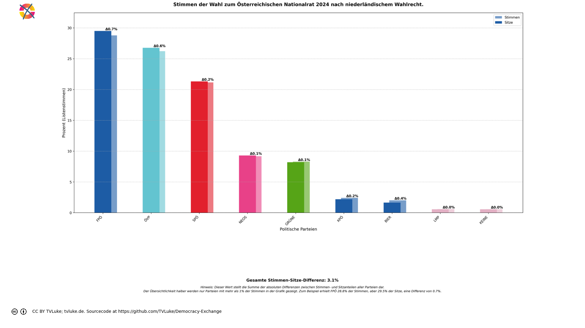

# Stimmen der Wahl zum Österreichischen Nationalrat 2024 nach niederländischem Wahlrecht.
Year: 2024

## Election Statistics
- **Total Population**: 8,932,664
- **Eligible Voters**: 6,346,059
- **Total Votes Cast**: 4,910,197
- **Turnout**: 77.37%
- **Parliament Size**: 183 seats

### Vote Summary

A total of 19,640,788 votes were cast, representing a turnout of 309.5% of the electorate.

| Party | Votes | Percentage |
|-------|--------|------------|
| FPÖ | 5,654,372 | 28.8% |
| ÖVP | 5,150,492 | 26.2% |
| SPÖ | 4,155,316 | 21.2% |
| NEOS | 1,801,140 | 9.2% |
| GRÜNE | 1,626,312 | 8.3% |
| KPÖ | 472,352 | 2.4% |
| BIER | 395,956 | 2.0% |
| LMP | 115,048 | 0.6% |
| KEINE | 111,836 | 0.6% |
| MFG | 79,568 | 0.4% |
| GAZA | 77,772 | 0.4% |
| BGE | 624 | 0.0% |

**FPÖ** received the most votes with 5,654,372 votes (28.8% of total votes).

## Seat Calculation Process

## French Electoral System Explanation

This election uses the French two-round voting system (scrutin uninominal majoritaire à deux tours):

1. **First Round**
   - All candidates can participate
   - If a candidate receives >50% of votes AND ≥25% of registered voters, they win immediately
   - Otherwise, qualified candidates proceed to second round

2. **Second Round Qualification**
   - Candidates need ≥12.5% of votes to qualify
   - If no candidates reach 12.5%, top two advance
   - When no second round data is provided, votes are simulated:
     * 80% of votes from eliminated parties go to parties with same left-right position
     * 30% of remaining votes go to parties within 1 position on left-right scale
     * Other votes are considered lost/abstentions

Key Features:
- 183 total seats to be distributed
- Single-member constituencies
- Two rounds if no absolute majority in first round

3. **Seat Scaling**
   When the required number of seats (183) differs from the number of districts (39),
   we use proportional scaling to maintain fair representation:
   - First calculate results for all districts
   - Then multiply each party's seats by (total_seats / number_of_districts)
   - Round to nearest whole number while preserving total seats
   - This maintains the proportional representation from the district results
   
   Example: If we have 100 districts but need 200 seats:
   - Party A wins 60 districts → scaled to 120 seats (60 * 200/100)
   - Party B wins 40 districts → scaled to 80 seats (40 * 200/100)
   The relative strength of each party remains the same.

## Example Districts

To illustrate how the French two-round system works in practice, here are three example districts:

### Example 1: Burgenland Nord

**First Round Results:**
- Total votes cast: 102,327
- Registered voters: 204,654

**Party Results:**
- FPÖ: 28,903 votes (28.2% of votes, 14.1% of registered)
- ÖVP: 28,057 votes (27.4% of votes, 13.7% of registered)
- SPÖ: 27,636 votes (27.0% of votes, 13.5% of registered)
- NEOS: 7,480 votes (7.3% of votes, 3.7% of registered)
- GRÜNE: 5,329 votes (5.2% of votes, 2.6% of registered)
- BIER: 2,218 votes (2.2% of votes, 1.1% of registered)
- KPÖ: 1,375 votes (1.3% of votes, 0.7% of registered)
- KEINE: 517 votes (0.5% of votes, 0.3% of registered)
- LMP: 479 votes (0.5% of votes, 0.2% of registered)
- GAZA: 293 votes (0.3% of votes, 0.1% of registered)
- BGE: 40 votes (0.0% of votes, 0.0% of registered)
- MFG: 0 votes (0.0% of votes, 0.0% of registered)

**Second Round:** Parties qualifying (≥12.5%):
- SPÖ: 27,636 votes (27.0%)
- FPÖ: 28,903 votes (28.2%)
- ÖVP: 28,057 votes (27.4%)

**Vote Redistribution Simulation:**
Vote Transfers:
- GRÜNE → SPÖ: 799 votes
- GRÜNE: 4,530 votes lost/abstained
- NEOS → ÖVP: 1,122 votes
- NEOS: 6,358 votes lost/abstained
- BIER: 2,218 votes lost/abstained
- BGE: 40 votes lost/abstained
- LMP: 479 votes lost/abstained
- GAZA: 293 votes lost/abstained
- KPÖ: 1,375 votes lost/abstained
- KEINE: 517 votes lost/abstained

**Final Second Round Result:**
- ÖVP: 29,179 votes (28.5%)
- FPÖ: 28,903 votes (28.2%)
- SPÖ: 28,435 votes (27.8%)

**Result:** ÖVP wins the simulated second round

### Example 2: Burgenland Süd

**First Round Results:**
- Total votes cast: 88,363
- Registered voters: 176,726

**Party Results:**
- ÖVP: 26,323 votes (29.8% of votes, 14.9% of registered)
- FPÖ: 25,955 votes (29.4% of votes, 14.7% of registered)
- SPÖ: 23,881 votes (27.0% of votes, 13.5% of registered)
- NEOS: 4,894 votes (5.5% of votes, 2.8% of registered)
- GRÜNE: 3,693 votes (4.2% of votes, 2.1% of registered)
- BIER: 1,613 votes (1.8% of votes, 0.9% of registered)
- KPÖ: 1,070 votes (1.2% of votes, 0.6% of registered)
- LMP: 384 votes (0.4% of votes, 0.2% of registered)
- KEINE: 381 votes (0.4% of votes, 0.2% of registered)
- BGE: 116 votes (0.1% of votes, 0.1% of registered)
- GAZA: 53 votes (0.1% of votes, 0.0% of registered)
- MFG: 0 votes (0.0% of votes, 0.0% of registered)

**Second Round:** Parties qualifying (≥12.5%):
- SPÖ: 23,881 votes (27.0%)
- FPÖ: 25,955 votes (29.4%)
- ÖVP: 26,323 votes (29.8%)

**Vote Redistribution Simulation:**
Vote Transfers:
- GRÜNE → SPÖ: 553 votes
- GRÜNE: 3,140 votes lost/abstained
- NEOS → ÖVP: 734 votes
- NEOS: 4,160 votes lost/abstained
- BIER: 1,613 votes lost/abstained
- BGE: 116 votes lost/abstained
- LMP: 384 votes lost/abstained
- GAZA: 53 votes lost/abstained
- KPÖ: 1,070 votes lost/abstained
- KEINE: 381 votes lost/abstained

**Final Second Round Result:**
- ÖVP: 27,057 votes (30.6%)
- FPÖ: 25,955 votes (29.4%)
- SPÖ: 24,434 votes (27.7%)

**Result:** ÖVP wins the simulated second round

### Example 3: Klagenfurt

**First Round Results:**
- Total votes cast: 89,557
- Registered voters: 179,114

**Party Results:**
- FPÖ: 29,456 votes (32.9% of votes, 16.4% of registered)
- SPÖ: 21,275 votes (23.8% of votes, 11.9% of registered)
- ÖVP: 18,694 votes (20.9% of votes, 10.4% of registered)
- NEOS: 9,077 votes (10.1% of votes, 5.1% of registered)
- GRÜNE: 5,821 votes (6.5% of votes, 3.2% of registered)
- BIER: 2,005 votes (2.2% of votes, 1.1% of registered)
- KPÖ: 1,981 votes (2.2% of votes, 1.1% of registered)
- LMP: 679 votes (0.8% of votes, 0.4% of registered)
- KEINE: 569 votes (0.6% of votes, 0.3% of registered)
- MFG: 0 votes (0.0% of votes, 0.0% of registered)
- BGE: 0 votes (0.0% of votes, 0.0% of registered)
- GAZA: 0 votes (0.0% of votes, 0.0% of registered)

**Second Round:** Parties qualifying (≥12.5%):
- SPÖ: 21,275 votes (23.8%)
- FPÖ: 29,456 votes (32.9%)
- ÖVP: 18,694 votes (20.9%)

**Vote Redistribution Simulation:**
Vote Transfers:
- GRÜNE → SPÖ: 873 votes
- GRÜNE: 4,948 votes lost/abstained
- NEOS → ÖVP: 1,361 votes
- NEOS: 7,716 votes lost/abstained
- BIER: 2,005 votes lost/abstained
- LMP: 679 votes lost/abstained
- KPÖ: 1,981 votes lost/abstained
- KEINE: 569 votes lost/abstained

**Final Second Round Result:**
- FPÖ: 29,456 votes (32.9%)
- SPÖ: 22,148 votes (24.7%)
- ÖVP: 20,055 votes (22.4%)

**Result:** FPÖ wins the simulated second round

## Seat Scaling Applied

Scaling from 39 districts to 183 total seats:

### Before Scaling (39 seats)
| Party | Seats | Percentage |
|-------|--------|------------|
| ÖVP | 18 | 46.2% |
| FPÖ | 12 | 30.8% |
| SPÖ | 9 | 23.1% |

### After Scaling (183 seats)
| Party | Seats | Percentage | Change |
|-------|--------|------------|---------|
| ÖVP | 85 | 46.4% | +0.3% |
| FPÖ | 56 | 30.6% | -0.2% |
| SPÖ | 42 | 23.0% | -0.1% |

Scaling Details:
- Scaling factor: 4.692
- Each party's seats multiplied by this factor and rounded
- Total seats preserved through rounding adjustments
- Percentages of total seats remain nearly identical

## Visualizations
### Parliament Seating

### Coalition Possibilities
![Possible coalition combinations that form a majority, sorted by ideological distance (smaller distance means parties are closer on the left-right spectrum): ÖVP + FPÖ with 103 seats (56.3%, ideological distance: 1.0); SPÖ + FPÖ with 93 seats (50.8%, ideological distance: 4.0); SPÖ + GRÜNE + ÖVP with 103 seats (56.3%, ideological distance: 6.0); SPÖ + NEOS + ÖVP with 105 seats (57.4%, ideological distance: 6.0); SPÖ + GRÜNE + FPÖ with 108 seats (59.0%, ideological distance: 8.0); SPÖ + NEOS + FPÖ with 110 seats (60.1%, ideological distance: 8.0); BIER + SPÖ + FPÖ with 96 seats (52.5%, ideological distance: 10.0); LMP + SPÖ + FPÖ with 94 seats (51.4%, ideological distance: 10.0); KPÖ + SPÖ + FPÖ with 97 seats (53.0%, ideological distance: 10.0); KEINE + SPÖ + FPÖ with 94 seats (51.4%, ideological distance: 10.0). Die "Ideologische Distanz": Für die Darstellung in korrekter Reihenfolge hat jede Partei einen left_to_right-Wert, mit 1 für die Partei, welche üblicherweise im Parlament ganz links sitzt, dann aufsteigend: Dieser Wert wird hier auch einfach als Distanzwert gewertet, um wahrscheinliche Koalitionen darzustellen. Diese Berechnung ist natürlich stark vereinfachend und in vielen Fällen einfach falsch.  Beispiel für die Koalition SPÖ-GRÜNE-ÖVP: SPÖ: left_to_right = 1 GRÜNE: left_to_right = 2 ÖVP: left_to_right = 4 Ideologische Distanz = |1-2| + |1-4| + |2-4| = 6](../plots/austria2024_netherlands_coalitions.png)

### Vote vs Seat Distribution

### Party Vote Distribution

## Detailed Results
| Party | Votes | Vote Share | Seats | Seat Share | Representation Gap |
|-------|--------|------------|-------|------------|-------------------|
| FPÖ | 1,413,593 | 28.79% | 54 | 29.51% | 0.72% |
| ÖVP | 1,287,623 | 26.22% | 49 | 26.78% | 0.55% |
| SPÖ | 1,038,829 | 21.16% | 39 | 21.31% | 0.15% |
| NEOS | 450,285 | 9.17% | 17 | 9.29% | 0.12% |
| GRÜNE | 406,578 | 8.28% | 15 | 8.20% | -0.08% |
| KPÖ | 118,088 | 2.40% | 4 | 2.19% | -0.22% |
| BIER | 98,989 | 2.02% | 3 | 1.64% | -0.38% |
| LMP | 28,762 | 0.59% | 1 | 0.55% | -0.04% |
| KEINE | 27,959 | 0.57% | 1 | 0.55% | -0.02% |
| MFG | 19,892 | 0.41% | 0 | 0.00% | -0.41% |
| BGE | 156 | 0.00% | 0 | 0.00% | -0.00% |
| GAZA | 19,443 | 0.40% | 0 | 0.00% | -0.40% |

## Analysis of Representation
### Most Over-represented Parties
- **FPÖ**: +0.72%
- **ÖVP**: +0.55%
- **SPÖ**: +0.15%

### Most Under-represented Parties
- **MFG**: -0.41%
- **GAZA**: -0.40%
- **BIER**: -0.38%

## Sources

### About the Electoral System
- [Wahlrecht](https://www.wahlrecht.de/ausland/kieswet.html)