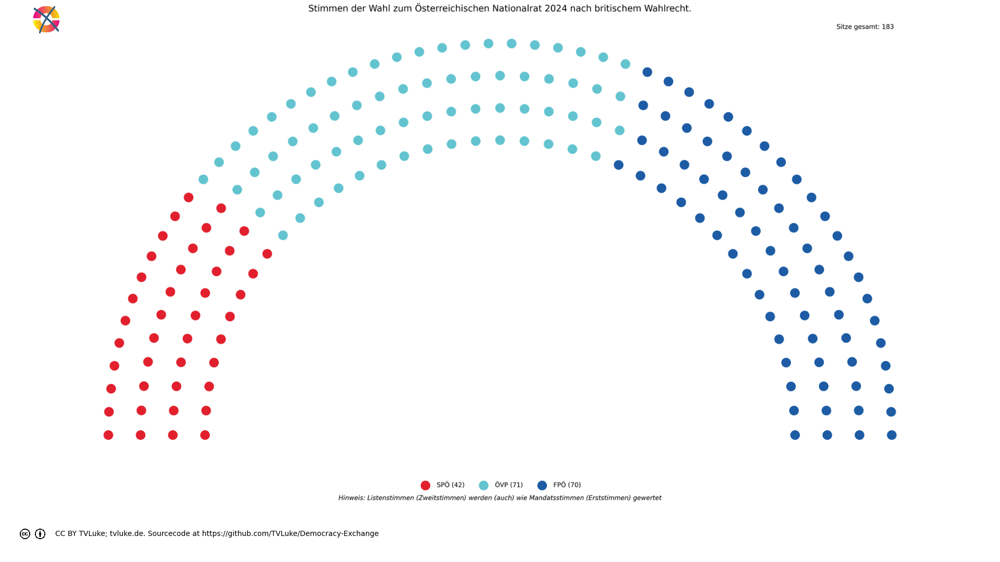
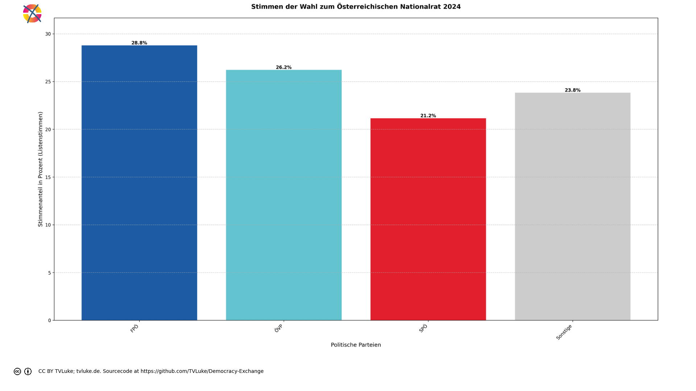

# Stimmen der Wahl zum Österreichischen Nationalrat 2024 nach britischem Wahlrecht.
Year: 2024

## Election Statistics
- **Total Population**: 8,932,664
- **Eligible Voters**: 6,346,059
- **Total Votes Cast**: 4,910,197
- **Turnout**: 77.37%
- **Parliament Size**: 183 seats

### Vote Summary

A total of 4,910,197 votes were cast, representing a turnout of 77.4% of the electorate.

| Party | Votes | Percentage |
|-------|--------|------------|
| FPÖ | 1,413,593 | 28.8% |
| ÖVP | 1,287,623 | 26.2% |
| SPÖ | 1,038,829 | 21.2% |
| NEOS | 450,285 | 9.2% |
| GRÜNE | 406,578 | 8.3% |
| KPÖ | 118,088 | 2.4% |
| BIER | 98,989 | 2.0% |
| LMP | 28,762 | 0.6% |
| KEINE | 27,959 | 0.6% |
| MFG | 19,892 | 0.4% |
| GAZA | 19,443 | 0.4% |
| BGE | 156 | 0.0% |

**FPÖ** received the most votes with 1,413,593 votes (28.8% of total votes).

## Seat Calculation Process

# United Kingdom Electoral System
The UK uses First-Past-The-Post (FPTP) voting where:
- Each constituency (district) elects one Member of Parliament (MP)
- The candidate with the most votes in each constituency wins that seat
- No minimum threshold is required
- Normally, the total number of seats equals the number of constituencies (39 in this dataset)

In this calculation, the target number of seats is 183, which differs from the number of constituencies. This means we will need to scale the results proportionally after determining constituency winners.

## Constituency: Mostviertel
This constituency demonstrates how First-Past-The-Post works:

## Example Constituency: Mostviertel
This example shows how First-Past-The-Post determines the winner:

Total votes cast: 162,336
- ÖVP: 51,756 votes (31.9%)
- FPÖ: 49,804 votes (30.7%)
- SPÖ: 30,162 votes (18.6%)
- NEOS: 11,475 votes (7.1%)
- GRÜNE: 10,028 votes (6.2%)
- BIER: 3,256 votes (2.0%)
- KPÖ: 2,621 votes (1.6%)
- KEINE: 1,156 votes (0.7%)
- LMP: 1,000 votes (0.6%)
- MFG: 896 votes (0.6%)
- GAZA: 182 votes (0.1%)
- BGE: 0 votes (0.0%)

Winner determination:
- Highest vote count: ÖVP with 51,756 votes (31.9%)
- Second place: FPÖ with 49,804 votes (30.7%)
- Margin of victory: 1,952 votes (1.2% of total votes)

Result: ÖVP wins this constituency's single seat, regardless of the margin of victory.

## Constituency: Niederösterreich Süd
This constituency demonstrates how First-Past-The-Post works:

## Example Constituency: Niederösterreich Süd
This example shows how First-Past-The-Post determines the winner:

Total votes cast: 126,523
- FPÖ: 42,270 votes (33.4%)
- ÖVP: 33,791 votes (26.7%)
- SPÖ: 27,344 votes (21.6%)
- NEOS: 8,953 votes (7.1%)
- GRÜNE: 6,319 votes (5.0%)
- BIER: 2,648 votes (2.1%)
- KPÖ: 2,117 votes (1.7%)
- GAZA: 995 votes (0.8%)
- LMP: 850 votes (0.7%)
- KEINE: 758 votes (0.6%)
- MFG: 478 votes (0.4%)
- BGE: 0 votes (0.0%)

Winner determination:
- Highest vote count: FPÖ with 42,270 votes (33.4%)
- Second place: ÖVP with 33,791 votes (26.7%)
- Margin of victory: 8,479 votes (6.7% of total votes)

Result: FPÖ wins this constituency's single seat, regardless of the margin of victory.

## Constituency: Graz und Umgebung
This constituency demonstrates how First-Past-The-Post works:

## Example Constituency: Graz und Umgebung
This example shows how First-Past-The-Post determines the winner:

Total votes cast: 245,452
- FPÖ: 60,428 votes (24.6%)
- ÖVP: 56,628 votes (23.1%)
- SPÖ: 49,953 votes (20.4%)
- GRÜNE: 31,342 votes (12.8%)
- NEOS: 27,059 votes (11.0%)
- KPÖ: 11,462 votes (4.7%)
- BIER: 4,162 votes (1.7%)
- LMP: 1,523 votes (0.6%)
- KEINE: 1,225 votes (0.5%)
- MFG: 842 votes (0.3%)
- GAZA: 828 votes (0.3%)
- BGE: 0 votes (0.0%)

Winner determination:
- Highest vote count: FPÖ with 60,428 votes (24.6%)
- Second place: ÖVP with 56,628 votes (23.1%)
- Margin of victory: 3,800 votes (1.5% of total votes)

Result: FPÖ wins this constituency's single seat, regardless of the margin of victory.

## Scaling Process Explanation
The UK system needs to scale from 39 constituencies to 183 total seats.

This scaling maintains proportionality through these steps:
1. Calculate scaling factor: 183 seats ÷ 39 constituencies = 4.6923
2. Multiply each party's constituency seats by this factor
3. Take the integer part first (floor)
4. Distribute remaining seats by highest decimal remainder

This preserves the proportional relationship between parties while reaching the target seat count.

Original seat distribution (showing only parties that won seats):
{
  "\u00d6VP": "15 seats (38.5%)",
  "SP\u00d6": "9 seats (23.1%)",
  "FP\u00d6": "15 seats (38.5%)"
}

Final seat distribution after scaling (showing only parties that won seats):
{
  "\u00d6VP": "71 seats (38.8%)",
  "SP\u00d6": "42 seats (23.0%)",
  "FP\u00d6": "70 seats (38.3%)"
}

Note how the percentage of seats for each party remains nearly identical after scaling,
demonstrating that the proportional relationships are preserved.

## Visualizations
### Parliament Seating

### Coalition Possibilities
![Possible coalition combinations that form a majority, sorted by ideological distance (smaller distance means parties are closer on the left-right spectrum): ÖVP + FPÖ with 141 seats (77.0%, ideological distance: 1.0); SPÖ + ÖVP with 113 seats (61.7%, ideological distance: 3.0); SPÖ + FPÖ with 112 seats (61.2%, ideological distance: 4.0). Die "Ideologische Distanz": Für die Darstellung in korrekter Reihenfolge hat jede Partei einen left_to_right-Wert, mit 1 für die Partei, welche üblicherweise im Parlament ganz links sitzt, dann aufsteigend: Dieser Wert wird hier auch einfach als Distanzwert gewertet, um wahrscheinliche Koalitionen darzustellen. Diese Berechnung ist natürlich stark vereinfachend und in vielen Fällen einfach falsch.  Beispiel für die Koalition ÖVP-FPÖ: ÖVP: left_to_right = 4 FPÖ: left_to_right = 5 Ideologische Distanz = |4-5| = 1](../plots/austria2024_uk_coalitions.png)

### Vote vs Seat Distribution
![Bar chart comparing each party's vote percentage (darker bars) with their seat percentage (lighter bars). Parties with significant differences: FPÖ (28.8% votes vs 38.3% seats, Δ9.5%), ÖVP (26.2% votes vs 38.8% seats, Δ12.6%), SPÖ (21.2% votes vs 23.0% seats, Δ1.8%), NEOS (9.2% votes vs 0.0% seats, Δ9.2%), GRÜNE (8.3% votes vs 0.0% seats, Δ8.3%), KPÖ (2.4% votes vs 0.0% seats, Δ2.4%), BIER (2.0% votes vs 0.0% seats, Δ2.0%). Total vote-seat difference: 47.7%. (Listenstimmen werden wie Mandatsstimmen gewertet)](../plots/austria2024_uk_vote_seat_distribution.png)

### Party Vote Distribution

## Detailed Results
| Party | Votes | Vote Share | Seats | Seat Share | Representation Gap |
|-------|--------|------------|-------|------------|-------------------|
| ÖVP | 1,287,623 | 26.22% | 71 | 38.80% | 12.57% |
| FPÖ | 1,413,593 | 28.79% | 70 | 38.25% | 9.46% |
| SPÖ | 1,038,829 | 21.16% | 42 | 22.95% | 1.79% |
| BIER | 98,989 | 2.02% | 0 | 0.00% | -2.02% |
| MFG | 19,892 | 0.41% | 0 | 0.00% | -0.41% |
| BGE | 156 | 0.00% | 0 | 0.00% | -0.00% |
| LMP | 28,762 | 0.59% | 0 | 0.00% | -0.59% |
| GAZA | 19,443 | 0.40% | 0 | 0.00% | -0.40% |
| KPÖ | 118,088 | 2.40% | 0 | 0.00% | -2.40% |
| KEINE | 27,959 | 0.57% | 0 | 0.00% | -0.57% |
| GRÜNE | 406,578 | 8.28% | 0 | 0.00% | -8.28% |
| NEOS | 450,285 | 9.17% | 0 | 0.00% | -9.17% |

## Analysis of Representation
### Most Over-represented Parties
- **ÖVP**: +12.57%
- **FPÖ**: +9.46%
- **SPÖ**: +1.79%

### Most Under-represented Parties
- **NEOS**: -9.17%
- **GRÜNE**: -8.28%
- **KPÖ**: -2.40%

## Sources

### About the Electoral System
- [How MPs are elected (parliament.uk)](https://www.parliament.uk/about/mps-and-lords/members/electing-mps/)