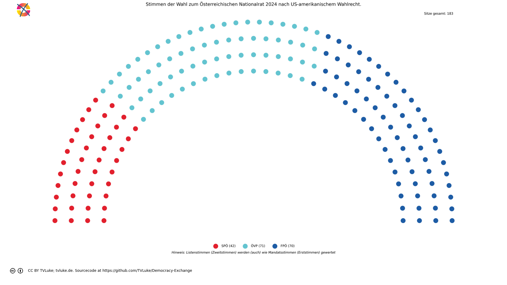

# Stimmen der Wahl zum Österreichischen Nationalrat 2024 nach US-amerikanischem Wahlrecht.
Year: 2024

## Election Statistics
- **Total Population**: 8,932,664
- **Eligible Voters**: 6,346,059
- **Total Votes Cast**: 4,910,197
- **Turnout**: 77.37%
- **Parliament Size**: 183 seats

### Vote Summary

A total of 4,910,197 votes were cast, representing a turnout of 77.4% of the electorate.

| Party | Votes | Percentage |
|-------|--------|------------|
| FPÖ | 1,413,593 | 28.8% |
| ÖVP | 1,287,623 | 26.2% |
| SPÖ | 1,038,829 | 21.2% |
| NEOS | 450,285 | 9.2% |
| GRÜNE | 406,578 | 8.3% |
| KPÖ | 118,088 | 2.4% |
| BIER | 98,989 | 2.0% |
| LMP | 28,762 | 0.6% |
| KEINE | 27,959 | 0.6% |
| MFG | 19,892 | 0.4% |
| GAZA | 19,443 | 0.4% |
| BGE | 156 | 0.0% |

**FPÖ** received the most votes with 1,413,593 votes (28.8% of total votes).

## Seat Calculation Process

# United States House of Representatives Electoral System
The US uses First-Past-The-Post (FPTP) voting where:
- Each congressional district elects one Representative
- The candidate with the most votes (plurality) in each district wins that seat
- No minimum vote threshold is required
- Districts are redrawn every 10 years following the census
- Each state is guaranteed at least one Representative

In this calculation:
- Number of districts: 39
- Target number of seats: 183

## Congressional District: Niederösterreich Mitte
This district demonstrates how First-Past-The-Post works in US House elections:

## Example Congressional District: Niederösterreich Mitte
This example shows how the Representative is determined:

Total votes cast: 198,898
- ÖVP: 56,775 votes (28.5%)
- FPÖ: 53,067 votes (26.7%)
- SPÖ: 41,277 votes (20.8%)
- NEOS: 18,809 votes (9.5%)
- GRÜNE: 17,021 votes (8.6%)
- BIER: 4,266 votes (2.1%)
- KPÖ: 3,751 votes (1.9%)
- LMP: 1,649 votes (0.8%)
- KEINE: 1,110 votes (0.6%)
- MFG: 727 votes (0.4%)
- GAZA: 446 votes (0.2%)
- BGE: 0 votes (0.0%)

Winner determination:
- Highest vote count: ÖVP with 56,775 votes (28.5%)
- Second place: FPÖ with 53,067 votes (26.7%)
- Margin of victory: 3,708 votes (1.9% of total votes)

Result: ÖVP wins this district's seat in the House of Representatives.

## Congressional District: Thermenregion
This district demonstrates how First-Past-The-Post works in US House elections:

## Example Congressional District: Thermenregion
This example shows how the Representative is determined:

Total votes cast: 160,419
- ÖVP: 40,477 votes (25.2%)
- FPÖ: 40,450 votes (25.2%)
- SPÖ: 38,649 votes (24.1%)
- NEOS: 18,898 votes (11.8%)
- GRÜNE: 13,403 votes (8.4%)
- BIER: 2,949 votes (1.8%)
- KPÖ: 2,467 votes (1.5%)
- LMP: 1,031 votes (0.6%)
- KEINE: 817 votes (0.5%)
- GAZA: 810 votes (0.5%)
- MFG: 468 votes (0.3%)
- BGE: 0 votes (0.0%)

Winner determination:
- Highest vote count: ÖVP with 40,477 votes (25.2%)
- Second place: FPÖ with 40,450 votes (25.2%)
- Margin of victory: 27 votes (0.0% of total votes)

Result: ÖVP wins this district's seat in the House of Representatives.

## Congressional District: Wien Süd
This district demonstrates how First-Past-The-Post works in US House elections:

## Example Congressional District: Wien Süd
This example shows how the Representative is determined:

Total votes cast: 141,633
- SPÖ: 46,328 votes (32.7%)
- FPÖ: 37,877 votes (26.7%)
- ÖVP: 21,795 votes (15.4%)
- GRÜNE: 11,173 votes (7.9%)
- NEOS: 11,005 votes (7.8%)
- KPÖ: 5,193 votes (3.7%)
- BIER: 3,817 votes (2.7%)
- GAZA: 2,838 votes (2.0%)
- LMP: 700 votes (0.5%)
- KEINE: 620 votes (0.4%)
- MFG: 287 votes (0.2%)
- BGE: 0 votes (0.0%)

Winner determination:
- Highest vote count: SPÖ with 46,328 votes (32.7%)
- Second place: FPÖ with 37,877 votes (26.7%)
- Margin of victory: 8,451 votes (6.0% of total votes)

Result: SPÖ wins this district's seat in the House of Representatives.

## Scaling Process Explanation
The US House system needs to scale from 39 districts to 183 total seats.

This scaling maintains proportionality through these steps:
1. Calculate scaling factor: 183 seats ÷ 39 districts = 4.6923
2. Multiply each party's district seats by this factor
3. Take the integer part first (floor)
4. Distribute remaining seats by highest decimal remainder

This preserves the proportional relationship between parties while reaching the target seat count.

Original seat distribution (showing only parties that won seats):
{
  "\u00d6VP": "15 seats (38.5%)",
  "SP\u00d6": "9 seats (23.1%)",
  "FP\u00d6": "15 seats (38.5%)"
}

Final seat distribution after scaling:
{
  "\u00d6VP": 71,
  "SP\u00d6": 42,
  "FP\u00d6": 70
}

## Visualizations
### Parliament Seating

### Coalition Possibilities
![Possible coalition combinations that form a majority, sorted by ideological distance (smaller distance means parties are closer on the left-right spectrum): ÖVP + FPÖ with 141 seats (77.0%, ideological distance: 1.0); SPÖ + ÖVP with 113 seats (61.7%, ideological distance: 3.0); SPÖ + FPÖ with 112 seats (61.2%, ideological distance: 4.0). Die "Ideologische Distanz": Für die Darstellung in korrekter Reihenfolge hat jede Partei einen left_to_right-Wert, mit 1 für die Partei, welche üblicherweise im Parlament ganz links sitzt, dann aufsteigend: Dieser Wert wird hier auch einfach als Distanzwert gewertet, um wahrscheinliche Koalitionen darzustellen. Diese Berechnung ist natürlich stark vereinfachend und in vielen Fällen einfach falsch.  Beispiel für die Koalition ÖVP-FPÖ: ÖVP: left_to_right = 4 FPÖ: left_to_right = 5 Ideologische Distanz = |4-5| = 1](../plots/austria2024_usa_coalitions.png)

### Vote vs Seat Distribution
![Bar chart comparing each party's vote percentage (darker bars) with their seat percentage (lighter bars). Parties with significant differences: FPÖ (28.8% votes vs 38.3% seats, Δ9.5%), ÖVP (26.2% votes vs 38.8% seats, Δ12.6%), SPÖ (21.2% votes vs 23.0% seats, Δ1.8%), NEOS (9.2% votes vs 0.0% seats, Δ9.2%), GRÜNE (8.3% votes vs 0.0% seats, Δ8.3%), KPÖ (2.4% votes vs 0.0% seats, Δ2.4%), BIER (2.0% votes vs 0.0% seats, Δ2.0%). Total vote-seat difference: 47.7%. (Listenstimmen werden wie Mandatsstimmen gewertet)](../plots/austria2024_usa_vote_seat_distribution.png)

### Party Vote Distribution

## Detailed Results
| Party | Votes | Vote Share | Seats | Seat Share | Representation Gap |
|-------|--------|------------|-------|------------|-------------------|
| ÖVP | 1,287,623 | 26.22% | 71 | 38.80% | 12.57% |
| FPÖ | 1,413,593 | 28.79% | 70 | 38.25% | 9.46% |
| SPÖ | 1,038,829 | 21.16% | 42 | 22.95% | 1.79% |
| BIER | 98,989 | 2.02% | 0 | 0.00% | -2.02% |
| MFG | 19,892 | 0.41% | 0 | 0.00% | -0.41% |
| BGE | 156 | 0.00% | 0 | 0.00% | -0.00% |
| LMP | 28,762 | 0.59% | 0 | 0.00% | -0.59% |
| GAZA | 19,443 | 0.40% | 0 | 0.00% | -0.40% |
| KPÖ | 118,088 | 2.40% | 0 | 0.00% | -2.40% |
| KEINE | 27,959 | 0.57% | 0 | 0.00% | -0.57% |
| GRÜNE | 406,578 | 8.28% | 0 | 0.00% | -8.28% |
| NEOS | 450,285 | 9.17% | 0 | 0.00% | -9.17% |

## Analysis of Representation
### Most Over-represented Parties
- **ÖVP**: +12.57%
- **FPÖ**: +9.46%
- **SPÖ**: +1.79%

### Most Under-represented Parties
- **NEOS**: -9.17%
- **GRÜNE**: -8.28%
- **KPÖ**: -2.40%