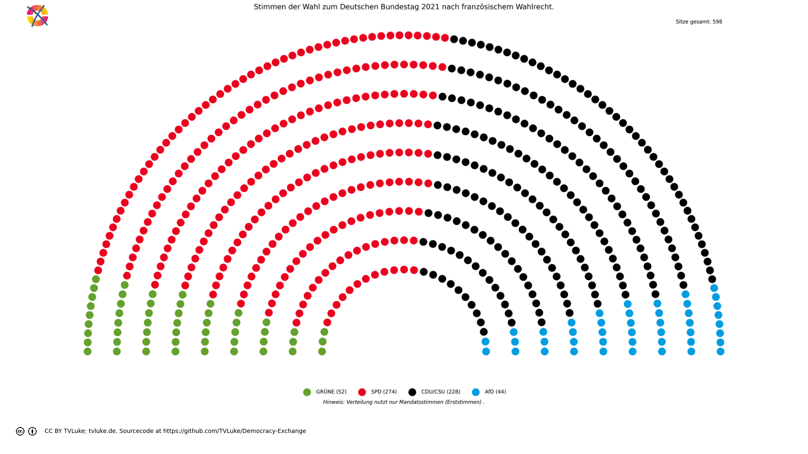

# Stimmen der Wahl zum Deutschen Bundestag 2021 nach französischem Wahlrecht.
Year: 2021

## Election Statistics
- **Total Population**: 82,711,282
- **Total Citizens**: 72,463,198
- **Eligible Voters**: 61,172,771
- **Total Votes Cast**: 46,298,387
- **Turnout**: 75.68%
- **Parliament Size**: 598 seats

### Vote Summary

A total of 46,107,986 votes were cast, representing a turnout of 75.4% of the electorate.

| Party | Votes | Percentage |
|-------|--------|------------|
| CDU/CSU | 13,233,968 | 28.7% |
| SPD | 12,184,096 | 26.4% |
| GRÜNE | 6,435,380 | 14.0% |
| AfD | 4,699,926 | 10.2% |
| FDP | 4,019,565 | 8.7% |
| DIE LINKE | 2,286,070 | 5.0% |
| FREIE WÄHLER | 1,332,710 | 2.9% |
| dieBasis | 732,620 | 1.6% |
| Die PARTEI | 540,170 | 1.2% |
| Tierschutzpartei | 160,865 | 0.3% |
| ÖDP | 152,542 | 0.3% |
| Volt | 77,594 | 0.2% |
| PIRATEN | 60,548 | 0.1% |
| BP | 36,748 | 0.1% |
| SSW | 35,027 | 0.1% |
| MLPD | 22,535 | 0.0% |
| UNABHÄNGIGE | 13,421 | 0.0% |
| Die Humanisten | 12,672 | 0.0% |
| Wir Bürger (2021: LKR) | 11,005 | 0.0% |
| V-Partei³ | 10,644 | 0.0% |
| Tierschutzallianz | 7,371 | 0.0% |
| Bündnis C | 6,222 | 0.0% |
| DKP | 5,446 | 0.0% |
| Team Todenhöfer | 5,422 | 0.0% |
| KlimalisteBW | 3,967 | 0.0% |
| DiB | 2,609 | 0.0% |
| Verjüngungsforschung (2021: Gesundheitsforschung) | 2,171 | 0.0% |
| Gartenpartei | 2,095 | 0.0% |
| Die Grauen | 1,962 | 0.0% |
| du. | 1,890 | 0.0% |
| FAMILIE | 1,817 | 0.0% |
| BÜRGERBEWEGUNG | 1,556 | 0.0% |
| HEIMAT (2021: NPD) | 1,090 | 0.0% |
| Volksabstimmung | 1,086 | 0.0% |
| Graue Panther | 961 | 0.0% |
| LIEBE | 873 | 0.0% |
| BüSo | 811 | 0.0% |
| MENSCHLICHE WELT | 652 | 0.0% |
| THP | 549 | 0.0% |
| III. Weg | 515 | 0.0% |
| BÜNDNIS21 | 372 | 0.0% |
| sonstige | 251 | 0.0% |
| B* | 192 | 0.0% |
| SGP | 0 | 0.0% |
| PdF | 0 | 0.0% |
| LfK | 0 | 0.0% |

**CDU/CSU** received the most votes with 13,233,968 votes (28.7% of total votes).

## Seat Calculation Process

## French Electoral System Explanation

This election uses the French two-round voting system (scrutin uninominal majoritaire à deux tours):

1. **First Round**
   - All candidates can participate
   - If a candidate receives >50% of votes AND ≥25% of registered voters, they win immediately
   - Otherwise, qualified candidates proceed to second round

2. **Second Round Qualification**
   - Candidates need ≥12.5% of votes to qualify
   - If no candidates reach 12.5%, top two advance
   - When no second round data is provided, votes are simulated:
     * 80% of votes from eliminated parties go to parties with same left-right position
     * 30% of remaining votes go to parties within 1 position on left-right scale
     * Other votes are considered lost/abstentions

Key Features:
- 598 total seats to be distributed
- Single-member constituencies
- Two rounds if no absolute majority in first round

3. **Seat Scaling**
   When the required number of seats (598) differs from the number of districts (299),
   we use proportional scaling to maintain fair representation:
   - First calculate results for all districts
   - Then multiply each party's seats by (total_seats / number_of_districts)
   - Round to nearest whole number while preserving total seats
   - This maintains the proportional representation from the district results
   
   Example: If we have 100 districts but need 200 seats:
   - Party A wins 60 districts → scaled to 120 seats (60 * 200/100)
   - Party B wins 40 districts → scaled to 80 seats (40 * 200/100)
   The relative strength of each party remains the same.

## Example Districts

To illustrate how the French two-round system works in practice, here are three example districts:

### Example 1: Flensburg – Schleswig

**First Round Results:**
- Total votes cast: 178,625
- Registered voters: 357,250

**Party Results:**
- SPD: 45,508 votes (25.5% of votes, 12.7% of registered)
- CDU/CSU: 36,421 votes (20.4% of votes, 10.2% of registered)
- GRÜNE: 33,300 votes (18.6% of votes, 9.3% of registered)
- FDP: 19,189 votes (10.7% of votes, 5.4% of registered)
- SSW: 16,415 votes (9.2% of votes, 4.6% of registered)
- AfD: 10,317 votes (5.8% of votes, 2.9% of registered)
- DIE LINKE: 7,475 votes (4.2% of votes, 2.1% of registered)
- dieBasis: 2,866 votes (1.6% of votes, 0.8% of registered)
- Tierschutzpartei: 1,990 votes (1.1% of votes, 0.6% of registered)
- Die PARTEI: 1,844 votes (1.0% of votes, 0.5% of registered)
- FREIE WÄHLER: 1,715 votes (1.0% of votes, 0.5% of registered)
- Volt: 403 votes (0.2% of votes, 0.1% of registered)
- Team Todenhöfer: 318 votes (0.2% of votes, 0.1% of registered)
- V-Partei³: 194 votes (0.1% of votes, 0.1% of registered)
- Die Humanisten: 157 votes (0.1% of votes, 0.0% of registered)
- HEIMAT (2021: NPD): 138 votes (0.1% of votes, 0.0% of registered)
- ÖDP: 132 votes (0.1% of votes, 0.0% of registered)
- du.: 118 votes (0.1% of votes, 0.0% of registered)
- Wir Bürger (2021: LKR): 73 votes (0.0% of votes, 0.0% of registered)
- DKP: 40 votes (0.0% of votes, 0.0% of registered)
- MLPD: 12 votes (0.0% of votes, 0.0% of registered)

**Second Round:** Parties qualifying (≥12.5%):
- GRÜNE: 33,300 votes (18.6%)
- SPD: 45,508 votes (25.5%)
- CDU/CSU: 36,421 votes (20.4%)

**Vote Redistribution Simulation:**
Vote Transfers:
- FDP → CDU/CSU: 1,439 votes
- FDP: 17,750 votes lost/abstained
- AfD: 10,317 votes lost/abstained
- DIE LINKE → GRÜNE: 89 votes
- DIE LINKE: 7,386 votes lost/abstained
- Die PARTEI → GRÜNE: 368 votes
- Die PARTEI: 1,476 votes lost/abstained
- FREIE WÄHLER → CDU/CSU: 1,372 votes
- FREIE WÄHLER: 343 votes lost/abstained
- HEIMAT (2021: NPD): 138 votes lost/abstained
- ÖDP → GRÜNE: 26 votes
- ÖDP: 106 votes lost/abstained
- MLPD: 12 votes lost/abstained
- dieBasis: 2,866 votes lost/abstained
- DKP: 40 votes lost/abstained
- du.: 118 votes lost/abstained
- Wir Bürger (2021: LKR): 73 votes lost/abstained
- Die Humanisten: 157 votes lost/abstained
- Tierschutzpartei → GRÜNE: 398 votes
- Tierschutzpartei: 1,592 votes lost/abstained
- SSW → GRÜNE: 820 votes
- SSW → SPD: 820 votes
- SSW: 14,775 votes lost/abstained
- Team Todenhöfer: 318 votes lost/abstained
- Volt → GRÜNE: 4 votes
- Volt: 399 votes lost/abstained
- V-Partei³: 194 votes lost/abstained

**Final Second Round Result:**
- SPD: 46,328 votes (25.9%)
- CDU/CSU: 39,232 votes (22.0%)
- GRÜNE: 35,005 votes (19.6%)

**Result:** SPD wins the simulated second round

### Example 2: Flensburg – Schleswig

**First Round Results:**
- Total votes cast: 178,625
- Registered voters: 357,250

**Party Results:**
- SPD: 45,508 votes (25.5% of votes, 12.7% of registered)
- CDU/CSU: 36,421 votes (20.4% of votes, 10.2% of registered)
- GRÜNE: 33,300 votes (18.6% of votes, 9.3% of registered)
- FDP: 19,189 votes (10.7% of votes, 5.4% of registered)
- SSW: 16,415 votes (9.2% of votes, 4.6% of registered)
- AfD: 10,317 votes (5.8% of votes, 2.9% of registered)
- DIE LINKE: 7,475 votes (4.2% of votes, 2.1% of registered)
- dieBasis: 2,866 votes (1.6% of votes, 0.8% of registered)
- Tierschutzpartei: 1,990 votes (1.1% of votes, 0.6% of registered)
- Die PARTEI: 1,844 votes (1.0% of votes, 0.5% of registered)
- FREIE WÄHLER: 1,715 votes (1.0% of votes, 0.5% of registered)
- Volt: 403 votes (0.2% of votes, 0.1% of registered)
- Team Todenhöfer: 318 votes (0.2% of votes, 0.1% of registered)
- V-Partei³: 194 votes (0.1% of votes, 0.1% of registered)
- Die Humanisten: 157 votes (0.1% of votes, 0.0% of registered)
- HEIMAT (2021: NPD): 138 votes (0.1% of votes, 0.0% of registered)
- ÖDP: 132 votes (0.1% of votes, 0.0% of registered)
- du.: 118 votes (0.1% of votes, 0.0% of registered)
- Wir Bürger (2021: LKR): 73 votes (0.0% of votes, 0.0% of registered)
- DKP: 40 votes (0.0% of votes, 0.0% of registered)
- MLPD: 12 votes (0.0% of votes, 0.0% of registered)

**Second Round:** Parties qualifying (≥12.5%):
- GRÜNE: 33,300 votes (18.6%)
- SPD: 45,508 votes (25.5%)
- CDU/CSU: 36,421 votes (20.4%)

**Vote Redistribution Simulation:**
Vote Transfers:
- FDP → CDU/CSU: 1,439 votes
- FDP: 17,750 votes lost/abstained
- AfD: 10,317 votes lost/abstained
- DIE LINKE → GRÜNE: 89 votes
- DIE LINKE: 7,386 votes lost/abstained
- Die PARTEI → GRÜNE: 368 votes
- Die PARTEI: 1,476 votes lost/abstained
- FREIE WÄHLER → CDU/CSU: 1,372 votes
- FREIE WÄHLER: 343 votes lost/abstained
- HEIMAT (2021: NPD): 138 votes lost/abstained
- ÖDP → GRÜNE: 26 votes
- ÖDP: 106 votes lost/abstained
- MLPD: 12 votes lost/abstained
- dieBasis: 2,866 votes lost/abstained
- DKP: 40 votes lost/abstained
- du.: 118 votes lost/abstained
- Wir Bürger (2021: LKR): 73 votes lost/abstained
- Die Humanisten: 157 votes lost/abstained
- Tierschutzpartei → GRÜNE: 398 votes
- Tierschutzpartei: 1,592 votes lost/abstained
- SSW → GRÜNE: 820 votes
- SSW → SPD: 820 votes
- SSW: 14,775 votes lost/abstained
- Team Todenhöfer: 318 votes lost/abstained
- Volt → GRÜNE: 4 votes
- Volt: 399 votes lost/abstained
- V-Partei³: 194 votes lost/abstained

**Final Second Round Result:**
- SPD: 46,328 votes (25.9%)
- CDU/CSU: 39,232 votes (22.0%)
- GRÜNE: 35,005 votes (19.6%)

**Result:** SPD wins the simulated second round

### Example 3: Flensburg – Schleswig

**First Round Results:**
- Total votes cast: 178,625
- Registered voters: 357,250

**Party Results:**
- SPD: 45,508 votes (25.5% of votes, 12.7% of registered)
- CDU/CSU: 36,421 votes (20.4% of votes, 10.2% of registered)
- GRÜNE: 33,300 votes (18.6% of votes, 9.3% of registered)
- FDP: 19,189 votes (10.7% of votes, 5.4% of registered)
- SSW: 16,415 votes (9.2% of votes, 4.6% of registered)
- AfD: 10,317 votes (5.8% of votes, 2.9% of registered)
- DIE LINKE: 7,475 votes (4.2% of votes, 2.1% of registered)
- dieBasis: 2,866 votes (1.6% of votes, 0.8% of registered)
- Tierschutzpartei: 1,990 votes (1.1% of votes, 0.6% of registered)
- Die PARTEI: 1,844 votes (1.0% of votes, 0.5% of registered)
- FREIE WÄHLER: 1,715 votes (1.0% of votes, 0.5% of registered)
- Volt: 403 votes (0.2% of votes, 0.1% of registered)
- Team Todenhöfer: 318 votes (0.2% of votes, 0.1% of registered)
- V-Partei³: 194 votes (0.1% of votes, 0.1% of registered)
- Die Humanisten: 157 votes (0.1% of votes, 0.0% of registered)
- HEIMAT (2021: NPD): 138 votes (0.1% of votes, 0.0% of registered)
- ÖDP: 132 votes (0.1% of votes, 0.0% of registered)
- du.: 118 votes (0.1% of votes, 0.0% of registered)
- Wir Bürger (2021: LKR): 73 votes (0.0% of votes, 0.0% of registered)
- DKP: 40 votes (0.0% of votes, 0.0% of registered)
- MLPD: 12 votes (0.0% of votes, 0.0% of registered)

**Second Round:** Parties qualifying (≥12.5%):
- GRÜNE: 33,300 votes (18.6%)
- SPD: 45,508 votes (25.5%)
- CDU/CSU: 36,421 votes (20.4%)

**Vote Redistribution Simulation:**
Vote Transfers:
- FDP → CDU/CSU: 1,439 votes
- FDP: 17,750 votes lost/abstained
- AfD: 10,317 votes lost/abstained
- DIE LINKE → GRÜNE: 89 votes
- DIE LINKE: 7,386 votes lost/abstained
- Die PARTEI → GRÜNE: 368 votes
- Die PARTEI: 1,476 votes lost/abstained
- FREIE WÄHLER → CDU/CSU: 1,372 votes
- FREIE WÄHLER: 343 votes lost/abstained
- HEIMAT (2021: NPD): 138 votes lost/abstained
- ÖDP → GRÜNE: 26 votes
- ÖDP: 106 votes lost/abstained
- MLPD: 12 votes lost/abstained
- dieBasis: 2,866 votes lost/abstained
- DKP: 40 votes lost/abstained
- du.: 118 votes lost/abstained
- Wir Bürger (2021: LKR): 73 votes lost/abstained
- Die Humanisten: 157 votes lost/abstained
- Tierschutzpartei → GRÜNE: 398 votes
- Tierschutzpartei: 1,592 votes lost/abstained
- SSW → GRÜNE: 820 votes
- SSW → SPD: 820 votes
- SSW: 14,775 votes lost/abstained
- Team Todenhöfer: 318 votes lost/abstained
- Volt → GRÜNE: 4 votes
- Volt: 399 votes lost/abstained
- V-Partei³: 194 votes lost/abstained

**Final Second Round Result:**
- SPD: 46,328 votes (25.9%)
- CDU/CSU: 39,232 votes (22.0%)
- GRÜNE: 35,005 votes (19.6%)

**Result:** SPD wins the simulated second round

## Seat Scaling Applied

Scaling from 299 districts to 598 total seats:

### Before Scaling (299 seats)
| Party | Seats | Percentage |
|-------|--------|------------|
| SPD | 137 | 45.8% |
| CDU/CSU | 114 | 38.1% |
| GRÜNE | 26 | 8.7% |
| AfD | 22 | 7.4% |

### After Scaling (598 seats)
| Party | Seats | Percentage | Change |
|-------|--------|------------|---------|
| SPD | 274 | 45.8% | +0.0% |
| CDU/CSU | 228 | 38.1% | +0.0% |
| GRÜNE | 52 | 8.7% | +0.0% |
| AfD | 44 | 7.4% | +0.0% |

Scaling Details:
- Scaling factor: 2.000
- Each party's seats multiplied by this factor and rounded
- Total seats preserved through rounding adjustments
- Percentages of total seats remain nearly identical

## Visualizations
### Parliament Seating

### Coalition Possibilities
![Possible coalition combinations that form a majority, sorted by ideological distance (smaller distance means parties are closer on the left-right spectrum): GRÜNE + SPD with 326 seats (54.5%, ideological distance: 2.0); SPD + CDU/CSU with 502 seats (83.9%, ideological distance: 2.0); SPD + AfD with 318 seats (53.2%, ideological distance: 4.0); GRÜNE + CDU/CSU + AfD with 324 seats (54.2%, ideological distance: 12.0). Die "Ideologische Distanz": Für die Darstellung in korrekter Reihenfolge hat jede Partei einen left_to_right-Wert, mit 1 für die Partei, welche üblicherweise im Parlament ganz links sitzt, dann aufsteigend: Dieser Wert wird hier auch einfach als Distanzwert gewertet, um wahrscheinliche Koalitionen darzustellen. Diese Berechnung ist natürlich stark vereinfachend und in vielen Fällen einfach falsch.  Beispiel für die Koalition GRÜNE-CDU/CSU-AfD: GRÜNE: left_to_right = 2 CDU/CSU: left_to_right = 6 AfD: left_to_right = 8 Ideologische Distanz = |2-6| + |2-8| + |6-8| = 12](../plots/germany2021_france_coalitions.png)

### Vote vs Seat Distribution
![Bar chart comparing each party's vote percentage (darker bars) with their seat percentage (lighter bars). Parties with significant differences: SPD (25.7% votes vs 45.8% seats, Δ20.1%), CDU/CSU (24.1% votes vs 38.1% seats, Δ14.0%), GRÜNE (14.7% votes vs 8.7% seats, Δ6.0%), FDP (11.4% votes vs 0.0% seats, Δ11.4%), AfD (10.4% votes vs 7.4% seats, Δ3.0%), DIE LINKE (4.9% votes vs 0.0% seats, Δ4.9%), FREIE WÄHLER (2.4% votes vs 0.0% seats, Δ2.4%), Tierschutzpartei (1.5% votes vs 0.0% seats, Δ1.5%), dieBasis (1.4% votes vs 0.0% seats, Δ1.4%). Total vote-seat difference: 68.2%. (Mandatsstimmen)](../plots/germany2021_france_vote_seat_distribution.png)

### Party Vote Distribution

## Detailed Results
| Party | Votes | Vote Share | Seats | Seat Share | Representation Gap |
|-------|--------|------------|-------|------------|-------------------|
| SPD | 11,901,558 | 25.71% | 274 | 45.82% | 20.11% |
| CDU/CSU | 11,177,747 | 24.14% | 228 | 38.13% | 13.98% |
| GRÜNE | 6,814,408 | 14.72% | 52 | 8.70% | -6.02% |
| AfD | 4,809,233 | 10.39% | 44 | 7.36% | -3.03% |
| BP | 32,790 | 0.07% | 0 | 0.00% | -0.07% |
| BÜNDNIS21 | 3,488 | 0.01% | 0 | 0.00% | -0.01% |
| BÜRGERBEWEGUNG | 7,491 | 0.02% | 0 | 0.00% | -0.02% |
| BüSo | 665 | 0.00% | 0 | 0.00% | -0.00% |
| Bündnis C | 39,868 | 0.09% | 0 | 0.00% | -0.09% |
| DKP | 14,957 | 0.03% | 0 | 0.00% | -0.03% |
| DiB | 7,184 | 0.02% | 0 | 0.00% | -0.02% |
| Die Grauen | 17,304 | 0.04% | 0 | 0.00% | -0.04% |
| Die Humanisten | 47,524 | 0.10% | 0 | 0.00% | -0.10% |
| Gartenpartei | 7,611 | 0.02% | 0 | 0.00% | -0.02% |
| LIEBE | 12,967 | 0.03% | 0 | 0.00% | -0.03% |
| LfK | 9,189 | 0.02% | 0 | 0.00% | -0.02% |
| MENSCHLICHE WELT | 3,786 | 0.01% | 0 | 0.00% | -0.01% |
| MLPD | 17,820 | 0.04% | 0 | 0.00% | -0.04% |
| PdF | 3,228 | 0.01% | 0 | 0.00% | -0.01% |
| SGP | 1,399 | 0.00% | 0 | 0.00% | -0.00% |
| Team Todenhöfer | 211,854 | 0.46% | 0 | 0.00% | -0.46% |
| Tierschutzallianz | 13,672 | 0.03% | 0 | 0.00% | -0.03% |
| UNABHÄNGIGE | 22,736 | 0.05% | 0 | 0.00% | -0.05% |
| V-Partei³ | 31,763 | 0.07% | 0 | 0.00% | -0.07% |
| Verjüngungsforschung (2021: Gesundheitsforschung) | 48,496 | 0.10% | 0 | 0.00% | -0.10% |
| Wir Bürger (2021: LKR) | 11,328 | 0.02% | 0 | 0.00% | -0.02% |
| du. | 17,738 | 0.04% | 0 | 0.00% | -0.04% |
| DIE LINKE | 2,255,864 | 4.87% | 0 | 0.00% | -4.87% |
| Volt | 164,300 | 0.35% | 0 | 0.00% | -0.35% |
| Die PARTEI | 460,431 | 0.99% | 0 | 0.00% | -0.99% |
| PIRATEN | 169,587 | 0.37% | 0 | 0.00% | -0.37% |
| Tierschutzpartei | 673,669 | 1.46% | 0 | 0.00% | -1.46% |
| ÖDP | 112,129 | 0.24% | 0 | 0.00% | -0.24% |
| SSW | 55,578 | 0.12% | 0 | 0.00% | -0.12% |
| FREIE WÄHLER | 1,125,667 | 2.43% | 0 | 0.00% | -2.43% |
| FDP | 5,291,013 | 11.43% | 0 | 0.00% | -11.43% |
| dieBasis | 630,153 | 1.36% | 0 | 0.00% | -1.36% |
| HEIMAT (2021: NPD) | 64,360 | 0.14% | 0 | 0.00% | -0.14% |
| III. Weg | 7,832 | 0.02% | 0 | 0.00% | -0.02% |

## Analysis of Representation
### Most Over-represented Parties
- **SPD**: +20.11%
- **CDU/CSU**: +13.98%
- **BüSo**: +-0.00%

### Most Under-represented Parties
- **FDP**: -11.43%
- **GRÜNE**: -6.02%
- **DIE LINKE**: -4.87%

## Sources

### Data Sources
- [Gesamtergebnis laut Bundeswahlleiterin](https://www.bundeswahlleiterin.de/bundestagswahlen/2021/ergebnisse/opendata/btw21/20240211_wdhwahl-vgl2021/daten/gesamtergebnis_01.xml)
- [Demografische Daten zu den Wahlkreisen. Statistisches Bundesamt.](https://ergebnisse.zensus2022.de/datenbank/online/table/4000W-1W11)

### About the Electoral System
- [Assemblée nationale (National Assembly) (http://archive.ipu.org/)](http://archive.ipu.org/parline/reports/2113_B.htm)