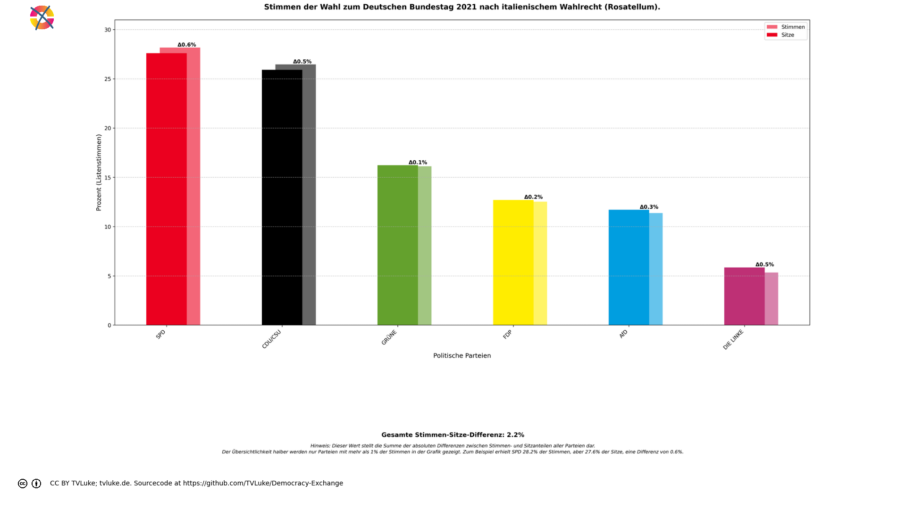
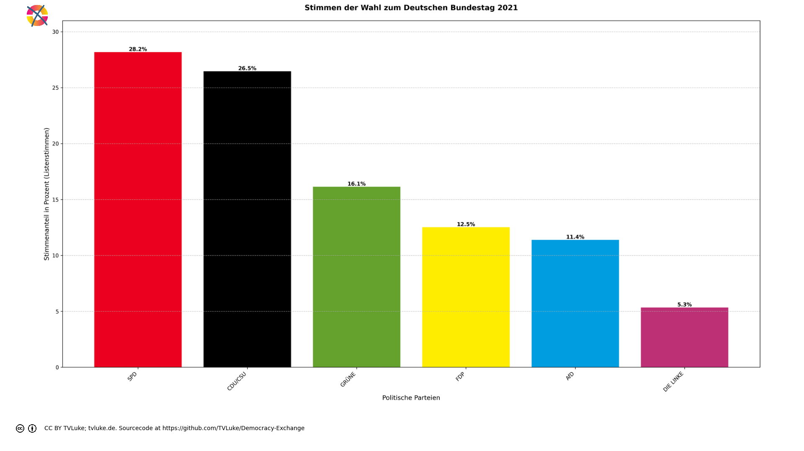

# Stimmen der Wahl zum Deutschen Bundestag 2021 nach italienischem Wahlrecht (Rosatellum).
Year: 2021

## Election Statistics
- **Total Population**: 82,711,282
- **Total Citizens**: 72,463,198
- **Eligible Voters**: 61,172,771
- **Total Votes Cast**: 42,249,823
- **Turnout**: 69.07%
- **Parliament Size**: 598 seats

### Vote Summary

A total of 46,298,387 votes were cast, representing a turnout of 75.7% of the electorate.

| Party | Votes | Percentage |
|-------|--------|------------|
| SPD | 11,901,558 | 25.7% |
| CDU/CSU | 11,177,747 | 24.1% |
| GRÜNE | 6,814,408 | 14.7% |
| FDP | 5,291,013 | 11.4% |
| AfD | 4,809,233 | 10.4% |
| DIE LINKE | 2,255,864 | 4.9% |
| FREIE WÄHLER | 1,125,667 | 2.4% |
| Tierschutzpartei | 673,669 | 1.5% |
| dieBasis | 630,153 | 1.4% |
| Die PARTEI | 460,431 | 1.0% |
| Team Todenhöfer | 211,854 | 0.5% |
| PIRATEN | 169,587 | 0.4% |
| Volt | 164,300 | 0.4% |
| ÖDP | 112,129 | 0.2% |
| HEIMAT (2021: NPD) | 64,360 | 0.1% |
| SSW | 55,578 | 0.1% |
| Verjüngungsforschung (2021: Gesundheitsforschung) | 48,496 | 0.1% |
| Die Humanisten | 47,524 | 0.1% |
| Bündnis C | 39,868 | 0.1% |
| BP | 32,790 | 0.1% |
| V-Partei³ | 31,763 | 0.1% |
| UNABHÄNGIGE | 22,736 | 0.0% |
| MLPD | 17,820 | 0.0% |
| du. | 17,738 | 0.0% |
| Die Grauen | 17,304 | 0.0% |
| DKP | 14,957 | 0.0% |
| Tierschutzallianz | 13,672 | 0.0% |
| LIEBE | 12,967 | 0.0% |
| Wir Bürger (2021: LKR) | 11,328 | 0.0% |
| LfK | 9,189 | 0.0% |
| III. Weg | 7,832 | 0.0% |
| Gartenpartei | 7,611 | 0.0% |
| BÜRGERBEWEGUNG | 7,491 | 0.0% |
| DiB | 7,184 | 0.0% |
| MENSCHLICHE WELT | 3,786 | 0.0% |
| BÜNDNIS21 | 3,488 | 0.0% |
| PdF | 3,228 | 0.0% |
| SGP | 1,399 | 0.0% |
| BüSo | 665 | 0.0% |
| FAMILIE | 0 | 0.0% |
| sonstige | 0 | 0.0% |
| B* | 0 | 0.0% |
| Volksabstimmung | 0 | 0.0% |
| Graue Panther | 0 | 0.0% |
| THP | 0 | 0.0% |
| KlimalisteBW | 0 | 0.0% |

**SPD** received the most votes with 11,901,558 votes (25.7% of total votes).

## Seat Calculation Process
## Electoral System Description

Das italienische Wahlsystem 'Rosatellum' für die Abgeordnetenkammer (Camera dei deputati):

Grundsätze:
- Gemischtes Wahlsystem mit zwei Komponenten:
  * 36% der Sitze durch Mehrheitswahl in Einerwahlkreisen (FPTP)
  * 64% der Sitze durch Verhältniswahl mit Parteilisten (PR)

Sperrklauseln:
- Einzelne Parteien: 3% der Gesamtstimmen
- Wahlbündnisse (Koalitionen): 10% der Gesamtstimmen
  * Mindestens eine Partei im Bündnis muss 3% erreichen

Besonderheiten:
- Eine Stimme zählt sowohl für Direkt- als auch Listenmandat
- Stimmen von Parteien zwischen 1-3% werden auf Koalitionspartner über 3% verteilt
- Parteien müssen Koalitionszugehörigkeit vor der Wahl erklären
- Verteilung der Verhältniswahlsitze nach dem Hare-Niemeyer-Verfahren
- Insgesamt 630 Sitze in der Abgeordnetenkammer

Ablauf der Sitzverteilung:
1. Direktmandate (36%):
   - In jedem Wahlkreis gewinnt der Kandidat mit den meisten Stimmen
   - 36% der Sitze werden durch Direktmandate vergeben (bei 630 Sitzen: 226 Sitze)

2. Verhältniswahlmandate (64%):
   - Nur Parteien über der Sperrklausel werden berücksichtigt
   - 404 Sitze nach Verhältniswahl mit Hare-Niemeyer
   - Restmandate nach größten Dezimalstellen

Dieses System wurde 2017 eingeführt und nach seinem Autor Ettore Rosato benannt.

Seat allocation:

Direct allocation seats (36%): 215

Proportional seats (64%): 383

=== Example Districts ===
Here are three randomly selected districts showing how votes are counted and allocated:

## District: Schwerin – Ludwigslust-Parchim I – Nordwestmecklenburg I
This district demonstrates how votes are split between direct mandate (36%) and proportional representation (64%):

Total votes cast: 154,163
- SPD: 49,271 votes (32.0%)
- CDU/CSU: 26,383 votes (17.1%)
- AfD: 24,185 votes (15.7%)
- DIE LINKE: 16,604 votes (10.8%)
- FDP: 13,242 votes (8.6%)
- GRÜNE: 12,419 votes (8.1%)
- Tierschutzpartei: 2,645 votes (1.7%)
- FREIE WÄHLER: 2,476 votes (1.6%)
- dieBasis: 2,207 votes (1.4%)
- Die PARTEI: 1,252 votes (0.8%)
- HEIMAT (2021: NPD): 1,112 votes (0.7%)
- PIRATEN: 1,023 votes (0.7%)
- Team Todenhöfer: 399 votes (0.3%)
- Volt: 381 votes (0.2%)
- Die Humanisten: 175 votes (0.1%)
- ÖDP: 151 votes (0.1%)
- DKP: 121 votes (0.1%)
- MLPD: 117 votes (0.1%)

Direct mandate winner:
- SPD: 49,271 votes (32.0%)

Vote allocation:
- Direct votes (36%): 55,498 votes for FPTP allocation
- Proportional votes (64%): 98,664 votes for PR allocation

## District: Regensburg
This district demonstrates how votes are split between direct mandate (36%) and proportional representation (64%):

Total votes cast: 198,175
- CDU/CSU: 61,187 votes (30.9%)
- SPD: 34,563 votes (17.4%)
- GRÜNE: 32,094 votes (16.2%)
- FDP: 18,773 votes (9.5%)
- AfD: 17,343 votes (8.8%)
- FREIE WÄHLER: 16,618 votes (8.4%)
- DIE LINKE: 6,798 votes (3.4%)
- dieBasis: 2,526 votes (1.3%)
- Tierschutzpartei: 1,884 votes (1.0%)
- Die PARTEI: 1,485 votes (0.7%)
- ÖDP: 1,419 votes (0.7%)
- BP: 963 votes (0.5%)
- PIRATEN: 528 votes (0.3%)
- Volt: 412 votes (0.2%)
- Team Todenhöfer: 335 votes (0.2%)
- UNABHÄNGIGE: 243 votes (0.1%)
- Die Humanisten: 196 votes (0.1%)
- V-Partei³: 189 votes (0.1%)
- Verjüngungsforschung (2021: Gesundheitsforschung): 178 votes (0.1%)
- HEIMAT (2021: NPD): 101 votes (0.1%)
- Bündnis C: 85 votes (0.0%)
- du.: 82 votes (0.0%)
- III. Weg: 54 votes (0.0%)
- Wir Bürger (2021: LKR): 51 votes (0.0%)
- DKP: 47 votes (0.0%)
- MLPD: 21 votes (0.0%)

Direct mandate winner:
- CDU/CSU: 61,187 votes (30.9%)

Vote allocation:
- Direct votes (36%): 71,343 votes for FPTP allocation
- Proportional votes (64%): 126,832 votes for PR allocation

## District: Erlangen
This district demonstrates how votes are split between direct mandate (36%) and proportional representation (64%):

Total votes cast: 154,708
- CDU/CSU: 44,664 votes (28.9%)
- GRÜNE: 31,222 votes (20.2%)
- SPD: 30,146 votes (19.5%)
- FDP: 16,062 votes (10.4%)
- AfD: 10,872 votes (7.0%)
- FREIE WÄHLER: 7,081 votes (4.6%)
- DIE LINKE: 5,817 votes (3.8%)
- dieBasis: 2,084 votes (1.3%)
- Tierschutzpartei: 1,370 votes (0.9%)
- Die PARTEI: 1,210 votes (0.8%)
- ÖDP: 1,077 votes (0.7%)
- PIRATEN: 676 votes (0.4%)
- Volt: 529 votes (0.3%)
- Team Todenhöfer: 496 votes (0.3%)
- UNABHÄNGIGE: 235 votes (0.2%)
- Die Humanisten: 220 votes (0.1%)
- BP: 202 votes (0.1%)
- V-Partei³: 175 votes (0.1%)
- Verjüngungsforschung (2021: Gesundheitsforschung): 153 votes (0.1%)
- Bündnis C: 120 votes (0.1%)
- HEIMAT (2021: NPD): 102 votes (0.1%)
- du.: 70 votes (0.0%)
- III. Weg: 61 votes (0.0%)
- MLPD: 31 votes (0.0%)
- Wir Bürger (2021: LKR): 19 votes (0.0%)
- DKP: 14 votes (0.0%)

Direct mandate winner:
- CDU/CSU: 44,664 votes (28.9%)

Vote allocation:
- Direct votes (36%): 55,694 votes for FPTP allocation
- Proportional votes (64%): 99,013 votes for PR allocation

=== Party Vote Totals ===

SPD: 11,901,558 total votes
  - Direct votes (36%): 4,284,425
  - Proportional votes (64%): 7,616,846

FDP: 5,291,013 total votes
  - Direct votes (36%): 1,904,625
  - Proportional votes (64%): 3,386,103

GRÜNE: 6,814,408 total votes
  - Direct votes (36%): 2,453,041
  - Proportional votes (64%): 4,361,078

AfD: 4,809,233 total votes
  - Direct votes (36%): 1,731,177
  - Proportional votes (64%): 3,077,769

DIE LINKE: 2,255,864 total votes
  - Direct votes (36%): 811,969
  - Proportional votes (64%): 1,443,610

Die PARTEI: 460,431 total votes
  - Direct votes (36%): 165,606
  - Proportional votes (64%): 294,536

FREIE WÄHLER: 1,125,667 total votes
  - Direct votes (36%): 405,098
  - Proportional votes (64%): 720,279

HEIMAT (2021: NPD): 64,360 total votes
  - Direct votes (36%): 23,034
  - Proportional votes (64%): 41,046

ÖDP: 112,129 total votes
  - Direct votes (36%): 40,223
  - Proportional votes (64%): 71,618

MLPD: 17,820 total votes
  - Direct votes (36%): 6,277
  - Proportional votes (64%): 11,260

dieBasis: 630,153 total votes
  - Direct votes (36%): 226,716
  - Proportional votes (64%): 403,161

DKP: 14,957 total votes
  - Direct votes (36%): 5,258
  - Proportional votes (64%): 9,443

du.: 17,738 total votes
  - Direct votes (36%): 6,306
  - Proportional votes (64%): 11,260

Wir Bürger (2021: LKR): 11,328 total votes
  - Direct votes (36%): 3,970
  - Proportional votes (64%): 7,127

Die Humanisten: 47,524 total votes
  - Direct votes (36%): 16,962
  - Proportional votes (64%): 30,278

Tierschutzpartei: 673,669 total votes
  - Direct votes (36%): 242,378
  - Proportional votes (64%): 431,003

SSW: 55,578 total votes
  - Direct votes (36%): 20,001
  - Proportional votes (64%): 35,566

Team Todenhöfer: 211,854 total votes
  - Direct votes (36%): 76,131
  - Proportional votes (64%): 135,448

Volt: 164,300 total votes
  - Direct votes (36%): 59,015
  - Proportional votes (64%): 105,000

V-Partei³: 31,763 total votes
  - Direct votes (36%): 11,328
  - Proportional votes (64%): 20,213

CDU/CSU: 11,177,747 total votes
  - Direct votes (36%): 4,023,847
  - Proportional votes (64%): 7,153,615

PIRATEN: 169,587 total votes
  - Direct votes (36%): 60,919
  - Proportional votes (64%): 108,395

UNABHÄNGIGE: 22,736 total votes
  - Direct votes (36%): 8,159
  - Proportional votes (64%): 14,524

BÜNDNIS21: 3,488 total votes
  - Direct votes (36%): 1,226
  - Proportional votes (64%): 2,200

MENSCHLICHE WELT: 3,786 total votes
  - Direct votes (36%): 1,357
  - Proportional votes (64%): 2,419

FAMILIE: 0 total votes
  - Direct votes (36%): 0
  - Proportional votes (64%): 0

Tierschutzallianz: 13,672 total votes
  - Direct votes (36%): 4,918
  - Proportional votes (64%): 8,745

Gartenpartei: 7,611 total votes
  - Direct votes (36%): 2,735
  - Proportional votes (64%): 4,867

Die Grauen: 17,304 total votes
  - Direct votes (36%): 6,223
  - Proportional votes (64%): 11,069

Verjüngungsforschung (2021: Gesundheitsforschung): 48,496 total votes
  - Direct votes (36%): 17,362
  - Proportional votes (64%): 30,943

BüSo: 665 total votes
  - Direct votes (36%): 231
  - Proportional votes (64%): 422

SGP: 1,399 total votes
  - Direct votes (36%): 465
  - Proportional votes (64%): 860

sonstige: 0 total votes
  - Direct votes (36%): 0
  - Proportional votes (64%): 0

B*: 0 total votes
  - Direct votes (36%): 0
  - Proportional votes (64%): 0

Bündnis C: 39,868 total votes
  - Direct votes (36%): 14,265
  - Proportional votes (64%): 25,425

LIEBE: 12,967 total votes
  - Direct votes (36%): 4,638
  - Proportional votes (64%): 8,265

PdF: 3,228 total votes
  - Direct votes (36%): 1,133
  - Proportional votes (64%): 2,034

LfK: 9,189 total votes
  - Direct votes (36%): 3,279
  - Proportional votes (64%): 5,847

Volksabstimmung: 0 total votes
  - Direct votes (36%): 0
  - Proportional votes (64%): 0

III. Weg: 7,832 total votes
  - Direct votes (36%): 2,791
  - Proportional votes (64%): 4,983

Graue Panther: 0 total votes
  - Direct votes (36%): 0
  - Proportional votes (64%): 0

THP: 0 total votes
  - Direct votes (36%): 0
  - Proportional votes (64%): 0

DiB: 7,184 total votes
  - Direct votes (36%): 2,560
  - Proportional votes (64%): 4,574

BP: 32,790 total votes
  - Direct votes (36%): 11,780
  - Proportional votes (64%): 20,967

BÜRGERBEWEGUNG: 7,491 total votes
  - Direct votes (36%): 2,677
  - Proportional votes (64%): 4,777

KlimalisteBW: 0 total votes
  - Direct votes (36%): 0
  - Proportional votes (64%): 0

Direct vote counts (36% of total votes):

SPD: 4,284,425 votes (25.7%)

CDU/CSU: 4,023,847 votes (24.1%)

GRÜNE: 2,453,041 votes (14.7%)

FDP: 1,904,625 votes (11.4%)

AfD: 1,731,177 votes (10.4%)

DIE LINKE: 811,969 votes (4.9%)

FREIE WÄHLER: 405,098 votes (2.4%)

Tierschutzpartei: 242,378 votes (1.5%)

dieBasis: 226,716 votes (1.4%)

Die PARTEI: 165,606 votes (1.0%)

Team Todenhöfer: 76,131 votes (0.5%)

PIRATEN: 60,919 votes (0.4%)

Volt: 59,015 votes (0.4%)

ÖDP: 40,223 votes (0.2%)

HEIMAT (2021: NPD): 23,034 votes (0.1%)

SSW: 20,001 votes (0.1%)

Verjüngungsforschung (2021: Gesundheitsforschung): 17,362 votes (0.1%)

Die Humanisten: 16,962 votes (0.1%)

Bündnis C: 14,265 votes (0.1%)

BP: 11,780 votes (0.1%)

V-Partei³: 11,328 votes (0.1%)

UNABHÄNGIGE: 8,159 votes (0.0%)

du.: 6,306 votes (0.0%)

MLPD: 6,277 votes (0.0%)

Die Grauen: 6,223 votes (0.0%)

DKP: 5,258 votes (0.0%)

Tierschutzallianz: 4,918 votes (0.0%)

LIEBE: 4,638 votes (0.0%)

Wir Bürger (2021: LKR): 3,970 votes (0.0%)

LfK: 3,279 votes (0.0%)

III. Weg: 2,791 votes (0.0%)

Gartenpartei: 2,735 votes (0.0%)

BÜRGERBEWEGUNG: 2,677 votes (0.0%)

DiB: 2,560 votes (0.0%)

MENSCHLICHE WELT: 1,357 votes (0.0%)

BÜNDNIS21: 1,226 votes (0.0%)

PdF: 1,133 votes (0.0%)

SGP: 465 votes (0.0%)

BüSo: 231 votes (0.0%)

FAMILIE: 0 votes (0.0%)

sonstige: 0 votes (0.0%)

B*: 0 votes (0.0%)

Volksabstimmung: 0 votes (0.0%)

Graue Panther: 0 votes (0.0%)

THP: 0 votes (0.0%)

KlimalisteBW: 0 votes (0.0%)

=== DIRECT SEAT ALLOCATION (36% = 215 seats) ===

Using 36% of member votes (if available) or list votes

Direct votes (36% of total votes):

SPD: 4,284,425 votes (25.71%)

CDU/CSU: 4,023,847 votes (24.14%)

GRÜNE: 2,453,041 votes (14.72%)

FDP: 1,904,625 votes (11.43%)

AfD: 1,731,177 votes (10.39%)

DIE LINKE: 811,969 votes (4.87%)

FREIE WÄHLER: 405,098 votes (2.43%)

Tierschutzpartei: 242,378 votes (1.45%)

dieBasis: 226,716 votes (1.36%)

Die PARTEI: 165,606 votes (0.99%)

Team Todenhöfer: 76,131 votes (0.46%)

PIRATEN: 60,919 votes (0.37%)

Volt: 59,015 votes (0.35%)

ÖDP: 40,223 votes (0.24%)

HEIMAT (2021: NPD): 23,034 votes (0.14%)

SSW: 20,001 votes (0.12%)

Verjüngungsforschung (2021: Gesundheitsforschung): 17,362 votes (0.10%)

Die Humanisten: 16,962 votes (0.10%)

Bündnis C: 14,265 votes (0.09%)

BP: 11,780 votes (0.07%)

V-Partei³: 11,328 votes (0.07%)

UNABHÄNGIGE: 8,159 votes (0.05%)

du.: 6,306 votes (0.04%)

MLPD: 6,277 votes (0.04%)

Die Grauen: 6,223 votes (0.04%)

DKP: 5,258 votes (0.03%)

Tierschutzallianz: 4,918 votes (0.03%)

LIEBE: 4,638 votes (0.03%)

Wir Bürger (2021: LKR): 3,970 votes (0.02%)

LfK: 3,279 votes (0.02%)

III. Weg: 2,791 votes (0.02%)

Gartenpartei: 2,735 votes (0.02%)

BÜRGERBEWEGUNG: 2,677 votes (0.02%)

DiB: 2,560 votes (0.02%)

MENSCHLICHE WELT: 1,357 votes (0.01%)

BÜNDNIS21: 1,226 votes (0.01%)

PdF: 1,133 votes (0.01%)

SGP: 465 votes (0.00%)

BüSo: 231 votes (0.00%)

FAMILIE: 0 votes (0.00%)

sonstige: 0 votes (0.00%)

B*: 0 votes (0.00%)

Volksabstimmung: 0 votes (0.00%)

Graue Panther: 0 votes (0.00%)

THP: 0 votes (0.00%)

KlimalisteBW: 0 votes (0.00%)

Initial direct seat allocation:

SPD: 55 seats (fair share: 55.267, remainder: 0.267)

CDU/CSU: 51 seats (fair share: 51.906, remainder: 0.906)

GRÜNE: 31 seats (fair share: 31.643, remainder: 0.643)

FDP: 24 seats (fair share: 24.569, remainder: 0.569)

AfD: 22 seats (fair share: 22.331, remainder: 0.331)

DIE LINKE: 10 seats (fair share: 10.474, remainder: 0.474)

FREIE WÄHLER: 5 seats (fair share: 5.226, remainder: 0.226)

Tierschutzpartei: 3 seats (fair share: 3.127, remainder: 0.127)

dieBasis: 2 seats (fair share: 2.925, remainder: 0.925)

Die PARTEI: 2 seats (fair share: 2.136, remainder: 0.136)

Team Todenhöfer: 0 seats (fair share: 0.982, remainder: 0.982)

PIRATEN: 0 seats (fair share: 0.786, remainder: 0.786)

Volt: 0 seats (fair share: 0.761, remainder: 0.761)

ÖDP: 0 seats (fair share: 0.519, remainder: 0.519)

HEIMAT (2021: NPD): 0 seats (fair share: 0.297, remainder: 0.297)

SSW: 0 seats (fair share: 0.258, remainder: 0.258)

Verjüngungsforschung (2021: Gesundheitsforschung): 0 seats (fair share: 0.224, remainder: 0.224)

Die Humanisten: 0 seats (fair share: 0.219, remainder: 0.219)

Bündnis C: 0 seats (fair share: 0.184, remainder: 0.184)

BP: 0 seats (fair share: 0.152, remainder: 0.152)

V-Partei³: 0 seats (fair share: 0.146, remainder: 0.146)

UNABHÄNGIGE: 0 seats (fair share: 0.105, remainder: 0.105)

du.: 0 seats (fair share: 0.081, remainder: 0.081)

MLPD: 0 seats (fair share: 0.081, remainder: 0.081)

Die Grauen: 0 seats (fair share: 0.080, remainder: 0.080)

DKP: 0 seats (fair share: 0.068, remainder: 0.068)

Tierschutzallianz: 0 seats (fair share: 0.063, remainder: 0.063)

LIEBE: 0 seats (fair share: 0.060, remainder: 0.060)

Wir Bürger (2021: LKR): 0 seats (fair share: 0.051, remainder: 0.051)

LfK: 0 seats (fair share: 0.042, remainder: 0.042)

III. Weg: 0 seats (fair share: 0.036, remainder: 0.036)

Gartenpartei: 0 seats (fair share: 0.035, remainder: 0.035)

BÜRGERBEWEGUNG: 0 seats (fair share: 0.035, remainder: 0.035)

DiB: 0 seats (fair share: 0.033, remainder: 0.033)

MENSCHLICHE WELT: 0 seats (fair share: 0.018, remainder: 0.018)

BÜNDNIS21: 0 seats (fair share: 0.016, remainder: 0.016)

PdF: 0 seats (fair share: 0.015, remainder: 0.015)

SGP: 0 seats (fair share: 0.006, remainder: 0.006)

BüSo: 0 seats (fair share: 0.003, remainder: 0.003)

FAMILIE: 0 seats (fair share: 0.000, remainder: 0.000)

sonstige: 0 seats (fair share: 0.000, remainder: 0.000)

B*: 0 seats (fair share: 0.000, remainder: 0.000)

Volksabstimmung: 0 seats (fair share: 0.000, remainder: 0.000)

Graue Panther: 0 seats (fair share: 0.000, remainder: 0.000)

THP: 0 seats (fair share: 0.000, remainder: 0.000)

KlimalisteBW: 0 seats (fair share: 0.000, remainder: 0.000)

Distributing 10 remaining direct seats by largest remainder:

Team Todenhöfer: +1 seat (remainder was 0.982)

dieBasis: +1 seat (remainder was 0.925)

CDU/CSU: +1 seat (remainder was 0.906)

PIRATEN: +1 seat (remainder was 0.786)

Volt: +1 seat (remainder was 0.761)

GRÜNE: +1 seat (remainder was 0.643)

FDP: +1 seat (remainder was 0.569)

ÖDP: +1 seat (remainder was 0.519)

DIE LINKE: +1 seat (remainder was 0.474)

AfD: +1 seat (remainder was 0.331)

Final direct seat allocation:

SPD: 55 seats (25.58% of seats, 25.71% of direct votes)

CDU/CSU: 52 seats (24.19% of seats, 24.14% of direct votes)

GRÜNE: 32 seats (14.88% of seats, 14.72% of direct votes)

FDP: 25 seats (11.63% of seats, 11.43% of direct votes)

AfD: 23 seats (10.70% of seats, 10.39% of direct votes)

DIE LINKE: 11 seats (5.12% of seats, 4.87% of direct votes)

FREIE WÄHLER: 5 seats (2.33% of seats, 2.43% of direct votes)

Tierschutzpartei: 3 seats (1.40% of seats, 1.45% of direct votes)

dieBasis: 3 seats (1.40% of seats, 1.36% of direct votes)

Die PARTEI: 2 seats (0.93% of seats, 0.99% of direct votes)

Team Todenhöfer: 1 seats (0.47% of seats, 0.46% of direct votes)

PIRATEN: 1 seats (0.47% of seats, 0.37% of direct votes)

Volt: 1 seats (0.47% of seats, 0.35% of direct votes)

ÖDP: 1 seats (0.47% of seats, 0.24% of direct votes)

Proportional vote counts (64% of total votes):

SPD: 7,616,846 votes (25.7%)

CDU/CSU: 7,153,615 votes (24.1%)

GRÜNE: 4,361,078 votes (14.7%)

FDP: 3,386,103 votes (11.4%)

AfD: 3,077,769 votes (10.4%)

DIE LINKE: 1,443,610 votes (4.9%)

FREIE WÄHLER: 720,279 votes (2.4%)

Tierschutzpartei: 431,003 votes (1.5%)

dieBasis: 403,161 votes (1.4%)

Die PARTEI: 294,536 votes (1.0%)

Team Todenhöfer: 135,448 votes (0.5%)

PIRATEN: 108,395 votes (0.4%)

Volt: 105,000 votes (0.4%)

ÖDP: 71,618 votes (0.2%)

HEIMAT (2021: NPD): 41,046 votes (0.1%)

SSW: 35,566 votes (0.1%)

Verjüngungsforschung (2021: Gesundheitsforschung): 30,943 votes (0.1%)

Die Humanisten: 30,278 votes (0.1%)

Bündnis C: 25,425 votes (0.1%)

BP: 20,967 votes (0.1%)

V-Partei³: 20,213 votes (0.1%)

UNABHÄNGIGE: 14,524 votes (0.0%)

MLPD: 11,260 votes (0.0%)

du.: 11,260 votes (0.0%)

Die Grauen: 11,069 votes (0.0%)

DKP: 9,443 votes (0.0%)

Tierschutzallianz: 8,745 votes (0.0%)

LIEBE: 8,265 votes (0.0%)

Wir Bürger (2021: LKR): 7,127 votes (0.0%)

LfK: 5,847 votes (0.0%)

III. Weg: 4,983 votes (0.0%)

Gartenpartei: 4,867 votes (0.0%)

BÜRGERBEWEGUNG: 4,777 votes (0.0%)

DiB: 4,574 votes (0.0%)

MENSCHLICHE WELT: 2,419 votes (0.0%)

BÜNDNIS21: 2,200 votes (0.0%)

PdF: 2,034 votes (0.0%)

SGP: 860 votes (0.0%)

BüSo: 422 votes (0.0%)

FAMILIE: 0 votes (0.0%)

sonstige: 0 votes (0.0%)

B*: 0 votes (0.0%)

Volksabstimmung: 0 votes (0.0%)

Graue Panther: 0 votes (0.0%)

THP: 0 votes (0.0%)

KlimalisteBW: 0 votes (0.0%)

Vote shares and thresholds:

Total proportional votes: 29,630,835

SPD:

  Proportional votes: 7,616,846 (25.71%)

  ELIGIBLE: Above 3% threshold

FDP:

  Proportional votes: 3,386,103 (11.43%)

  ELIGIBLE: Above 3% threshold

GRÜNE:

  Proportional votes: 4,361,078 (14.72%)

  ELIGIBLE: Above 3% threshold

AfD:

  Proportional votes: 3,077,769 (10.39%)

  ELIGIBLE: Above 3% threshold

DIE LINKE:

  Proportional votes: 1,443,610 (4.87%)

  ELIGIBLE: Above 3% threshold

Die PARTEI:

  Proportional votes: 294,536 (0.99%)

  NOT ELIGIBLE: Below 3% threshold

FREIE WÄHLER:

  Proportional votes: 720,279 (2.43%)

  NOT ELIGIBLE: Below 3% threshold

HEIMAT (2021: NPD):

  Proportional votes: 41,046 (0.14%)

  NOT ELIGIBLE: Below 3% threshold

ÖDP:

  Proportional votes: 71,618 (0.24%)

  NOT ELIGIBLE: Below 3% threshold

MLPD:

  Proportional votes: 11,260 (0.04%)

  NOT ELIGIBLE: Below 3% threshold

dieBasis:

  Proportional votes: 403,161 (1.36%)

  NOT ELIGIBLE: Below 3% threshold

DKP:

  Proportional votes: 9,443 (0.03%)

  NOT ELIGIBLE: Below 3% threshold

du.:

  Proportional votes: 11,260 (0.04%)

  NOT ELIGIBLE: Below 3% threshold

Wir Bürger (2021: LKR):

  Proportional votes: 7,127 (0.02%)

  NOT ELIGIBLE: Below 3% threshold

Die Humanisten:

  Proportional votes: 30,278 (0.10%)

  NOT ELIGIBLE: Below 3% threshold

Tierschutzpartei:

  Proportional votes: 431,003 (1.45%)

  NOT ELIGIBLE: Below 3% threshold

SSW:

  Proportional votes: 35,566 (0.12%)

  NOT ELIGIBLE: Below 3% threshold

Team Todenhöfer:

  Proportional votes: 135,448 (0.46%)

  NOT ELIGIBLE: Below 3% threshold

Volt:

  Proportional votes: 105,000 (0.35%)

  NOT ELIGIBLE: Below 3% threshold

V-Partei³:

  Proportional votes: 20,213 (0.07%)

  NOT ELIGIBLE: Below 3% threshold

CDU/CSU:

  Proportional votes: 7,153,615 (24.14%)

  ELIGIBLE: Above 3% threshold

PIRATEN:

  Proportional votes: 108,395 (0.37%)

  NOT ELIGIBLE: Below 3% threshold

UNABHÄNGIGE:

  Proportional votes: 14,524 (0.05%)

  NOT ELIGIBLE: Below 3% threshold

BÜNDNIS21:

  Proportional votes: 2,200 (0.01%)

  NOT ELIGIBLE: Below 3% threshold

MENSCHLICHE WELT:

  Proportional votes: 2,419 (0.01%)

  NOT ELIGIBLE: Below 3% threshold

FAMILIE:

  Proportional votes: 0 (0.00%)

  NOT ELIGIBLE: Below 3% threshold

Tierschutzallianz:

  Proportional votes: 8,745 (0.03%)

  NOT ELIGIBLE: Below 3% threshold

Gartenpartei:

  Proportional votes: 4,867 (0.02%)

  NOT ELIGIBLE: Below 3% threshold

Die Grauen:

  Proportional votes: 11,069 (0.04%)

  NOT ELIGIBLE: Below 3% threshold

Verjüngungsforschung (2021: Gesundheitsforschung):

  Proportional votes: 30,943 (0.10%)

  NOT ELIGIBLE: Below 3% threshold

BüSo:

  Proportional votes: 422 (0.00%)

  NOT ELIGIBLE: Below 3% threshold

SGP:

  Proportional votes: 860 (0.00%)

  NOT ELIGIBLE: Below 3% threshold

sonstige:

  Proportional votes: 0 (0.00%)

  NOT ELIGIBLE: Below 3% threshold

B*:

  Proportional votes: 0 (0.00%)

  NOT ELIGIBLE: Below 3% threshold

Bündnis C:

  Proportional votes: 25,425 (0.09%)

  NOT ELIGIBLE: Below 3% threshold

LIEBE:

  Proportional votes: 8,265 (0.03%)

  NOT ELIGIBLE: Below 3% threshold

PdF:

  Proportional votes: 2,034 (0.01%)

  NOT ELIGIBLE: Below 3% threshold

LfK:

  Proportional votes: 5,847 (0.02%)

  NOT ELIGIBLE: Below 3% threshold

Volksabstimmung:

  Proportional votes: 0 (0.00%)

  NOT ELIGIBLE: Below 3% threshold

III. Weg:

  Proportional votes: 4,983 (0.02%)

  NOT ELIGIBLE: Below 3% threshold

Graue Panther:

  Proportional votes: 0 (0.00%)

  NOT ELIGIBLE: Below 3% threshold

THP:

  Proportional votes: 0 (0.00%)

  NOT ELIGIBLE: Below 3% threshold

DiB:

  Proportional votes: 4,574 (0.02%)

  NOT ELIGIBLE: Below 3% threshold

BP:

  Proportional votes: 20,967 (0.07%)

  NOT ELIGIBLE: Below 3% threshold

BÜRGERBEWEGUNG:

  Proportional votes: 4,777 (0.02%)

  NOT ELIGIBLE: Below 3% threshold

KlimalisteBW:

  Proportional votes: 0 (0.00%)

  NOT ELIGIBLE: Below 3% threshold

Eligible parties: ['SPD', 'FDP', 'GRÜNE', 'AfD', 'DIE LINKE', 'CDU/CSU']

FPTP Seats (36%): 215
Proportional Seats (64%): 383

FPTP allocation (215 seats):

Total eligible votes: 27,039,021

SPD: 60 seats (28.2% of votes)

FDP: 26 seats (12.5% of votes)

GRÜNE: 34 seats (16.1% of votes)

AfD: 24 seats (11.4% of votes)

DIE LINKE: 11 seats (5.3% of votes)

CDU/CSU: 56 seats (26.5% of votes)

Distributing 4 remaining FPTP seats:

FDP: +1 seat (remainder was 0.925)

CDU/CSU: +1 seat (remainder was 0.882)

GRÜNE: +1 seat (remainder was 0.677)

SPD: +1 seat (remainder was 0.565)

Final FPTP allocation:

SPD: 61 seats (28.4% of seats, 28.2% of votes)

CDU/CSU: 57 seats (26.5% of seats, 26.5% of votes)

GRÜNE: 35 seats (16.3% of seats, 16.1% of votes)

FDP: 27 seats (12.6% of seats, 12.5% of votes)

AfD: 24 seats (11.2% of seats, 11.4% of votes)

DIE LINKE: 11 seats (5.1% of seats, 5.3% of votes)

Total FPTP seats allocated: 215 of 215

=== PROPORTIONAL ALLOCATION (64% = 383 seats) ===

Proportional votes (64% of total votes):

SPD: 7,616,846 votes (25.71%)

CDU/CSU: 7,153,615 votes (24.14%)

GRÜNE: 4,361,078 votes (14.72%)

FDP: 3,386,103 votes (11.43%)

AfD: 3,077,769 votes (10.39%)

DIE LINKE: 1,443,610 votes (4.87%)

Initial proportional seat allocation:

SPD: 98 seats (fair share: 98.453, remainder: 0.453)

CDU/CSU: 92 seats (fair share: 92.466, remainder: 0.466)

GRÜNE: 56 seats (fair share: 56.370, remainder: 0.370)

FDP: 43 seats (fair share: 43.768, remainder: 0.768)

AfD: 39 seats (fair share: 39.782, remainder: 0.782)

DIE LINKE: 18 seats (fair share: 18.660, remainder: 0.660)

Distributing 37 remaining proportional seats:

AfD: +1 seat (remainder was 0.782)

FDP: +1 seat (remainder was 0.768)

DIE LINKE: +1 seat (remainder was 0.660)

CDU/CSU: +1 seat (remainder was 0.466)

SPD: +1 seat (remainder was 0.453)

GRÜNE: +1 seat (remainder was 0.370)

AfD: +1 seat (remainder was 0.782)

FDP: +1 seat (remainder was 0.768)

DIE LINKE: +1 seat (remainder was 0.660)

CDU/CSU: +1 seat (remainder was 0.466)

SPD: +1 seat (remainder was 0.453)

GRÜNE: +1 seat (remainder was 0.370)

AfD: +1 seat (remainder was 0.782)

FDP: +1 seat (remainder was 0.768)

DIE LINKE: +1 seat (remainder was 0.660)

CDU/CSU: +1 seat (remainder was 0.466)

SPD: +1 seat (remainder was 0.453)

GRÜNE: +1 seat (remainder was 0.370)

AfD: +1 seat (remainder was 0.782)

FDP: +1 seat (remainder was 0.768)

DIE LINKE: +1 seat (remainder was 0.660)

CDU/CSU: +1 seat (remainder was 0.466)

SPD: +1 seat (remainder was 0.453)

GRÜNE: +1 seat (remainder was 0.370)

AfD: +1 seat (remainder was 0.782)

FDP: +1 seat (remainder was 0.768)

DIE LINKE: +1 seat (remainder was 0.660)

CDU/CSU: +1 seat (remainder was 0.466)

SPD: +1 seat (remainder was 0.453)

GRÜNE: +1 seat (remainder was 0.370)

AfD: +1 seat (remainder was 0.782)

FDP: +1 seat (remainder was 0.768)

DIE LINKE: +1 seat (remainder was 0.660)

CDU/CSU: +1 seat (remainder was 0.466)

SPD: +1 seat (remainder was 0.453)

GRÜNE: +1 seat (remainder was 0.370)

AfD: +1 seat (remainder was 0.782)

Final proportional allocation:

SPD: 104 seats (27.2% of seats, 25.7% of proportional votes)

CDU/CSU: 98 seats (25.6% of seats, 24.1% of proportional votes)

GRÜNE: 62 seats (16.2% of seats, 14.7% of proportional votes)

FDP: 49 seats (12.8% of seats, 11.4% of proportional votes)

AfD: 46 seats (12.0% of seats, 10.4% of proportional votes)

DIE LINKE: 24 seats (6.3% of seats, 4.9% of proportional votes)

Total proportional seats allocated: 383 of 383

Final party allocations:

SPD: 165 seats (27.6% of seats, 25.7% of votes)

AfD: 70 seats (11.7% of seats, 10.4% of votes)

GRÜNE: 97 seats (16.2% of seats, 14.7% of votes)

CDU/CSU: 155 seats (25.9% of seats, 24.1% of votes)

DIE LINKE: 35 seats (5.9% of seats, 4.9% of votes)

FDP: 76 seats (12.7% of seats, 11.4% of votes)

Total allocated seats: 598 of 598

=== FINAL SEAT DISTRIBUTION SUMMARY ===
- Total seats allocated: 598 of 598 (100.0%)
- FPTP seats: 215 of 215 (100.0%)
- Proportional seats: 383 of 383 (100.0%)
- Number of parties represented: 6

Party-by-Party Breakdown:
- SPD : 165 seats (27.6%)
- CDU/CSU : 155 seats (25.9%)
- GRÜNE : 97 seats (16.2%)
- FDP : 76 seats (12.7%)
- AfD : 70 seats (11.7%)
- DIE LINKE : 35 seats (5.9%)

Threshold Effects:
- Independent parties needed 3% of total votes
- Coalitions needed 10% of total votes collectively
- Parties in coalitions above 10% needed only 1% individually
- Parties in coalitions below 10% needed 3% individually

System Details:
- Direct mandate seats: 36% of total seats
- Proportional seats: 64% of total seats
- Threshold for representation: 3% of total votes (or 1% if in coalition above 10%)
- Coalition threshold: 10% of total votes

==================================================

## Visualizations
### Parliament Seating

### Coalition Possibilities
![Possible coalition combinations that form a majority, sorted by ideological distance (smaller distance means parties are closer on the left-right spectrum): SPD + CDU/CSU with 320 seats (53.5%, ideological distance: 2.0); CDU/CSU + FDP + AfD with 301 seats (50.3%, ideological distance: 4.0); SPD + FDP + AfD with 311 seats (52.0%, ideological distance: 8.0); GRÜNE + SPD + FDP with 338 seats (56.5%, ideological distance: 10.0); GRÜNE + CDU/CSU + FDP with 328 seats (54.8%, ideological distance: 10.0); GRÜNE + SPD + AfD with 332 seats (55.5%, ideological distance: 12.0); GRÜNE + CDU/CSU + AfD with 322 seats (53.8%, ideological distance: 12.0); DIE LINKE + CDU/CSU + FDP + AfD with 336 seats (56.2%, ideological distance: 22.0). Die "Ideologische Distanz": Für die Darstellung in korrekter Reihenfolge hat jede Partei einen left_to_right-Wert, mit 1 für die Partei, welche üblicherweise im Parlament ganz links sitzt, dann aufsteigend: Dieser Wert wird hier auch einfach als Distanzwert gewertet, um wahrscheinliche Koalitionen darzustellen. Diese Berechnung ist natürlich stark vereinfachend und in vielen Fällen einfach falsch.  Beispiel für die Koalition CDU/CSU-FDP-AfD: CDU/CSU: left_to_right = 6 FDP: left_to_right = 7 AfD: left_to_right = 8 Ideologische Distanz = |6-7| + |6-8| + |7-8| = 4](../plots/germany2021_italy_coalitions.png)

### Vote vs Seat Distribution

### Party Vote Distribution

## Detailed Results
| Party | Votes | Vote Share | Seats | Seat Share | Representation Gap |
|-------|--------|------------|-------|------------|-------------------|
| SPD | 11,901,558 | 28.17% | 165 | 27.59% | -0.58% |
| CDU/CSU | 11,177,747 | 26.46% | 155 | 25.92% | -0.54% |
| GRÜNE | 6,814,408 | 16.13% | 97 | 16.22% | 0.09% |
| FDP | 5,291,013 | 12.52% | 76 | 12.71% | 0.19% |
| AfD | 4,809,233 | 11.38% | 70 | 11.71% | 0.32% |
| DIE LINKE | 2,255,864 | 5.34% | 35 | 5.85% | 0.51% |

## Analysis of Representation
### Most Over-represented Parties
- **DIE LINKE**: +0.51%
- **AfD**: +0.32%
- **FDP**: +0.19%

### Most Under-represented Parties
- **SPD**: -0.58%
- **CDU/CSU**: -0.54%
- **GRÜNE**: 0.09%

## Sources

### Data Sources
- [Gesamtergebnis laut Bundeswahlleiterin](https://www.bundeswahlleiterin.de/bundestagswahlen/2021/ergebnisse/opendata/btw21/20240211_wdhwahl-vgl2021/daten/gesamtergebnis_01.xml)
- [Demografische Daten zu den Wahlkreisen. Statistisches Bundesamt.](https://ergebnisse.zensus2022.de/datenbank/online/table/4000W-1W11)

### About the Electoral System
- [polyas.de](https://www.polyas.de/blog/de/online-wahlen/wahlsystem-italien)