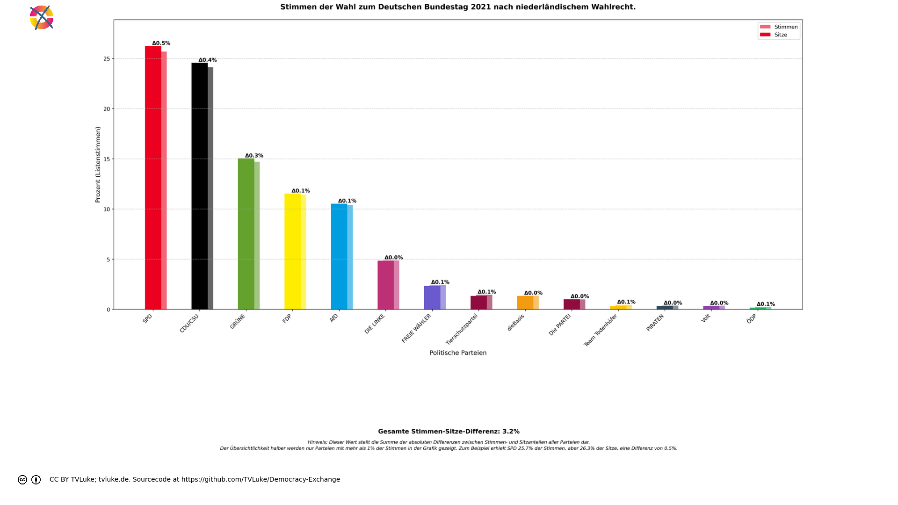

# Stimmen der Wahl zum Deutschen Bundestag 2021 nach niederländischem Wahlrecht.
Year: 2021

## Election Statistics
- **Total Population**: 82,711,282
- **Total Citizens**: 72,463,198
- **Eligible Voters**: 61,172,771
- **Total Votes Cast**: 46,298,387
- **Turnout**: 75.68%
- **Parliament Size**: 598 seats

### Vote Summary

A total of 277,409,520 votes were cast, representing a turnout of 453.5% of the electorate.

| Party | Votes | Percentage |
|-------|--------|------------|
| SPD | 71,974,424 | 25.9% |
| CDU/CSU | 71,178,924 | 25.7% |
| GRÜNE | 40,128,392 | 14.5% |
| FDP | 29,203,182 | 10.5% |
| AfD | 28,636,784 | 10.3% |
| DIE LINKE | 13,595,596 | 4.9% |
| FREIE WÄHLER | 7,168,088 | 2.6% |
| dieBasis | 3,985,852 | 1.4% |
| Tierschutzpartei | 3,016,406 | 1.1% |
| Die PARTEI | 2,922,064 | 1.1% |
| Team Todenhöfer | 858,260 | 0.3% |
| Volt | 812,388 | 0.3% |
| PIRATEN | 799,444 | 0.3% |
| ÖDP | 753,600 | 0.3% |
| SSW | 292,366 | 0.1% |
| HEIMAT (2021: NPD) | 259,620 | 0.1% |
| Die Humanisten | 215,440 | 0.1% |
| BP | 204,656 | 0.1% |
| Verjüngungsforschung (2021: Gesundheitsforschung) | 198,326 | 0.1% |
| Bündnis C | 171,916 | 0.1% |
| V-Partei³ | 148,340 | 0.1% |
| UNABHÄNGIGE | 117,786 | 0.0% |
| MLPD | 116,350 | 0.0% |
| du. | 74,732 | 0.0% |
| Die Grauen | 73,140 | 0.0% |
| DKP | 70,720 | 0.0% |
| Tierschutzallianz | 69,430 | 0.0% |
| Wir Bürger (2021: LKR) | 67,322 | 0.0% |
| LIEBE | 53,614 | 0.0% |
| LfK | 36,756 | 0.0% |
| Gartenpartei | 34,634 | 0.0% |
| DiB | 33,954 | 0.0% |
| BÜRGERBEWEGUNG | 33,076 | 0.0% |
| III. Weg | 32,358 | 0.0% |
| MENSCHLICHE WELT | 16,448 | 0.0% |
| BÜNDNIS21 | 14,696 | 0.0% |
| PdF | 12,912 | 0.0% |
| KlimalisteBW | 7,934 | 0.0% |
| SGP | 5,596 | 0.0% |
| BüSo | 4,282 | 0.0% |
| FAMILIE | 3,634 | 0.0% |
| Volksabstimmung | 2,172 | 0.0% |
| Graue Panther | 1,922 | 0.0% |
| THP | 1,098 | 0.0% |
| sonstige | 502 | 0.0% |
| B* | 384 | 0.0% |

**SPD** received the most votes with 71,974,424 votes (25.9% of total votes).

## Seat Calculation Process

## French Electoral System Explanation

This election uses the French two-round voting system (scrutin uninominal majoritaire à deux tours):

1. **First Round**
   - All candidates can participate
   - If a candidate receives >50% of votes AND ≥25% of registered voters, they win immediately
   - Otherwise, qualified candidates proceed to second round

2. **Second Round Qualification**
   - Candidates need ≥12.5% of votes to qualify
   - If no candidates reach 12.5%, top two advance
   - When no second round data is provided, votes are simulated:
     * 80% of votes from eliminated parties go to parties with same left-right position
     * 30% of remaining votes go to parties within 1 position on left-right scale
     * Other votes are considered lost/abstentions

Key Features:
- 598 total seats to be distributed
- Single-member constituencies
- Two rounds if no absolute majority in first round

3. **Seat Scaling**
   When the required number of seats (598) differs from the number of districts (299),
   we use proportional scaling to maintain fair representation:
   - First calculate results for all districts
   - Then multiply each party's seats by (total_seats / number_of_districts)
   - Round to nearest whole number while preserving total seats
   - This maintains the proportional representation from the district results
   
   Example: If we have 100 districts but need 200 seats:
   - Party A wins 60 districts → scaled to 120 seats (60 * 200/100)
   - Party B wins 40 districts → scaled to 80 seats (40 * 200/100)
   The relative strength of each party remains the same.

## Example Districts

To illustrate how the French two-round system works in practice, here are three example districts:

### Example 1: Flensburg – Schleswig

**First Round Results:**
- Total votes cast: 178,575
- Registered voters: 357,150

**Party Results:**
- GRÜNE: 50,231 votes (28.1% of votes, 14.1% of registered)
- CDU/CSU: 41,721 votes (23.4% of votes, 11.7% of registered)
- SPD: 38,927 votes (21.8% of votes, 10.9% of registered)
- SSW: 13,020 votes (7.3% of votes, 3.6% of registered)
- FDP: 12,299 votes (6.9% of votes, 3.4% of registered)
- AfD: 9,768 votes (5.5% of votes, 2.7% of registered)
- DIE LINKE: 6,544 votes (3.7% of votes, 1.8% of registered)
- dieBasis: 3,357 votes (1.9% of votes, 0.9% of registered)
- FREIE WÄHLER: 2,324 votes (1.3% of votes, 0.7% of registered)
- du.: 227 votes (0.1% of votes, 0.1% of registered)
- Wir Bürger (2021: LKR): 157 votes (0.1% of votes, 0.0% of registered)
- Die PARTEI: 0 votes (0.0% of votes, 0.0% of registered)
- HEIMAT (2021: NPD): 0 votes (0.0% of votes, 0.0% of registered)
- ÖDP: 0 votes (0.0% of votes, 0.0% of registered)
- MLPD: 0 votes (0.0% of votes, 0.0% of registered)
- DKP: 0 votes (0.0% of votes, 0.0% of registered)
- Die Humanisten: 0 votes (0.0% of votes, 0.0% of registered)
- Tierschutzpartei: 0 votes (0.0% of votes, 0.0% of registered)
- Team Todenhöfer: 0 votes (0.0% of votes, 0.0% of registered)
- Volt: 0 votes (0.0% of votes, 0.0% of registered)
- V-Partei³: 0 votes (0.0% of votes, 0.0% of registered)

**Second Round:** Parties qualifying (≥12.5%):
- GRÜNE: 50,231 votes (28.1%)
- SPD: 38,927 votes (21.8%)
- CDU/CSU: 41,721 votes (23.4%)

**Vote Redistribution Simulation:**
Vote Transfers:
- FDP → CDU/CSU: 922 votes
- FDP: 11,377 votes lost/abstained
- AfD: 9,768 votes lost/abstained
- DIE LINKE → GRÜNE: 78 votes
- DIE LINKE: 6,466 votes lost/abstained
- Die PARTEI → GRÜNE: 0 votes
- FREIE WÄHLER → CDU/CSU: 1,859 votes
- FREIE WÄHLER: 465 votes lost/abstained
- ÖDP → GRÜNE: 0 votes
- dieBasis: 3,357 votes lost/abstained
- du.: 227 votes lost/abstained
- Wir Bürger (2021: LKR): 157 votes lost/abstained
- Tierschutzpartei → GRÜNE: 0 votes
- SSW → GRÜNE: 651 votes
- SSW → SPD: 651 votes
- SSW: 11,718 votes lost/abstained
- Volt → GRÜNE: 0 votes

**Final Second Round Result:**
- GRÜNE: 50,960 votes (28.5%)
- CDU/CSU: 44,502 votes (24.9%)
- SPD: 39,578 votes (22.2%)

**Result:** GRÜNE wins the simulated second round

### Example 2: Nordfriesland – Dithmarschen Nord

**First Round Results:**
- Total votes cast: 144,050
- Registered voters: 288,100

**Party Results:**
- CDU/CSU: 43,745 votes (30.4% of votes, 15.2% of registered)
- SPD: 40,026 votes (27.8% of votes, 13.9% of registered)
- GRÜNE: 20,611 votes (14.3% of votes, 7.2% of registered)
- FDP: 13,958 votes (9.7% of votes, 4.8% of registered)
- SSW: 9,410 votes (6.5% of votes, 3.3% of registered)
- AfD: 8,274 votes (5.7% of votes, 2.9% of registered)
- DIE LINKE: 4,060 votes (2.8% of votes, 1.4% of registered)
- dieBasis: 2,254 votes (1.6% of votes, 0.8% of registered)
- FREIE WÄHLER: 1,510 votes (1.0% of votes, 0.5% of registered)
- Wir Bürger (2021: LKR): 202 votes (0.1% of votes, 0.1% of registered)
- Die PARTEI: 0 votes (0.0% of votes, 0.0% of registered)
- HEIMAT (2021: NPD): 0 votes (0.0% of votes, 0.0% of registered)
- ÖDP: 0 votes (0.0% of votes, 0.0% of registered)
- MLPD: 0 votes (0.0% of votes, 0.0% of registered)
- DKP: 0 votes (0.0% of votes, 0.0% of registered)
- du.: 0 votes (0.0% of votes, 0.0% of registered)
- Die Humanisten: 0 votes (0.0% of votes, 0.0% of registered)
- Tierschutzpartei: 0 votes (0.0% of votes, 0.0% of registered)
- Team Todenhöfer: 0 votes (0.0% of votes, 0.0% of registered)
- Volt: 0 votes (0.0% of votes, 0.0% of registered)
- V-Partei³: 0 votes (0.0% of votes, 0.0% of registered)

**Second Round:** Parties qualifying (≥12.5%):
- GRÜNE: 20,611 votes (14.3%)
- SPD: 40,026 votes (27.8%)
- CDU/CSU: 43,745 votes (30.4%)

**Vote Redistribution Simulation:**
Vote Transfers:
- FDP → CDU/CSU: 1,046 votes
- FDP: 12,912 votes lost/abstained
- AfD: 8,274 votes lost/abstained
- DIE LINKE → GRÜNE: 48 votes
- DIE LINKE: 4,012 votes lost/abstained
- Die PARTEI → GRÜNE: 0 votes
- FREIE WÄHLER → CDU/CSU: 1,208 votes
- FREIE WÄHLER: 302 votes lost/abstained
- ÖDP → GRÜNE: 0 votes
- dieBasis: 2,254 votes lost/abstained
- Wir Bürger (2021: LKR): 202 votes lost/abstained
- Tierschutzpartei → GRÜNE: 0 votes
- SSW → GRÜNE: 470 votes
- SSW → SPD: 470 votes
- SSW: 8,470 votes lost/abstained
- Volt → GRÜNE: 0 votes

**Final Second Round Result:**
- CDU/CSU: 45,999 votes (31.9%)
- SPD: 40,496 votes (28.1%)
- GRÜNE: 21,129 votes (14.7%)

**Result:** CDU/CSU wins the simulated second round

### Example 3: Steinburg – Dithmarschen Süd

**First Round Results:**
- Total votes cast: 134,980
- Registered voters: 269,960

**Party Results:**
- CDU/CSU: 39,431 votes (29.2% of votes, 14.6% of registered)
- SPD: 39,379 votes (29.2% of votes, 14.6% of registered)
- FDP: 19,315 votes (14.3% of votes, 7.2% of registered)
- GRÜNE: 16,686 votes (12.4% of votes, 6.2% of registered)
- AfD: 10,429 votes (7.7% of votes, 3.9% of registered)
- DIE LINKE: 4,339 votes (3.2% of votes, 1.6% of registered)
- FREIE WÄHLER: 2,566 votes (1.9% of votes, 1.0% of registered)
- dieBasis: 2,040 votes (1.5% of votes, 0.8% of registered)
- V-Partei³: 581 votes (0.4% of votes, 0.2% of registered)
- Wir Bürger (2021: LKR): 214 votes (0.2% of votes, 0.1% of registered)
- Die PARTEI: 0 votes (0.0% of votes, 0.0% of registered)
- HEIMAT (2021: NPD): 0 votes (0.0% of votes, 0.0% of registered)
- ÖDP: 0 votes (0.0% of votes, 0.0% of registered)
- MLPD: 0 votes (0.0% of votes, 0.0% of registered)
- DKP: 0 votes (0.0% of votes, 0.0% of registered)
- du.: 0 votes (0.0% of votes, 0.0% of registered)
- Die Humanisten: 0 votes (0.0% of votes, 0.0% of registered)
- Tierschutzpartei: 0 votes (0.0% of votes, 0.0% of registered)
- SSW: 0 votes (0.0% of votes, 0.0% of registered)
- Team Todenhöfer: 0 votes (0.0% of votes, 0.0% of registered)
- Volt: 0 votes (0.0% of votes, 0.0% of registered)

**Second Round:** Parties qualifying (≥12.5%):
- SPD: 39,379 votes (29.2%)
- CDU/CSU: 39,431 votes (29.2%)
- FDP: 19,315 votes (14.3%)

**Vote Redistribution Simulation:**
Vote Transfers:
- GRÜNE: 16,686 votes lost/abstained
- AfD → FDP: 208 votes
- AfD: 10,221 votes lost/abstained
- DIE LINKE: 4,339 votes lost/abstained
- FREIE WÄHLER → CDU/CSU: 2,052 votes
- FREIE WÄHLER → FDP: 77 votes
- FREIE WÄHLER: 437 votes lost/abstained
- dieBasis → FDP: 40 votes
- dieBasis: 2,000 votes lost/abstained
- Wir Bürger (2021: LKR): 214 votes lost/abstained
- SSW → SPD: 0 votes
- V-Partei³: 581 votes lost/abstained

**Final Second Round Result:**
- CDU/CSU: 41,483 votes (30.7%)
- SPD: 39,379 votes (29.2%)
- FDP: 19,640 votes (14.6%)

**Result:** CDU/CSU wins the simulated second round

## Seat Scaling Applied

Scaling from 299 districts to 598 total seats:

### Before Scaling (299 seats)
| Party | Seats | Percentage |
|-------|--------|------------|
| CDU/CSU | 158 | 52.8% |
| SPD | 104 | 34.8% |
| AfD | 19 | 6.4% |
| GRÜNE | 15 | 5.0% |
| DIE LINKE | 3 | 1.0% |

### After Scaling (598 seats)
| Party | Seats | Percentage | Change |
|-------|--------|------------|---------|
| CDU/CSU | 316 | 52.8% | +0.0% |
| SPD | 208 | 34.8% | +0.0% |
| AfD | 38 | 6.4% | +0.0% |
| GRÜNE | 30 | 5.0% | +0.0% |
| DIE LINKE | 6 | 1.0% | +0.0% |

Scaling Details:
- Scaling factor: 2.000
- Each party's seats multiplied by this factor and rounded
- Total seats preserved through rounding adjustments
- Percentages of total seats remain nearly identical

## Visualizations
### Parliament Seating
![Parliament seating arrangement with 598 total seats. Parties from left to right: Team Todenhöfer with 2 seats (0.3%), DIE LINKE with 29 seats (4.8%), Volt with 2 seats (0.3%), Die PARTEI with 6 seats (1.0%), GRÜNE with 90 seats (15.1%), PIRATEN with 2 seats (0.3%), Tierschutzpartei with 8 seats (1.3%), ÖDP with 1 seats (0.2%), SPD with 157 seats (26.3%), FREIE WÄHLER with 14 seats (2.3%), CDU/CSU with 147 seats (24.6%), FDP with 69 seats (11.5%), AfD with 63 seats (10.5%), dieBasis with 8 seats (1.3%). Hinweis: Verteilung nutzt nur Listenstimmen (Zweitstimmen).](../plots/germany2021_netherlands_parliament.png)

### Coalition Possibilities
![Possible coalition combinations that form a majority, sorted by ideological distance (smaller distance means parties are closer on the left-right spectrum): SPD + CDU/CSU with 304 seats (50.8%, ideological distance: 2.0); GRÜNE + SPD + FDP with 316 seats (52.8%, ideological distance: 10.0); GRÜNE + CDU/CSU + FDP with 306 seats (51.2%, ideological distance: 10.0); GRÜNE + SPD + AfD with 310 seats (51.8%, ideological distance: 12.0); GRÜNE + CDU/CSU + AfD with 300 seats (50.2%, ideological distance: 12.0); SPD + FREIE WÄHLER + FDP + AfD with 303 seats (50.7%, ideological distance: 13.0); GRÜNE + FREIE WÄHLER + CDU/CSU + AfD with 314 seats (52.5%, ideological distance: 18.0); GRÜNE + CDU/CSU + AfD + dieBasis with 308 seats (51.5%, ideological distance: 20.0); DIE LINKE + CDU/CSU + FDP + AfD with 308 seats (51.5%, ideological distance: 22.0); Die PARTEI + GRÜNE + CDU/CSU + AfD with 306 seats (51.2%, ideological distance: 22.0). Die "Ideologische Distanz": Für die Darstellung in korrekter Reihenfolge hat jede Partei einen left_to_right-Wert, mit 1 für die Partei, welche üblicherweise im Parlament ganz links sitzt, dann aufsteigend: Dieser Wert wird hier auch einfach als Distanzwert gewertet, um wahrscheinliche Koalitionen darzustellen. Diese Berechnung ist natürlich stark vereinfachend und in vielen Fällen einfach falsch.  Beispiel für die Koalition GRÜNE-SPD-FDP: GRÜNE: left_to_right = 2 SPD: left_to_right = 4 FDP: left_to_right = 7 Ideologische Distanz = |2-4| + |2-7| + |4-7| = 10](../plots/germany2021_netherlands_coalitions.png)

### Vote vs Seat Distribution

### Party Vote Distribution

## Detailed Results
| Party | Votes | Vote Share | Seats | Seat Share | Representation Gap |
|-------|--------|------------|-------|------------|-------------------|
| SPD | 11,901,558 | 25.71% | 157 | 26.25% | 0.55% |
| CDU/CSU | 11,177,747 | 24.14% | 147 | 24.58% | 0.44% |
| GRÜNE | 6,814,408 | 14.72% | 90 | 15.05% | 0.33% |
| FDP | 5,291,013 | 11.43% | 69 | 11.54% | 0.11% |
| AfD | 4,809,233 | 10.39% | 63 | 10.54% | 0.15% |
| DIE LINKE | 2,255,864 | 4.87% | 29 | 4.85% | -0.02% |
| FREIE WÄHLER | 1,125,667 | 2.43% | 14 | 2.34% | -0.09% |
| Tierschutzpartei | 673,669 | 1.46% | 8 | 1.34% | -0.12% |
| dieBasis | 630,153 | 1.36% | 8 | 1.34% | -0.02% |
| Die PARTEI | 460,431 | 0.99% | 6 | 1.00% | 0.01% |
| Team Todenhöfer | 211,854 | 0.46% | 2 | 0.33% | -0.12% |
| Volt | 164,300 | 0.35% | 2 | 0.33% | -0.02% |
| PIRATEN | 169,587 | 0.37% | 2 | 0.33% | -0.03% |
| ÖDP | 112,129 | 0.24% | 1 | 0.17% | -0.07% |
| B* | 0 | 0.00% | 0 | 0.00% | 0.00% |
| BP | 32,790 | 0.07% | 0 | 0.00% | -0.07% |
| BÜNDNIS21 | 3,488 | 0.01% | 0 | 0.00% | -0.01% |
| BÜRGERBEWEGUNG | 7,491 | 0.02% | 0 | 0.00% | -0.02% |
| BüSo | 665 | 0.00% | 0 | 0.00% | -0.00% |
| Bündnis C | 39,868 | 0.09% | 0 | 0.00% | -0.09% |
| DKP | 14,957 | 0.03% | 0 | 0.00% | -0.03% |
| DiB | 7,184 | 0.02% | 0 | 0.00% | -0.02% |
| Die Grauen | 17,304 | 0.04% | 0 | 0.00% | -0.04% |
| Die Humanisten | 47,524 | 0.10% | 0 | 0.00% | -0.10% |
| FAMILIE | 0 | 0.00% | 0 | 0.00% | 0.00% |
| Gartenpartei | 7,611 | 0.02% | 0 | 0.00% | -0.02% |
| Graue Panther | 0 | 0.00% | 0 | 0.00% | 0.00% |
| KlimalisteBW | 0 | 0.00% | 0 | 0.00% | 0.00% |
| LIEBE | 12,967 | 0.03% | 0 | 0.00% | -0.03% |
| LfK | 9,189 | 0.02% | 0 | 0.00% | -0.02% |
| MENSCHLICHE WELT | 3,786 | 0.01% | 0 | 0.00% | -0.01% |
| MLPD | 17,820 | 0.04% | 0 | 0.00% | -0.04% |
| PdF | 3,228 | 0.01% | 0 | 0.00% | -0.01% |
| SGP | 1,399 | 0.00% | 0 | 0.00% | -0.00% |
| THP | 0 | 0.00% | 0 | 0.00% | 0.00% |
| Tierschutzallianz | 13,672 | 0.03% | 0 | 0.00% | -0.03% |
| UNABHÄNGIGE | 22,736 | 0.05% | 0 | 0.00% | -0.05% |
| V-Partei³ | 31,763 | 0.07% | 0 | 0.00% | -0.07% |
| Verjüngungsforschung (2021: Gesundheitsforschung) | 48,496 | 0.10% | 0 | 0.00% | -0.10% |
| Volksabstimmung | 0 | 0.00% | 0 | 0.00% | 0.00% |
| Wir Bürger (2021: LKR) | 11,328 | 0.02% | 0 | 0.00% | -0.02% |
| du. | 17,738 | 0.04% | 0 | 0.00% | -0.04% |
| sonstige | 0 | 0.00% | 0 | 0.00% | 0.00% |
| SSW | 55,578 | 0.12% | 0 | 0.00% | -0.12% |
| BSW | 0 | 0.00% | 0 | 0.00% | 0.00% |
| HEIMAT (2021: NPD) | 64,360 | 0.14% | 0 | 0.00% | -0.14% |
| III. Weg | 7,832 | 0.02% | 0 | 0.00% | -0.02% |

## Analysis of Representation
### Most Over-represented Parties
- **SPD**: +0.55%
- **CDU/CSU**: +0.44%
- **GRÜNE**: +0.33%

### Most Under-represented Parties
- **HEIMAT (2021: NPD)**: -0.14%
- **Team Todenhöfer**: -0.12%
- **SSW**: -0.12%

## Sources

### Data Sources
- [Gesamtergebnis laut Bundeswahlleiterin](https://www.bundeswahlleiterin.de/bundestagswahlen/2021/ergebnisse/opendata/btw21/20240211_wdhwahl-vgl2021/daten/gesamtergebnis_01.xml)
- [Demografische Daten zu den Wahlkreisen. Statistisches Bundesamt.](https://ergebnisse.zensus2022.de/datenbank/online/table/4000W-1W11)

### About the Electoral System
- [Wahlrecht](https://www.wahlrecht.de/ausland/kieswet.html)