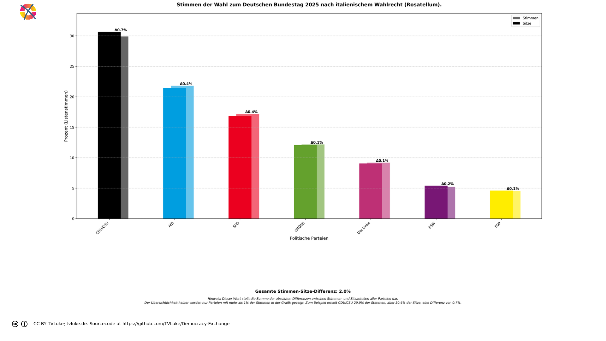

# Stimmen der Wahl zum Deutschen Bundestag 2025 nach italienischem Wahlrecht (Rosatellum).
Year: 2025

## Election Statistics
- **Total Population**: 834,566,000
- **Total Citizens**: 713,478,000
- **Eligible Voters**: 60,490,603
- **Total Votes Cast**: 47,368,270
- **Turnout**: 78.31%
- **Parliament Size**: 630 seats

### Vote Summary

A total of 49,642,087 votes were cast, representing a turnout of 82.1% of the electorate.

| Party | Votes | Percentage |
|-------|--------|------------|
| CDU/CSU | 14,158,432 | 28.5% |
| AfD | 10,327,148 | 20.8% |
| SPD | 8,148,284 | 16.4% |
| GRÜNE | 5,761,476 | 11.6% |
| Die Linke | 4,355,382 | 8.8% |
| BSW | 2,468,670 | 5.0% |
| FDP | 2,148,878 | 4.3% |
| FREIE WÄHLER | 769,170 | 1.5% |
| Tierschutzpartei | 482,032 | 1.0% |
| Volt | 355,146 | 0.7% |
| Die PARTEI | 242,806 | 0.5% |
| dieBasis | 85,557 | 0.2% |
| BÜNDNIS DEUTSCHLAND | 79,012 | 0.2% |
| SSW | 76,126 | 0.2% |
| ÖDP | 49,730 | 0.1% |
| Team Todenhöfer | 24,558 | 0.0% |
| PdF | 21,377 | 0.0% |
| MLPD | 19,876 | 0.0% |
| PdH | 14,446 | 0.0% |
| PIRATEN | 13,809 | 0.0% |
| BP | 12,315 | 0.0% |
| Bündnis C | 11,784 | 0.0% |
| MERA25 | 7,128 | 0.0% |
| WerteUnion | 6,803 | 0.0% |
| BüSo | 719 | 0.0% |
| MENSCHLICHE WELT | 694 | 0.0% |
| SGP | 425 | 0.0% |
| Verjüngungsforschung | 304 | 0.0% |

**CDU/CSU** received the most votes with 14,158,432 votes (28.5% of total votes).

## Seat Calculation Process

# Dutch Electoral System

The Netherlands uses a party-list proportional representation system with the following key features:

## Electoral Threshold (Kiesdeler)
- The electoral threshold is 1/630th of the total valid votes (78,797 votes in this election)
- While the Dutch parliament normally has 150 seats, in this calculation we use 630 seats
- Only parties that reach this threshold can receive seats
- With 630 seats, parties need 0.16% of the total vote to enter parliament

## D'Hondt Method
- Seats are allocated using the D'Hondt method
- Each party's votes are divided by 1, 2, 3, etc. as they win seats
- The party with the highest quotient gets the next seat
- This process continues until all 630 seats are allocated

## Qualified Parties
The following parties reached the electoral threshold:
AfD, BSW, BÜNDNIS DEUTSCHLAND, Die Linke, Die PARTEI, FDP, FREIE WÄHLER, GRÜNE, SPD, Tierschutzpartei, Volt, dieBasis, CDU/CSU

## Vote Totals
Total valid votes: 49,642,087

Party vote totals:

CDU/CSU: 14,158,432 list votes

AfD: 10,327,148 list votes

SPD: 8,148,284 list votes

GRÜNE: 5,761,476 list votes

Die Linke: 4,355,382 list votes

BSW: 2,468,670 list votes

FDP: 2,148,878 list votes

FREIE WÄHLER: 769,170 list votes

Tierschutzpartei: 482,032 list votes

Volt: 355,146 list votes

Die PARTEI: 242,806 list votes

dieBasis: 85,557 list votes

BÜNDNIS DEUTSCHLAND: 79,012 list votes

SSW: 76,126 list votes

ÖDP: 49,730 list votes

Team Todenhöfer: 24,558 list votes

PdF: 21,377 list votes

MLPD: 19,876 list votes

PdH: 14,446 list votes

PIRATEN: 13,809 list votes

BP: 12,315 list votes

Bündnis C: 11,784 list votes

MERA25: 7,128 list votes

WerteUnion: 6,803 list votes

BüSo: 719 list votes

MENSCHLICHE WELT: 694 list votes

SGP: 425 list votes

Verjüngungsforschung: 304 list votes

## Visualizations
### Parliament Seating

### Coalition Possibilities
![Possible coalition combinations that form a majority, sorted by ideological distance (smaller distance means parties are closer on the left-right spectrum): CDU/CSU + AfD with 328 seats (52.1%, ideological distance: 2.0); SPD + CDU/CSU + FDP with 328 seats (52.1%, ideological distance: 6.0); GRÜNE + SPD + CDU/CSU with 375 seats (59.5%, ideological distance: 8.0); Die Linke + GRÜNE + CDU/CSU with 326 seats (51.7%, ideological distance: 10.0); Die Linke + SPD + CDU/CSU with 356 seats (56.5%, ideological distance: 10.0); BSW + SPD + CDU/CSU with 333 seats (52.9%, ideological distance: 12.0); GRÜNE + SPD + AfD with 317 seats (50.3%, ideological distance: 12.0); GRÜNE + SPD + FDP + AfD with 346 seats (54.9%, ideological distance: 21.0); Die Linke + GRÜNE + SPD + AfD with 374 seats (59.4%, ideological distance: 23.0); Die Linke + SPD + FDP + AfD with 327 seats (51.9%, ideological distance: 24.0). Die "Ideologische Distanz": Für die Darstellung in korrekter Reihenfolge hat jede Partei einen left_to_right-Wert, mit 1 für die Partei, welche üblicherweise im Parlament ganz links sitzt, dann aufsteigend: Dieser Wert wird hier auch einfach als Distanzwert gewertet, um wahrscheinliche Koalitionen darzustellen. Diese Berechnung ist natürlich stark vereinfachend und in vielen Fällen einfach falsch.  Beispiel für die Koalition SPD-CDU/CSU-FDP: SPD: left_to_right = 4 CDU/CSU: left_to_right = 6 FDP: left_to_right = 7 Ideologische Distanz = |4-6| + |4-7| + |6-7| = 6](../plots/germany2025_italy_coalitions.png)

### Vote vs Seat Distribution

### Party Vote Distribution

## Detailed Results
| Party | Votes | Vote Share | Seats | Seat Share | Representation Gap |
|-------|--------|------------|-------|------------|-------------------|
| CDU/CSU | 14,158,432 | 29.89% | 193 | 30.63% | 0.74% |
| AfD | 10,327,148 | 21.80% | 135 | 21.43% | -0.37% |
| SPD | 8,148,284 | 17.20% | 106 | 16.83% | -0.38% |
| GRÜNE | 5,761,476 | 12.16% | 76 | 12.06% | -0.10% |
| Die Linke | 4,355,382 | 9.19% | 57 | 9.05% | -0.15% |
| BSW | 2,468,670 | 5.21% | 34 | 5.40% | 0.19% |
| FDP | 2,148,878 | 4.54% | 29 | 4.60% | 0.07% |

## Analysis of Representation
### Most Over-represented Parties
- **CDU/CSU**: +0.74%
- **BSW**: +0.19%
- **FDP**: +0.07%

### Most Under-represented Parties
- **SPD**: -0.38%
- **AfD**: -0.37%
- **Die Linke**: -0.15%

## Sources

### Data Sources
- [Gesamtergebnis laut Bundeswahlleiterin](https://www.bundeswahlleiterin.de/bundestagswahlen/2025/ergebnisse/opendata.html)
- [XML Vorläufiges Amtliches Ergebnis](https://www.bundeswahlleiterin.de/bundestagswahlen/2025/ergebnisse/opendata/btw25/daten/gesamtergebnis_01.xml)

### About the Electoral System
- [polyas.de](https://www.polyas.de/blog/de/online-wahlen/wahlsystem-italien)