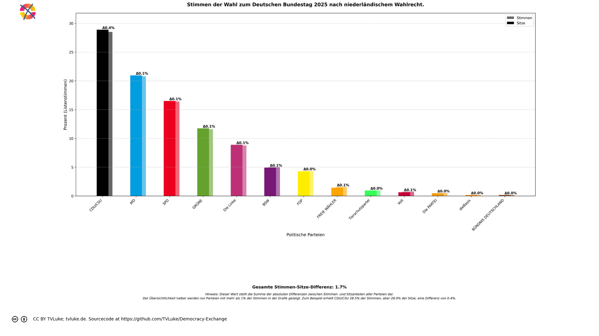

# Stimmen der Wahl zum Deutschen Bundestag 2025 
Year: 2025

## Election Statistics
- **Total Population**: 834,566,000
- **Total Citizens**: 713,478,000
- **Eligible Voters**: 60,490,603
- **Total Votes Cast**: 49,642,087
- **Turnout**: 82.07%
- **Parliament Size**: 630 seats

### Vote Summary

A total of 49,642,087 votes were cast, representing a turnout of 82.1% of the electorate.

| Party | Votes | Percentage |
|-------|--------|------------|
| CDU/CSU | 14,158,432 | 28.5% |
| AfD | 10,327,148 | 20.8% |
| SPD | 8,148,284 | 16.4% |
| GRÜNE | 5,761,476 | 11.6% |
| Die Linke | 4,355,382 | 8.8% |
| BSW | 2,468,670 | 5.0% |
| FDP | 2,148,878 | 4.3% |
| FREIE WÄHLER | 769,170 | 1.5% |
| Tierschutzpartei | 482,032 | 1.0% |
| Volt | 355,146 | 0.7% |
| Die PARTEI | 242,806 | 0.5% |
| dieBasis | 85,557 | 0.2% |
| BÜNDNIS DEUTSCHLAND | 79,012 | 0.2% |
| SSW | 76,126 | 0.2% |
| ÖDP | 49,730 | 0.1% |
| Team Todenhöfer | 24,558 | 0.0% |
| PdF | 21,377 | 0.0% |
| MLPD | 19,876 | 0.0% |
| PdH | 14,446 | 0.0% |
| PIRATEN | 13,809 | 0.0% |
| BP | 12,315 | 0.0% |
| Bündnis C | 11,784 | 0.0% |
| MERA25 | 7,128 | 0.0% |
| WerteUnion | 6,803 | 0.0% |
| BüSo | 719 | 0.0% |
| MENSCHLICHE WELT | 694 | 0.0% |
| SGP | 425 | 0.0% |
| Verjüngungsforschung | 304 | 0.0% |

**CDU/CSU** received the most votes with 14,158,432 votes (28.5% of total votes).

## Seat Calculation Process

# Dutch Electoral System

The Netherlands uses a party-list proportional representation system with the following key features:

## Electoral Threshold (Kiesdeler)
- The electoral threshold is 1/630th of the total valid votes (78,797 votes in this election)
- While the Dutch parliament normally has 150 seats, in this calculation we use 630 seats
- Only parties that reach this threshold can receive seats
- With 630 seats, parties need 0.16% of the total vote to enter parliament

## D'Hondt Method
- Seats are allocated using the D'Hondt method
- Each party's votes are divided by 1, 2, 3, etc. as they win seats
- The party with the highest quotient gets the next seat
- This process continues until all 630 seats are allocated

## Qualified Parties
The following parties reached the electoral threshold:
AfD, BSW, BÜNDNIS DEUTSCHLAND, Die Linke, Die PARTEI, FDP, FREIE WÄHLER, GRÜNE, SPD, Tierschutzpartei, Volt, dieBasis, CDU/CSU

## Vote Totals
Total valid votes: 49,642,087

Party vote totals:

CDU/CSU: 14,158,432 list votes

AfD: 10,327,148 list votes

SPD: 8,148,284 list votes

GRÜNE: 5,761,476 list votes

Die Linke: 4,355,382 list votes

BSW: 2,468,670 list votes

FDP: 2,148,878 list votes

FREIE WÄHLER: 769,170 list votes

Tierschutzpartei: 482,032 list votes

Volt: 355,146 list votes

Die PARTEI: 242,806 list votes

dieBasis: 85,557 list votes

BÜNDNIS DEUTSCHLAND: 79,012 list votes

SSW: 76,126 list votes

ÖDP: 49,730 list votes

Team Todenhöfer: 24,558 list votes

PdF: 21,377 list votes

MLPD: 19,876 list votes

PdH: 14,446 list votes

PIRATEN: 13,809 list votes

BP: 12,315 list votes

Bündnis C: 11,784 list votes

MERA25: 7,128 list votes

WerteUnion: 6,803 list votes

BüSo: 719 list votes

MENSCHLICHE WELT: 694 list votes

SGP: 425 list votes

Verjüngungsforschung: 304 list votes

## Visualizations
### Parliament Seating
![Parliament seating arrangement with 630 total seats. Parties from left to right: BSW with 31 seats (4.9%), BÜNDNIS DEUTSCHLAND with 1 seats (0.2%), Die Linke with 56 seats (8.9%), Volt with 4 seats (0.6%), Die PARTEI with 3 seats (0.5%), GRÜNE with 74 seats (11.7%), Tierschutzpartei with 6 seats (1.0%), SPD with 104 seats (16.5%), FREIE WÄHLER with 9 seats (1.4%), CDU/CSU with 182 seats (28.9%), FDP with 27 seats (4.3%), AfD with 132 seats (21.0%), dieBasis with 1 seats (0.2%). Hinweis: Verteilung nutzt nur Listenstimmen (Zweitstimmen).](../plots/germany2025_netherlands_parliament.png)

### Coalition Possibilities
![Possible coalition combinations that form a majority, sorted by ideological distance (smaller distance means parties are closer on the left-right spectrum): FREIE WÄHLER + CDU/CSU + AfD with 323 seats (51.3%, ideological distance: 4.0); CDU/CSU + FDP + AfD with 341 seats (54.1%, ideological distance: 4.0); GRÜNE + SPD + CDU/CSU with 360 seats (57.1%, ideological distance: 8.0); SPD + CDU/CSU + AfD with 418 seats (66.3%, ideological distance: 8.0); SPD + FREIE WÄHLER + CDU/CSU + FDP with 322 seats (51.1%, ideological distance: 9.0); Die Linke + SPD + CDU/CSU with 342 seats (54.3%, ideological distance: 10.0); BSW + SPD + CDU/CSU with 317 seats (50.3%, ideological distance: 12.0); Die PARTEI + CDU/CSU + AfD with 317 seats (50.3%, ideological distance: 12.0); GRÜNE + CDU/CSU + AfD with 388 seats (61.6%, ideological distance: 12.0); Tierschutzpartei + CDU/CSU + AfD with 320 seats (50.8%, ideological distance: 12.0). Die "Ideologische Distanz": Für die Darstellung in korrekter Reihenfolge hat jede Partei einen left_to_right-Wert, mit 1 für die Partei, welche üblicherweise im Parlament ganz links sitzt, dann aufsteigend: Dieser Wert wird hier auch einfach als Distanzwert gewertet, um wahrscheinliche Koalitionen darzustellen. Diese Berechnung ist natürlich stark vereinfachend und in vielen Fällen einfach falsch.  Beispiel für die Koalition FREIE WÄHLER-CDU/CSU-AfD: FREIE WÄHLER: left_to_right = 6 CDU/CSU: left_to_right = 6 AfD: left_to_right = 8 Ideologische Distanz = |6-6| + |6-8| + |6-8| = 4](../plots/germany2025_netherlands_coalitions.png)

### Vote vs Seat Distribution

### Party Vote Distribution

## Detailed Results
| Party | Votes | Vote Share | Seats | Seat Share | Representation Gap |
|-------|--------|------------|-------|------------|-------------------|
| CDU/CSU | 14,158,432 | 28.52% | 182 | 28.89% | 0.37% |
| AfD | 10,327,148 | 20.80% | 132 | 20.95% | 0.15% |
| SPD | 8,148,284 | 16.41% | 104 | 16.51% | 0.09% |
| GRÜNE | 5,761,476 | 11.61% | 74 | 11.75% | 0.14% |
| Die Linke | 4,355,382 | 8.77% | 56 | 8.89% | 0.12% |
| BSW | 2,468,670 | 4.97% | 31 | 4.92% | -0.05% |
| FDP | 2,148,878 | 4.33% | 27 | 4.29% | -0.04% |
| FREIE WÄHLER | 769,170 | 1.55% | 9 | 1.43% | -0.12% |
| Tierschutzpartei | 482,032 | 0.97% | 6 | 0.95% | -0.02% |
| Volt | 355,146 | 0.72% | 4 | 0.63% | -0.08% |
| Die PARTEI | 242,806 | 0.49% | 3 | 0.48% | -0.01% |
| BÜNDNIS DEUTSCHLAND | 79,012 | 0.16% | 1 | 0.16% | -0.00% |
| dieBasis | 85,557 | 0.17% | 1 | 0.16% | -0.01% |
| BP | 12,315 | 0.02% | 0 | 0.00% | -0.02% |
| BüSo | 719 | 0.00% | 0 | 0.00% | -0.00% |
| Bündnis C | 11,784 | 0.02% | 0 | 0.00% | -0.02% |
| MENSCHLICHE WELT | 694 | 0.00% | 0 | 0.00% | -0.00% |
| MERA25 | 7,128 | 0.01% | 0 | 0.00% | -0.01% |
| MLPD | 19,876 | 0.04% | 0 | 0.00% | -0.04% |
| PdF | 21,377 | 0.04% | 0 | 0.00% | -0.04% |
| PdH | 14,446 | 0.03% | 0 | 0.00% | -0.03% |
| SGP | 425 | 0.00% | 0 | 0.00% | -0.00% |
| Team Todenhöfer | 24,558 | 0.05% | 0 | 0.00% | -0.05% |
| Verjüngungsforschung | 304 | 0.00% | 0 | 0.00% | -0.00% |
| WerteUnion | 6,803 | 0.01% | 0 | 0.00% | -0.01% |
| PIRATEN | 13,809 | 0.03% | 0 | 0.00% | -0.03% |
| ÖDP | 49,730 | 0.10% | 0 | 0.00% | -0.10% |
| SSW | 76,126 | 0.15% | 0 | 0.00% | -0.15% |

## Analysis of Representation
### Most Over-represented Parties
- **CDU/CSU**: +0.37%
- **AfD**: +0.15%
- **GRÜNE**: +0.14%

### Most Under-represented Parties
- **SSW**: -0.15%
- **FREIE WÄHLER**: -0.12%
- **ÖDP**: -0.10%

## Sources

### Data Sources
- [Gesamtergebnis laut Bundeswahlleiterin](https://www.bundeswahlleiterin.de/bundestagswahlen/2025/ergebnisse/opendata.html)
- [XML Vorläufiges Amtliches Ergebnis](https://www.bundeswahlleiterin.de/bundestagswahlen/2025/ergebnisse/opendata/btw25/daten/gesamtergebnis_01.xml)

### About the Electoral System
- [Wahlrecht](https://www.wahlrecht.de/ausland/kieswet.html)