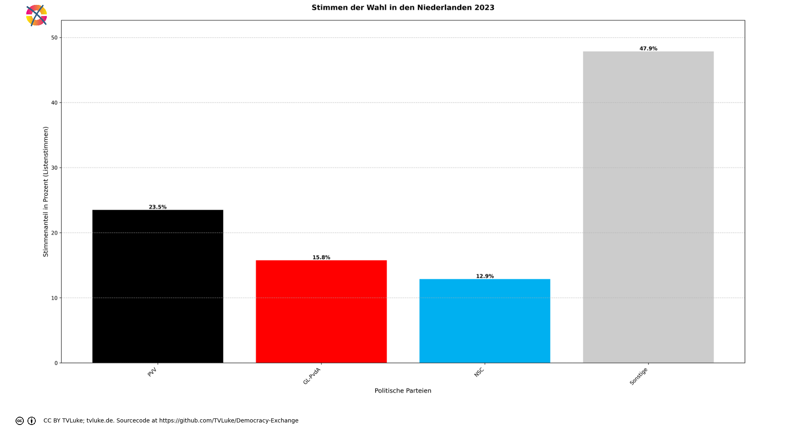

# Stimmen der Wahl in den Niederlanden 2023 nach französischem Wahlrecht.
Year: 2023

## Election Statistics
- **Total Population**: 17,458,120
- **Total Citizens**: 16,585,208
- **Eligible Voters**: 13,399,296
- **Total Votes Cast**: 10,424,607
- **Turnout**: 77.80%
- **Parliament Size**: 150 seats

### Vote Summary

A total of 10,424,607 votes were cast, representing a turnout of 77.8% of the electorate.

| Party | Votes | Percentage |
|-------|--------|------------|
| PVV | 2,450,453 | 23.5% |
| GL-PvdA | 1,642,523 | 15.8% |
| VVD | 1,589,085 | 15.2% |
| NSC | 1,342,959 | 12.9% |
| D66 | 655,250 | 6.3% |
| BBB | 485,354 | 4.7% |
| CDA | 345,760 | 3.3% |
| SP | 328,166 | 3.1% |
| DENK | 246,748 | 2.4% |
| PvdD | 235,062 | 2.3% |
| FVD | 232,874 | 2.2% |
| SGP | 217,254 | 2.1% |
| CU | 212,068 | 2.0% |
| Volt | 178,747 | 1.7% |
| JA21 | 71,334 | 0.7% |
| BVNL | 52,856 | 0.5% |
| 50PLUS | 51,037 | 0.5% |
| Bij1 | 44,209 | 0.4% |
| Splinter | 12,823 | 0.1% |
| Piratenpartij | 9,107 | 0.1% |
| PLAN | 5,487 | 0.1% |
| Samen voor Nederland | 5,325 | 0.1% |
| LEF | 5,122 | 0.0% |
| PvdS | 3,966 | 0.0% |
| PPB | 1,038 | 0.0% |

**PVV** received the most votes with 2,450,453 votes (23.5% of total votes).

## Seat Calculation Process

## French Electoral System Explanation

This election uses the French two-round voting system (scrutin uninominal majoritaire à deux tours):

1. **First Round**
   - All candidates can participate
   - If a candidate receives >50% of votes AND ≥25% of registered voters, they win immediately
   - Otherwise, qualified candidates proceed to second round

2. **Second Round Qualification**
   - Candidates need ≥12.5% of votes to qualify
   - If no candidates reach 12.5%, top two advance
   - When no second round data is provided, votes are simulated:
     * 80% of votes from eliminated parties go to parties with same left-right position
     * 30% of remaining votes go to parties within 1 position on left-right scale
     * Other votes are considered lost/abstentions

Key Features:
- 150 total seats to be distributed
- Single-member constituencies
- Two rounds if no absolute majority in first round

3. **Seat Scaling**
   When the required number of seats (150) differs from the number of districts (19),
   we use proportional scaling to maintain fair representation:
   - First calculate results for all districts
   - Then multiply each party's seats by (total_seats / number_of_districts)
   - Round to nearest whole number while preserving total seats
   - This maintains the proportional representation from the district results
   
   Example: If we have 100 districts but need 200 seats:
   - Party A wins 60 districts → scaled to 120 seats (60 * 200/100)
   - Party B wins 40 districts → scaled to 80 seats (40 * 200/100)
   The relative strength of each party remains the same.

## Example Districts

To illustrate how the French two-round system works in practice, here are three example districts:

### Example 1: Maastricht

**First Round Results:**
- Total votes cast: 652,843
- Registered voters: 1,305,686

**Party Results:**
- PVV: 217,216 votes (33.3% of votes, 16.6% of registered)
- NSC: 92,191 votes (14.1% of votes, 7.1% of registered)
- VVD: 90,273 votes (13.8% of votes, 6.9% of registered)
- GL-PvdA: 88,122 votes (13.5% of votes, 6.7% of registered)
- D66: 31,572 votes (4.8% of votes, 2.4% of registered)
- BBB: 28,862 votes (4.4% of votes, 2.2% of registered)
- SP: 23,940 votes (3.7% of votes, 1.8% of registered)
- CDA: 22,287 votes (3.4% of votes, 1.7% of registered)
- FVD: 15,092 votes (2.3% of votes, 1.2% of registered)
- PvdD: 11,258 votes (1.7% of votes, 0.9% of registered)
- DENK: 8,007 votes (1.2% of votes, 0.6% of registered)
- Volt: 6,515 votes (1.0% of votes, 0.5% of registered)
- JA21: 3,893 votes (0.6% of votes, 0.3% of registered)
- 50PLUS: 3,670 votes (0.6% of votes, 0.3% of registered)
- BVNL: 3,562 votes (0.5% of votes, 0.3% of registered)
- CU: 2,164 votes (0.3% of votes, 0.2% of registered)
- Bij1: 1,137 votes (0.2% of votes, 0.1% of registered)
- Splinter: 703 votes (0.1% of votes, 0.1% of registered)
- SGP: 665 votes (0.1% of votes, 0.1% of registered)
- Piratenpartij: 482 votes (0.1% of votes, 0.0% of registered)
- PvdS: 377 votes (0.1% of votes, 0.0% of registered)
- LEF: 298 votes (0.0% of votes, 0.0% of registered)
- PLAN: 289 votes (0.0% of votes, 0.0% of registered)
- Samen voor Nederland: 268 votes (0.0% of votes, 0.0% of registered)
- PPB: 0 votes (0.0% of votes, 0.0% of registered)

**Second Round:** Parties qualifying (≥12.5%):
- GL-PvdA: 88,122 votes (13.5%)
- VVD: 90,273 votes (13.8%)
- NSC: 92,191 votes (14.1%)
- PVV: 217,216 votes (33.3%)

**Vote Redistribution Simulation:**
Vote Transfers:
- D66 → NSC: 315 votes
- D66: 31,257 votes lost/abstained
- CDA → NSC: 5,943 votes
- CDA → VVD: 111 votes
- CDA: 16,233 votes lost/abstained
- SP → GL-PvdA: 19,152 votes
- SP: 4,788 votes lost/abstained
- FVD → PVV: 12,073 votes
- FVD: 3,019 votes lost/abstained
- PvdD → GL-PvdA: 61 votes
- PvdD: 11,197 votes lost/abstained
- CU → NSC: 577 votes
- CU → VVD: 10 votes
- CU: 1,577 votes lost/abstained
- Volt → NSC: 65 votes
- Volt: 6,450 votes lost/abstained
- JA21 → PVV: 46 votes
- JA21 → VVD: 46 votes
- JA21: 3,801 votes lost/abstained
- SGP → PVV: 7 votes
- SGP → VVD: 7 votes
- SGP: 651 votes lost/abstained
- DENK → NSC: 80 votes
- DENK: 7,927 votes lost/abstained
- 50PLUS → NSC: 978 votes
- 50PLUS → VVD: 18 votes
- 50PLUS: 2,674 votes lost/abstained
- BBB → VVD: 11,544 votes
- BBB → NSC: 247 votes
- BBB: 17,071 votes lost/abstained
- Bij1 → GL-PvdA: 170 votes
- Bij1: 967 votes lost/abstained
- Piratenpartij → NSC: 4 votes
- Piratenpartij: 478 votes lost/abstained
- BVNL → PVV: 42 votes
- BVNL → VVD: 42 votes
- BVNL: 3,478 votes lost/abstained
- Splinter → NSC: 7 votes
- Splinter: 696 votes lost/abstained
- LEF → NSC: 3 votes
- LEF: 295 votes lost/abstained
- Samen voor Nederland → NSC: 3 votes
- Samen voor Nederland: 265 votes lost/abstained
- PLAN → NSC: 3 votes
- PLAN: 286 votes lost/abstained
- PvdS → NSC: 4 votes
- PvdS: 373 votes lost/abstained
- PPB → GL-PvdA: 0 votes

**Final Second Round Result:**
- PVV: 229,384 votes (35.1%)
- GL-PvdA: 107,505 votes (16.5%)
- VVD: 102,051 votes (15.6%)
- NSC: 100,420 votes (15.4%)

**Result:** PVV wins the simulated second round

### Example 2: Maastricht

**First Round Results:**
- Total votes cast: 652,843
- Registered voters: 1,305,686

**Party Results:**
- PVV: 217,216 votes (33.3% of votes, 16.6% of registered)
- NSC: 92,191 votes (14.1% of votes, 7.1% of registered)
- VVD: 90,273 votes (13.8% of votes, 6.9% of registered)
- GL-PvdA: 88,122 votes (13.5% of votes, 6.7% of registered)
- D66: 31,572 votes (4.8% of votes, 2.4% of registered)
- BBB: 28,862 votes (4.4% of votes, 2.2% of registered)
- SP: 23,940 votes (3.7% of votes, 1.8% of registered)
- CDA: 22,287 votes (3.4% of votes, 1.7% of registered)
- FVD: 15,092 votes (2.3% of votes, 1.2% of registered)
- PvdD: 11,258 votes (1.7% of votes, 0.9% of registered)
- DENK: 8,007 votes (1.2% of votes, 0.6% of registered)
- Volt: 6,515 votes (1.0% of votes, 0.5% of registered)
- JA21: 3,893 votes (0.6% of votes, 0.3% of registered)
- 50PLUS: 3,670 votes (0.6% of votes, 0.3% of registered)
- BVNL: 3,562 votes (0.5% of votes, 0.3% of registered)
- CU: 2,164 votes (0.3% of votes, 0.2% of registered)
- Bij1: 1,137 votes (0.2% of votes, 0.1% of registered)
- Splinter: 703 votes (0.1% of votes, 0.1% of registered)
- SGP: 665 votes (0.1% of votes, 0.1% of registered)
- Piratenpartij: 482 votes (0.1% of votes, 0.0% of registered)
- PvdS: 377 votes (0.1% of votes, 0.0% of registered)
- LEF: 298 votes (0.0% of votes, 0.0% of registered)
- PLAN: 289 votes (0.0% of votes, 0.0% of registered)
- Samen voor Nederland: 268 votes (0.0% of votes, 0.0% of registered)
- PPB: 0 votes (0.0% of votes, 0.0% of registered)

**Second Round:** Parties qualifying (≥12.5%):
- GL-PvdA: 88,122 votes (13.5%)
- VVD: 90,273 votes (13.8%)
- NSC: 92,191 votes (14.1%)
- PVV: 217,216 votes (33.3%)

**Vote Redistribution Simulation:**
Vote Transfers:
- D66 → NSC: 315 votes
- D66: 31,257 votes lost/abstained
- CDA → NSC: 5,943 votes
- CDA → VVD: 111 votes
- CDA: 16,233 votes lost/abstained
- SP → GL-PvdA: 19,152 votes
- SP: 4,788 votes lost/abstained
- FVD → PVV: 12,073 votes
- FVD: 3,019 votes lost/abstained
- PvdD → GL-PvdA: 61 votes
- PvdD: 11,197 votes lost/abstained
- CU → NSC: 577 votes
- CU → VVD: 10 votes
- CU: 1,577 votes lost/abstained
- Volt → NSC: 65 votes
- Volt: 6,450 votes lost/abstained
- JA21 → PVV: 46 votes
- JA21 → VVD: 46 votes
- JA21: 3,801 votes lost/abstained
- SGP → PVV: 7 votes
- SGP → VVD: 7 votes
- SGP: 651 votes lost/abstained
- DENK → NSC: 80 votes
- DENK: 7,927 votes lost/abstained
- 50PLUS → NSC: 978 votes
- 50PLUS → VVD: 18 votes
- 50PLUS: 2,674 votes lost/abstained
- BBB → VVD: 11,544 votes
- BBB → NSC: 247 votes
- BBB: 17,071 votes lost/abstained
- Bij1 → GL-PvdA: 170 votes
- Bij1: 967 votes lost/abstained
- Piratenpartij → NSC: 4 votes
- Piratenpartij: 478 votes lost/abstained
- BVNL → PVV: 42 votes
- BVNL → VVD: 42 votes
- BVNL: 3,478 votes lost/abstained
- Splinter → NSC: 7 votes
- Splinter: 696 votes lost/abstained
- LEF → NSC: 3 votes
- LEF: 295 votes lost/abstained
- Samen voor Nederland → NSC: 3 votes
- Samen voor Nederland: 265 votes lost/abstained
- PLAN → NSC: 3 votes
- PLAN: 286 votes lost/abstained
- PvdS → NSC: 4 votes
- PvdS: 373 votes lost/abstained
- PPB → GL-PvdA: 0 votes

**Final Second Round Result:**
- PVV: 229,384 votes (35.1%)
- GL-PvdA: 107,505 votes (16.5%)
- VVD: 102,051 votes (15.6%)
- NSC: 100,420 votes (15.4%)

**Result:** PVV wins the simulated second round

### Example 3: Maastricht

**First Round Results:**
- Total votes cast: 652,843
- Registered voters: 1,305,686

**Party Results:**
- PVV: 217,216 votes (33.3% of votes, 16.6% of registered)
- NSC: 92,191 votes (14.1% of votes, 7.1% of registered)
- VVD: 90,273 votes (13.8% of votes, 6.9% of registered)
- GL-PvdA: 88,122 votes (13.5% of votes, 6.7% of registered)
- D66: 31,572 votes (4.8% of votes, 2.4% of registered)
- BBB: 28,862 votes (4.4% of votes, 2.2% of registered)
- SP: 23,940 votes (3.7% of votes, 1.8% of registered)
- CDA: 22,287 votes (3.4% of votes, 1.7% of registered)
- FVD: 15,092 votes (2.3% of votes, 1.2% of registered)
- PvdD: 11,258 votes (1.7% of votes, 0.9% of registered)
- DENK: 8,007 votes (1.2% of votes, 0.6% of registered)
- Volt: 6,515 votes (1.0% of votes, 0.5% of registered)
- JA21: 3,893 votes (0.6% of votes, 0.3% of registered)
- 50PLUS: 3,670 votes (0.6% of votes, 0.3% of registered)
- BVNL: 3,562 votes (0.5% of votes, 0.3% of registered)
- CU: 2,164 votes (0.3% of votes, 0.2% of registered)
- Bij1: 1,137 votes (0.2% of votes, 0.1% of registered)
- Splinter: 703 votes (0.1% of votes, 0.1% of registered)
- SGP: 665 votes (0.1% of votes, 0.1% of registered)
- Piratenpartij: 482 votes (0.1% of votes, 0.0% of registered)
- PvdS: 377 votes (0.1% of votes, 0.0% of registered)
- LEF: 298 votes (0.0% of votes, 0.0% of registered)
- PLAN: 289 votes (0.0% of votes, 0.0% of registered)
- Samen voor Nederland: 268 votes (0.0% of votes, 0.0% of registered)
- PPB: 0 votes (0.0% of votes, 0.0% of registered)

**Second Round:** Parties qualifying (≥12.5%):
- GL-PvdA: 88,122 votes (13.5%)
- VVD: 90,273 votes (13.8%)
- NSC: 92,191 votes (14.1%)
- PVV: 217,216 votes (33.3%)

**Vote Redistribution Simulation:**
Vote Transfers:
- D66 → NSC: 315 votes
- D66: 31,257 votes lost/abstained
- CDA → NSC: 5,943 votes
- CDA → VVD: 111 votes
- CDA: 16,233 votes lost/abstained
- SP → GL-PvdA: 19,152 votes
- SP: 4,788 votes lost/abstained
- FVD → PVV: 12,073 votes
- FVD: 3,019 votes lost/abstained
- PvdD → GL-PvdA: 61 votes
- PvdD: 11,197 votes lost/abstained
- CU → NSC: 577 votes
- CU → VVD: 10 votes
- CU: 1,577 votes lost/abstained
- Volt → NSC: 65 votes
- Volt: 6,450 votes lost/abstained
- JA21 → PVV: 46 votes
- JA21 → VVD: 46 votes
- JA21: 3,801 votes lost/abstained
- SGP → PVV: 7 votes
- SGP → VVD: 7 votes
- SGP: 651 votes lost/abstained
- DENK → NSC: 80 votes
- DENK: 7,927 votes lost/abstained
- 50PLUS → NSC: 978 votes
- 50PLUS → VVD: 18 votes
- 50PLUS: 2,674 votes lost/abstained
- BBB → VVD: 11,544 votes
- BBB → NSC: 247 votes
- BBB: 17,071 votes lost/abstained
- Bij1 → GL-PvdA: 170 votes
- Bij1: 967 votes lost/abstained
- Piratenpartij → NSC: 4 votes
- Piratenpartij: 478 votes lost/abstained
- BVNL → PVV: 42 votes
- BVNL → VVD: 42 votes
- BVNL: 3,478 votes lost/abstained
- Splinter → NSC: 7 votes
- Splinter: 696 votes lost/abstained
- LEF → NSC: 3 votes
- LEF: 295 votes lost/abstained
- Samen voor Nederland → NSC: 3 votes
- Samen voor Nederland: 265 votes lost/abstained
- PLAN → NSC: 3 votes
- PLAN: 286 votes lost/abstained
- PvdS → NSC: 4 votes
- PvdS: 373 votes lost/abstained
- PPB → GL-PvdA: 0 votes

**Final Second Round Result:**
- PVV: 229,384 votes (35.1%)
- GL-PvdA: 107,505 votes (16.5%)
- VVD: 102,051 votes (15.6%)
- NSC: 100,420 votes (15.4%)

**Result:** PVV wins the simulated second round

## Seat Scaling Applied

Scaling from 19 districts to 150 total seats:

### Before Scaling (19 seats)
| Party | Seats | Percentage |
|-------|--------|------------|
| PVV | 14 | 73.7% |
| GL-PvdA | 4 | 21.1% |
| NSC | 1 | 5.3% |

### After Scaling (150 seats)
| Party | Seats | Percentage | Change |
|-------|--------|------------|---------|
| PVV | 110 | 73.3% | -0.4% |
| GL-PvdA | 32 | 21.3% | +0.3% |
| NSC | 8 | 5.3% | +0.1% |

Scaling Details:
- Scaling factor: 7.895
- Each party's seats multiplied by this factor and rounded
- Total seats preserved through rounding adjustments
- Percentages of total seats remain nearly identical

## Visualizations
### Parliament Seating

### Coalition Possibilities
![Possible coalition combinations that form a majority, sorted by ideological distance (smaller distance means parties are closer on the left-right spectrum): PVV with 110 seats (73.3%, ideological distance: 0.0); NSC + PVV with 118 seats (78.7%, ideological distance: 3.0); GL-PvdA + PVV with 142 seats (94.7%, ideological distance: 6.0). Die "Ideologische Distanz": Für die Darstellung in korrekter Reihenfolge hat jede Partei einen left_to_right-Wert, mit 1 für die Partei, welche üblicherweise im Parlament ganz links sitzt, dann aufsteigend: Dieser Wert wird hier auch einfach als Distanzwert gewertet, um wahrscheinliche Koalitionen darzustellen. Diese Berechnung ist natürlich stark vereinfachend und in vielen Fällen einfach falsch.  Beispiel für eine Einzelpartei-Mehrheit (PVV): PVV: left_to_right = 8 Ideologische Distanz = 0 (Einzelpartei)](../plots/netherlands2023_france_coalitions.png)

### Vote vs Seat Distribution
![Bar chart comparing each party's vote percentage (darker bars) with their seat percentage (lighter bars). Parties with significant differences: PVV (23.5% votes vs 73.3% seats, Δ49.8%), GL-PvdA (15.8% votes vs 21.3% seats, Δ5.6%), VVD (15.2% votes vs 0.0% seats, Δ15.2%), NSC (12.9% votes vs 5.3% seats, Δ7.5%), D66 (6.3% votes vs 0.0% seats, Δ6.3%), BBB (4.7% votes vs 0.0% seats, Δ4.7%), CDA (3.3% votes vs 0.0% seats, Δ3.3%), SP (3.1% votes vs 0.0% seats, Δ3.1%), DENK (2.4% votes vs 0.0% seats, Δ2.4%), PvdD (2.3% votes vs 0.0% seats, Δ2.3%), FVD (2.2% votes vs 0.0% seats, Δ2.2%), SGP (2.1% votes vs 0.0% seats, Δ2.1%), CU (2.0% votes vs 0.0% seats, Δ2.0%), Volt (1.7% votes vs 0.0% seats, Δ1.7%). Total vote-seat difference: 110.8%. (Listenstimmen werden wie Mandatsstimmen gewertet)](../plots/netherlands2023_france_vote_seat_distribution.png)

### Party Vote Distribution

## Detailed Results
| Party | Votes | Vote Share | Seats | Seat Share | Representation Gap |
|-------|--------|------------|-------|------------|-------------------|
| PVV | 2,450,453 | 23.51% | 110 | 73.33% | 49.83% |
| GL-PvdA | 1,642,523 | 15.76% | 32 | 21.33% | 5.58% |
| NSC | 1,342,959 | 12.88% | 8 | 5.33% | -7.55% |
| Bij1 | 44,209 | 0.42% | 0 | 0.00% | -0.42% |
| SP | 328,166 | 3.15% | 0 | 0.00% | -3.15% |
| PPB | 1,038 | 0.01% | 0 | 0.00% | -0.01% |
| PvdD | 235,062 | 2.25% | 0 | 0.00% | -2.25% |
| D66 | 655,250 | 6.29% | 0 | 0.00% | -6.29% |
| DENK | 246,748 | 2.37% | 0 | 0.00% | -2.37% |
| LEF | 5,122 | 0.05% | 0 | 0.00% | -0.05% |
| PLAN | 5,487 | 0.05% | 0 | 0.00% | -0.05% |
| Piratenpartij | 9,107 | 0.09% | 0 | 0.00% | -0.09% |
| PvdS | 3,966 | 0.04% | 0 | 0.00% | -0.04% |
| Samen voor Nederland | 5,325 | 0.05% | 0 | 0.00% | -0.05% |
| Splinter | 12,823 | 0.12% | 0 | 0.00% | -0.12% |
| Volt | 178,747 | 1.71% | 0 | 0.00% | -1.71% |
| 50PLUS | 51,037 | 0.49% | 0 | 0.00% | -0.49% |
| CDA | 345,760 | 3.32% | 0 | 0.00% | -3.32% |
| CU | 212,068 | 2.03% | 0 | 0.00% | -2.03% |
| BBB | 485,354 | 4.66% | 0 | 0.00% | -4.66% |
| VVD | 1,589,085 | 15.24% | 0 | 0.00% | -15.24% |
| BVNL | 52,856 | 0.51% | 0 | 0.00% | -0.51% |
| JA21 | 71,334 | 0.68% | 0 | 0.00% | -0.68% |
| SGP | 217,254 | 2.08% | 0 | 0.00% | -2.08% |
| FVD | 232,874 | 2.23% | 0 | 0.00% | -2.23% |

## Analysis of Representation
### Most Over-represented Parties
- **PVV**: +49.83%
- **GL-PvdA**: +5.58%
- **PPB**: +-0.01%

### Most Under-represented Parties
- **VVD**: -15.24%
- **NSC**: -7.55%
- **D66**: -6.29%

## Sources

### About the Electoral System
- [Assemblée nationale (National Assembly) (http://archive.ipu.org/)](http://archive.ipu.org/parline/reports/2113_B.htm)