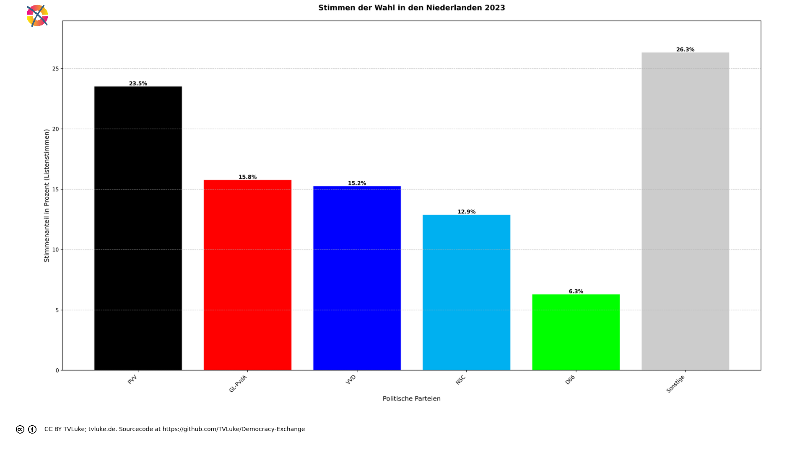

# Stimmen der Wahl in den Niederlanden 2023 nach deutschem Wahlrecht von 2023.
Year: 2023

## Election Statistics
- **Total Population**: 17,458,120
- **Total Citizens**: 16,585,208
- **Eligible Voters**: 13,399,296
- **Total Votes Cast**: 10,424,607
- **Turnout**: 77.80%
- **Parliament Size**: 150 seats

### Vote Summary

A total of 41,698,428 votes were cast, representing a turnout of 311.2% of the electorate.

| Party | Votes | Percentage |
|-------|--------|------------|
| PVV | 9,801,812 | 23.5% |
| GL-PvdA | 6,570,092 | 15.8% |
| VVD | 6,356,340 | 15.2% |
| NSC | 5,371,836 | 12.9% |
| D66 | 2,621,000 | 6.3% |
| BBB | 1,941,416 | 4.7% |
| CDA | 1,383,040 | 3.3% |
| SP | 1,312,664 | 3.1% |
| DENK | 986,992 | 2.4% |
| PvdD | 940,248 | 2.3% |
| FVD | 931,496 | 2.2% |
| SGP | 869,016 | 2.1% |
| CU | 848,272 | 2.0% |
| Volt | 714,988 | 1.7% |
| JA21 | 285,336 | 0.7% |
| BVNL | 211,424 | 0.5% |
| 50PLUS | 204,148 | 0.5% |
| Bij1 | 176,836 | 0.4% |
| Splinter | 51,292 | 0.1% |
| Piratenpartij | 36,428 | 0.1% |
| PLAN | 21,948 | 0.1% |
| Samen voor Nederland | 21,300 | 0.1% |
| LEF | 20,488 | 0.0% |
| PvdS | 15,864 | 0.0% |
| PPB | 4,152 | 0.0% |

**PVV** received the most votes with 9,801,812 votes (23.5% of total votes).

## Seat Calculation Process

## French Electoral System Explanation

This election uses the French two-round voting system (scrutin uninominal majoritaire à deux tours):

1. **First Round**
   - All candidates can participate
   - If a candidate receives >50% of votes AND ≥25% of registered voters, they win immediately
   - Otherwise, qualified candidates proceed to second round

2. **Second Round Qualification**
   - Candidates need ≥12.5% of votes to qualify
   - If no candidates reach 12.5%, top two advance
   - When no second round data is provided, votes are simulated:
     * 80% of votes from eliminated parties go to parties with same left-right position
     * 30% of remaining votes go to parties within 1 position on left-right scale
     * Other votes are considered lost/abstentions

Key Features:
- 150 total seats to be distributed
- Single-member constituencies
- Two rounds if no absolute majority in first round

3. **Seat Scaling**
   When the required number of seats (150) differs from the number of districts (19),
   we use proportional scaling to maintain fair representation:
   - First calculate results for all districts
   - Then multiply each party's seats by (total_seats / number_of_districts)
   - Round to nearest whole number while preserving total seats
   - This maintains the proportional representation from the district results
   
   Example: If we have 100 districts but need 200 seats:
   - Party A wins 60 districts → scaled to 120 seats (60 * 200/100)
   - Party B wins 40 districts → scaled to 80 seats (40 * 200/100)
   The relative strength of each party remains the same.

## Example Districts

To illustrate how the French two-round system works in practice, here are three example districts:

### Example 1: Groningen

**First Round Results:**
- Total votes cast: 365,485
- Registered voters: 730,970

**Party Results:**
- PVV: 79,811 votes (21.8% of votes, 10.9% of registered)
- GL-PvdA: 73,774 votes (20.2% of votes, 10.1% of registered)
- NSC: 53,539 votes (14.6% of votes, 7.3% of registered)
- VVD: 36,092 votes (9.9% of votes, 4.9% of registered)
- BBB: 22,356 votes (6.1% of votes, 3.1% of registered)
- D66: 20,899 votes (5.7% of votes, 2.9% of registered)
- SP: 16,564 votes (4.5% of votes, 2.3% of registered)
- CU: 12,374 votes (3.4% of votes, 1.7% of registered)
- CDA: 10,792 votes (3.0% of votes, 1.5% of registered)
- PvdD: 9,828 votes (2.7% of votes, 1.3% of registered)
- FVD: 8,358 votes (2.3% of votes, 1.1% of registered)
- Volt: 7,082 votes (1.9% of votes, 1.0% of registered)
- SGP: 3,280 votes (0.9% of votes, 0.4% of registered)
- DENK: 2,794 votes (0.8% of votes, 0.4% of registered)
- JA21: 2,013 votes (0.6% of votes, 0.3% of registered)
- BVNL: 1,870 votes (0.5% of votes, 0.3% of registered)
- 50PLUS: 1,432 votes (0.4% of votes, 0.2% of registered)
- Bij1: 1,182 votes (0.3% of votes, 0.2% of registered)
- Splinter: 377 votes (0.1% of votes, 0.1% of registered)
- Piratenpartij: 370 votes (0.1% of votes, 0.1% of registered)
- Samen voor Nederland: 295 votes (0.1% of votes, 0.0% of registered)
- LEF: 212 votes (0.1% of votes, 0.0% of registered)
- PLAN: 191 votes (0.1% of votes, 0.0% of registered)
- PvdS: 0 votes (0.0% of votes, 0.0% of registered)
- PPB: 0 votes (0.0% of votes, 0.0% of registered)

**Second Round:** Parties qualifying (≥12.5%):
- PVV: 79,811 votes (21.8%)
- GL-PvdA: 73,774 votes (20.2%)
- NSC: 53,539 votes (14.6%)

**Vote Redistribution Simulation:**
Vote Transfers:
- VVD → NSC: 309 votes
- VVD: 35,783 votes lost/abstained
- D66 → NSC: 209 votes
- D66: 20,690 votes lost/abstained
- CDA → NSC: 2,877 votes
- CDA: 7,915 votes lost/abstained
- SP → GL-PvdA: 13,251 votes
- SP: 3,313 votes lost/abstained
- FVD → PVV: 6,686 votes
- FVD: 1,672 votes lost/abstained
- PvdD → GL-PvdA: 53 votes
- PvdD: 9,775 votes lost/abstained
- CU → NSC: 3,299 votes
- CU: 9,075 votes lost/abstained
- Volt → NSC: 70 votes
- Volt: 7,012 votes lost/abstained
- JA21 → PVV: 24 votes
- JA21: 1,989 votes lost/abstained
- SGP → PVV: 39 votes
- SGP: 3,241 votes lost/abstained
- DENK → NSC: 28 votes
- DENK: 2,766 votes lost/abstained
- 50PLUS → NSC: 381 votes
- 50PLUS: 1,051 votes lost/abstained
- BBB → NSC: 191 votes
- BBB: 22,165 votes lost/abstained
- Bij1 → GL-PvdA: 177 votes
- Bij1: 1,005 votes lost/abstained
- Piratenpartij → NSC: 3 votes
- Piratenpartij: 367 votes lost/abstained
- BVNL → PVV: 22 votes
- BVNL: 1,848 votes lost/abstained
- Splinter → NSC: 4 votes
- Splinter: 373 votes lost/abstained
- LEF → NSC: 2 votes
- LEF: 210 votes lost/abstained
- Samen voor Nederland → NSC: 3 votes
- Samen voor Nederland: 292 votes lost/abstained
- PLAN → NSC: 1 votes
- PLAN: 190 votes lost/abstained
- PvdS → NSC: 0 votes
- PPB → GL-PvdA: 0 votes

**Final Second Round Result:**
- GL-PvdA: 87,255 votes (23.9%)
- PVV: 86,582 votes (23.7%)
- NSC: 60,916 votes (16.7%)

**Result:** GL-PvdA wins the simulated second round

### Example 2: Zwolle

**First Round Results:**
- Total votes cast: 745,568
- Registered voters: 1,491,136

**Party Results:**
- PVV: 163,887 votes (22.0% of votes, 11.0% of registered)
- NSC: 163,693 votes (22.0% of votes, 11.0% of registered)
- GL-PvdA: 86,650 votes (11.6% of votes, 5.8% of registered)
- VVD: 83,052 votes (11.1% of votes, 5.6% of registered)
- BBB: 63,533 votes (8.5% of votes, 4.3% of registered)
- D66: 32,251 votes (4.3% of votes, 2.2% of registered)
- CDA: 26,019 votes (3.5% of votes, 1.7% of registered)
- CU: 25,645 votes (3.4% of votes, 1.7% of registered)
- SGP: 22,334 votes (3.0% of votes, 1.5% of registered)
- SP: 18,051 votes (2.4% of votes, 1.2% of registered)
- FVD: 15,816 votes (2.1% of votes, 1.1% of registered)
- PvdD: 11,264 votes (1.5% of votes, 0.8% of registered)
- DENK: 10,138 votes (1.4% of votes, 0.7% of registered)
- Volt: 9,850 votes (1.3% of votes, 0.7% of registered)
- JA21: 4,230 votes (0.6% of votes, 0.3% of registered)
- BVNL: 3,375 votes (0.5% of votes, 0.2% of registered)
- 50PLUS: 2,154 votes (0.3% of votes, 0.1% of registered)
- Bij1: 1,347 votes (0.2% of votes, 0.1% of registered)
- Splinter: 617 votes (0.1% of votes, 0.0% of registered)
- Piratenpartij: 466 votes (0.1% of votes, 0.0% of registered)
- Samen voor Nederland: 321 votes (0.0% of votes, 0.0% of registered)
- PvdS: 314 votes (0.0% of votes, 0.0% of registered)
- PLAN: 283 votes (0.0% of votes, 0.0% of registered)
- LEF: 278 votes (0.0% of votes, 0.0% of registered)
- PPB: 0 votes (0.0% of votes, 0.0% of registered)

**Second Round:** Parties qualifying (≥12.5%):
- PVV: 163,887 votes (22.0%)
- NSC: 163,693 votes (22.0%)

**Vote Redistribution Simulation:**
Vote Transfers:
- VVD → NSC: 711 votes
- VVD: 82,341 votes lost/abstained
- D66 → NSC: 322 votes
- D66: 31,929 votes lost/abstained
- GL-PvdA: 86,650 votes lost/abstained
- CDA → NSC: 6,938 votes
- CDA: 19,081 votes lost/abstained
- SP: 18,051 votes lost/abstained
- FVD → PVV: 12,652 votes
- FVD: 3,164 votes lost/abstained
- PvdD: 11,264 votes lost/abstained
- CU → NSC: 6,838 votes
- CU: 18,807 votes lost/abstained
- Volt → NSC: 98 votes
- Volt: 9,752 votes lost/abstained
- JA21 → PVV: 50 votes
- JA21: 4,180 votes lost/abstained
- SGP → PVV: 268 votes
- SGP: 22,066 votes lost/abstained
- DENK → NSC: 101 votes
- DENK: 10,037 votes lost/abstained
- 50PLUS → NSC: 574 votes
- 50PLUS: 1,580 votes lost/abstained
- BBB → NSC: 544 votes
- BBB: 62,989 votes lost/abstained
- Bij1: 1,347 votes lost/abstained
- Piratenpartij → NSC: 4 votes
- Piratenpartij: 462 votes lost/abstained
- BVNL → PVV: 40 votes
- BVNL: 3,335 votes lost/abstained
- Splinter → NSC: 6 votes
- Splinter: 611 votes lost/abstained
- LEF → NSC: 3 votes
- LEF: 275 votes lost/abstained
- Samen voor Nederland → NSC: 3 votes
- Samen voor Nederland: 318 votes lost/abstained
- PLAN → NSC: 2 votes
- PLAN: 281 votes lost/abstained
- PvdS → NSC: 3 votes
- PvdS: 311 votes lost/abstained

**Final Second Round Result:**
- NSC: 179,840 votes (24.1%)
- PVV: 176,897 votes (23.7%)

**Result:** NSC wins the simulated second round

### Example 3: Leeuwarden

**First Round Results:**
- Total votes cast: 419,417
- Registered voters: 838,834

**Party Results:**
- PVV: 102,524 votes (24.4% of votes, 12.2% of registered)
- NSC: 68,451 votes (16.3% of votes, 8.2% of registered)
- GL-PvdA: 61,194 votes (14.6% of votes, 7.3% of registered)
- VVD: 47,098 votes (11.2% of votes, 5.6% of registered)
- BBB: 35,010 votes (8.3% of votes, 4.2% of registered)
- CDA: 22,478 votes (5.4% of votes, 2.7% of registered)
- D66: 18,249 votes (4.4% of votes, 2.2% of registered)
- SP: 14,266 votes (3.4% of votes, 1.7% of registered)
- CU: 11,469 votes (2.7% of votes, 1.4% of registered)
- FVD: 11,312 votes (2.7% of votes, 1.3% of registered)
- PvdD: 7,635 votes (1.8% of votes, 0.9% of registered)
- SGP: 4,197 votes (1.0% of votes, 0.5% of registered)
- Volt: 3,689 votes (0.9% of votes, 0.4% of registered)
- BVNL: 3,450 votes (0.8% of votes, 0.4% of registered)
- JA21: 2,737 votes (0.7% of votes, 0.3% of registered)
- 50PLUS: 1,756 votes (0.4% of votes, 0.2% of registered)
- DENK: 1,675 votes (0.4% of votes, 0.2% of registered)
- Bij1: 685 votes (0.2% of votes, 0.1% of registered)
- Splinter: 437 votes (0.1% of votes, 0.1% of registered)
- Piratenpartij: 377 votes (0.1% of votes, 0.0% of registered)
- Samen voor Nederland: 263 votes (0.1% of votes, 0.0% of registered)
- LEF: 202 votes (0.0% of votes, 0.0% of registered)
- PLAN: 161 votes (0.0% of votes, 0.0% of registered)
- PPB: 102 votes (0.0% of votes, 0.0% of registered)
- PvdS: 0 votes (0.0% of votes, 0.0% of registered)

**Second Round:** Parties qualifying (≥12.5%):
- PVV: 102,524 votes (24.4%)
- GL-PvdA: 61,194 votes (14.6%)
- NSC: 68,451 votes (16.3%)

**Vote Redistribution Simulation:**
Vote Transfers:
- VVD → NSC: 403 votes
- VVD: 46,695 votes lost/abstained
- D66 → NSC: 182 votes
- D66: 18,067 votes lost/abstained
- CDA → NSC: 5,994 votes
- CDA: 16,484 votes lost/abstained
- SP → GL-PvdA: 11,412 votes
- SP: 2,854 votes lost/abstained
- FVD → PVV: 9,049 votes
- FVD: 2,263 votes lost/abstained
- PvdD → GL-PvdA: 41 votes
- PvdD: 7,594 votes lost/abstained
- CU → NSC: 3,058 votes
- CU: 8,411 votes lost/abstained
- Volt → NSC: 37 votes
- Volt: 3,652 votes lost/abstained
- JA21 → PVV: 32 votes
- JA21: 2,705 votes lost/abstained
- SGP → PVV: 50 votes
- SGP: 4,147 votes lost/abstained
- DENK → NSC: 16 votes
- DENK: 1,659 votes lost/abstained
- 50PLUS → NSC: 468 votes
- 50PLUS: 1,288 votes lost/abstained
- BBB → NSC: 300 votes
- BBB: 34,710 votes lost/abstained
- Bij1 → GL-PvdA: 102 votes
- Bij1: 583 votes lost/abstained
- Piratenpartij → NSC: 4 votes
- Piratenpartij: 373 votes lost/abstained
- BVNL → PVV: 41 votes
- BVNL: 3,409 votes lost/abstained
- Splinter → NSC: 4 votes
- Splinter: 433 votes lost/abstained
- LEF → NSC: 2 votes
- LEF: 200 votes lost/abstained
- Samen voor Nederland → NSC: 2 votes
- Samen voor Nederland: 261 votes lost/abstained
- PLAN → NSC: 1 votes
- PLAN: 160 votes lost/abstained
- PvdS → NSC: 0 votes
- PPB → GL-PvdA: 0 votes
- PPB: 102 votes lost/abstained

**Final Second Round Result:**
- PVV: 111,696 votes (26.6%)
- NSC: 78,922 votes (18.8%)
- GL-PvdA: 72,749 votes (17.3%)

**Result:** PVV wins the simulated second round

## Seat Scaling Applied

Scaling from 19 districts to 150 total seats:

### Before Scaling (19 seats)
| Party | Seats | Percentage |
|-------|--------|------------|
| PVV | 14 | 73.7% |
| GL-PvdA | 4 | 21.1% |
| NSC | 1 | 5.3% |

### After Scaling (150 seats)
| Party | Seats | Percentage | Change |
|-------|--------|------------|---------|
| PVV | 110 | 73.3% | -0.4% |
| GL-PvdA | 32 | 21.3% | +0.3% |
| NSC | 8 | 5.3% | +0.1% |

Scaling Details:
- Scaling factor: 7.895
- Each party's seats multiplied by this factor and rounded
- Total seats preserved through rounding adjustments
- Percentages of total seats remain nearly identical

## Visualizations
### Parliament Seating

### Coalition Possibilities
![Possible coalition combinations that form a majority, sorted by ideological distance (smaller distance means parties are closer on the left-right spectrum): VVD + PVV with 79 seats (52.7%, ideological distance: 2.0); GL-PvdA + PVV with 80 seats (53.3%, ideological distance: 6.0); GL-PvdA + D66 + VVD with 76 seats (50.7%, ideological distance: 8.0); GL-PvdA + NSC + VVD with 89 seats (59.3%, ideological distance: 8.0); D66 + NSC + PVV with 87 seats (58.0%, ideological distance: 8.0). Die "Ideologische Distanz": Für die Darstellung in korrekter Reihenfolge hat jede Partei einen left_to_right-Wert, mit 1 für die Partei, welche üblicherweise im Parlament ganz links sitzt, dann aufsteigend: Dieser Wert wird hier auch einfach als Distanzwert gewertet, um wahrscheinliche Koalitionen darzustellen. Diese Berechnung ist natürlich stark vereinfachend und in vielen Fällen einfach falsch.  Beispiel für die Koalition GL-PvdA-D66-VVD: GL-PvdA: left_to_right = 2 D66: left_to_right = 4 VVD: left_to_right = 6 Ideologische Distanz = |2-4| + |2-6| + |4-6| = 8](../plots/netherlands2023_germany_coalitions.png)

### Vote vs Seat Distribution
![Bar chart comparing each party's vote percentage (darker bars) with their seat percentage (lighter bars). Parties with significant differences: PVV (23.5% votes vs 32.0% seats, Δ8.5%), GL-PvdA (15.8% votes vs 21.3% seats, Δ5.6%), VVD (15.2% votes vs 20.7% seats, Δ5.4%), NSC (12.9% votes vs 17.3% seats, Δ4.5%), D66 (6.3% votes vs 8.7% seats, Δ2.4%), BBB (4.7% votes vs 0.0% seats, Δ4.7%), CDA (3.3% votes vs 0.0% seats, Δ3.3%), SP (3.1% votes vs 0.0% seats, Δ3.1%), DENK (2.4% votes vs 0.0% seats, Δ2.4%), PvdD (2.3% votes vs 0.0% seats, Δ2.3%), FVD (2.2% votes vs 0.0% seats, Δ2.2%), SGP (2.1% votes vs 0.0% seats, Δ2.1%), CU (2.0% votes vs 0.0% seats, Δ2.0%), Volt (1.7% votes vs 0.0% seats, Δ1.7%). Total vote-seat difference: 52.7%. (Listenstimmen)](../plots/netherlands2023_germany_vote_seat_distribution.png)

### Party Vote Distribution

## Detailed Results
| Party | Votes | Vote Share | Seats | Seat Share | Representation Gap |
|-------|--------|------------|-------|------------|-------------------|
| PVV | 2,450,453 | 23.51% | 48 | 32.00% | 8.49% |
| GL-PvdA | 1,642,523 | 15.76% | 32 | 21.33% | 5.58% |
| VVD | 1,589,085 | 15.24% | 31 | 20.67% | 5.42% |
| NSC | 1,342,959 | 12.88% | 26 | 17.33% | 4.45% |
| D66 | 655,250 | 6.29% | 13 | 8.67% | 2.38% |
| Bij1 | 44,209 | 0.42% | 0 | 0.00% | -0.42% |
| SP | 328,166 | 3.15% | 0 | 0.00% | -3.15% |
| PPB | 1,038 | 0.01% | 0 | 0.00% | -0.01% |
| PvdD | 235,062 | 2.25% | 0 | 0.00% | -2.25% |
| DENK | 246,748 | 2.37% | 0 | 0.00% | -2.37% |
| LEF | 5,122 | 0.05% | 0 | 0.00% | -0.05% |
| PLAN | 5,487 | 0.05% | 0 | 0.00% | -0.05% |
| Piratenpartij | 9,107 | 0.09% | 0 | 0.00% | -0.09% |
| PvdS | 3,966 | 0.04% | 0 | 0.00% | -0.04% |
| Samen voor Nederland | 5,325 | 0.05% | 0 | 0.00% | -0.05% |
| Splinter | 12,823 | 0.12% | 0 | 0.00% | -0.12% |
| Volt | 178,747 | 1.71% | 0 | 0.00% | -1.71% |
| 50PLUS | 51,037 | 0.49% | 0 | 0.00% | -0.49% |
| CDA | 345,760 | 3.32% | 0 | 0.00% | -3.32% |
| CU | 212,068 | 2.03% | 0 | 0.00% | -2.03% |
| BBB | 485,354 | 4.66% | 0 | 0.00% | -4.66% |
| BVNL | 52,856 | 0.51% | 0 | 0.00% | -0.51% |
| JA21 | 71,334 | 0.68% | 0 | 0.00% | -0.68% |
| SGP | 217,254 | 2.08% | 0 | 0.00% | -2.08% |
| FVD | 232,874 | 2.23% | 0 | 0.00% | -2.23% |

## Analysis of Representation
### Most Over-represented Parties
- **PVV**: +8.49%
- **GL-PvdA**: +5.58%
- **VVD**: +5.42%

### Most Under-represented Parties
- **BBB**: -4.66%
- **CDA**: -3.32%
- **SP**: -3.15%

## Sources

### About the Electoral System
- [Das Wahlsystem (bundeswahlleiterin.de)](https://www.bundeswahlleiterin.de/bundestagswahlen/2025/informationen-waehler/wahlsystem.html#48635498-9ca6-4a2b-b374-969e5b8371ac)
- [Wahlsystem & Wahlrecht der Bundestagswahlen (bundestagswahl-bw.de)](https://www.bundestagswahl-bw.de/wahlsystem#c116523)