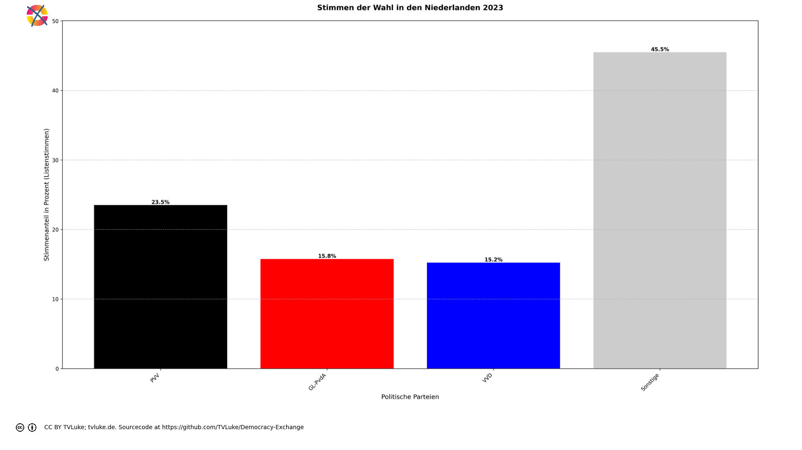

# Stimmen der Wahl in den Niederlanden 2023 nach britischem Wahlrecht.
Year: 2023

## Election Statistics
- **Total Population**: 17,458,120
- **Total Citizens**: 16,585,208
- **Eligible Voters**: 13,399,296
- **Total Votes Cast**: 10,424,607
- **Turnout**: 77.80%
- **Parliament Size**: 150 seats

### Vote Summary

A total of 10,424,607 votes were cast, representing a turnout of 77.8% of the electorate.

| Party | Votes | Percentage |
|-------|--------|------------|
| PVV | 2,450,453 | 23.5% |
| GL-PvdA | 1,642,523 | 15.8% |
| VVD | 1,589,085 | 15.2% |
| NSC | 1,342,959 | 12.9% |
| D66 | 655,250 | 6.3% |
| BBB | 485,354 | 4.7% |
| CDA | 345,760 | 3.3% |
| SP | 328,166 | 3.1% |
| DENK | 246,748 | 2.4% |
| PvdD | 235,062 | 2.3% |
| FVD | 232,874 | 2.2% |
| SGP | 217,254 | 2.1% |
| CU | 212,068 | 2.0% |
| Volt | 178,747 | 1.7% |
| JA21 | 71,334 | 0.7% |
| BVNL | 52,856 | 0.5% |
| 50PLUS | 51,037 | 0.5% |
| Bij1 | 44,209 | 0.4% |
| Splinter | 12,823 | 0.1% |
| Piratenpartij | 9,107 | 0.1% |
| PLAN | 5,487 | 0.1% |
| Samen voor Nederland | 5,325 | 0.1% |
| LEF | 5,122 | 0.0% |
| PvdS | 3,966 | 0.0% |
| PPB | 1,038 | 0.0% |

**PVV** received the most votes with 2,450,453 votes (23.5% of total votes).

## Seat Calculation Process

# United Kingdom Electoral System
The UK uses First-Past-The-Post (FPTP) voting where:
- Each constituency (district) elects one Member of Parliament (MP)
- The candidate with the most votes in each constituency wins that seat
- No minimum threshold is required
- Normally, the total number of seats equals the number of constituencies (19 in this dataset)

In this calculation, the target number of seats is 150, which differs from the number of constituencies. This means we will need to scale the results proportionally after determining constituency winners.

## Constituency: Rotterdam
This constituency demonstrates how First-Past-The-Post works:

## Example Constituency: Rotterdam
This example shows how First-Past-The-Post determines the winner:

Total votes cast: 293,904
- PVV: 63,126 votes (21.5%)
- GL-PvdA: 58,867 votes (20.0%)
- VVD: 34,543 votes (11.8%)
- DENK: 29,175 votes (9.9%)
- NSC: 26,561 votes (9.0%)
- D66: 20,606 votes (7.0%)
- SP: 9,564 votes (3.3%)
- PvdD: 9,177 votes (3.1%)
- Volt: 7,587 votes (2.6%)
- FVD: 7,576 votes (2.6%)
- CDA: 5,820 votes (2.0%)
- Bij1: 4,917 votes (1.7%)
- CU: 4,266 votes (1.5%)
- BBB: 3,858 votes (1.3%)
- JA21: 2,572 votes (0.9%)
- SGP: 1,873 votes (0.6%)
- 50PLUS: 1,251 votes (0.4%)
- BVNL: 1,201 votes (0.4%)
- Splinter: 408 votes (0.1%)
- Piratenpartij: 330 votes (0.1%)
- PLAN: 324 votes (0.1%)
- LEF: 168 votes (0.1%)
- Samen voor Nederland: 134 votes (0.0%)
- PvdS: 0 votes (0.0%)
- PPB: 0 votes (0.0%)

Winner determination:
- Highest vote count: PVV with 63,126 votes (21.5%)
- Second place: GL-PvdA with 58,867 votes (20.0%)
- Margin of victory: 4,259 votes (1.4% of total votes)

Result: PVV wins this constituency's single seat, regardless of the margin of victory.

## Constituency: Dordrecht
This constituency demonstrates how First-Past-The-Post works:

## Example Constituency: Dordrecht
This example shows how First-Past-The-Post determines the winner:

Total votes cast: 746,218
- PVV: 207,280 votes (27.8%)
- VVD: 117,000 votes (15.7%)
- NSC: 87,980 votes (11.8%)
- GL-PvdA: 85,660 votes (11.5%)
- D66: 36,879 votes (4.9%)
- SGP: 35,340 votes (4.7%)
- CDA: 27,933 votes (3.7%)
- CU: 22,318 votes (3.0%)
- BBB: 21,989 votes (2.9%)
- DENK: 21,766 votes (2.9%)
- SP: 21,122 votes (2.8%)
- FVD: 18,318 votes (2.5%)
- PvdD: 13,630 votes (1.8%)
- Volt: 9,637 votes (1.3%)
- JA21: 6,434 votes (0.9%)
- 50PLUS: 4,019 votes (0.5%)
- BVNL: 3,567 votes (0.5%)
- Bij1: 2,276 votes (0.3%)
- Splinter: 1,033 votes (0.1%)
- Piratenpartij: 545 votes (0.1%)
- PvdS: 451 votes (0.1%)
- Samen voor Nederland: 385 votes (0.1%)
- PLAN: 374 votes (0.1%)
- LEF: 282 votes (0.0%)
- PPB: 0 votes (0.0%)

Winner determination:
- Highest vote count: PVV with 207,280 votes (27.8%)
- Second place: VVD with 117,000 votes (15.7%)
- Margin of victory: 90,280 votes (12.1% of total votes)

Result: PVV wins this constituency's single seat, regardless of the margin of victory.

## Constituency: Maastricht
This constituency demonstrates how First-Past-The-Post works:

## Example Constituency: Maastricht
This example shows how First-Past-The-Post determines the winner:

Total votes cast: 652,843
- PVV: 217,216 votes (33.3%)
- NSC: 92,191 votes (14.1%)
- VVD: 90,273 votes (13.8%)
- GL-PvdA: 88,122 votes (13.5%)
- D66: 31,572 votes (4.8%)
- BBB: 28,862 votes (4.4%)
- SP: 23,940 votes (3.7%)
- CDA: 22,287 votes (3.4%)
- FVD: 15,092 votes (2.3%)
- PvdD: 11,258 votes (1.7%)
- DENK: 8,007 votes (1.2%)
- Volt: 6,515 votes (1.0%)
- JA21: 3,893 votes (0.6%)
- 50PLUS: 3,670 votes (0.6%)
- BVNL: 3,562 votes (0.5%)
- CU: 2,164 votes (0.3%)
- Bij1: 1,137 votes (0.2%)
- Splinter: 703 votes (0.1%)
- SGP: 665 votes (0.1%)
- Piratenpartij: 482 votes (0.1%)
- PvdS: 377 votes (0.1%)
- LEF: 298 votes (0.0%)
- PLAN: 289 votes (0.0%)
- Samen voor Nederland: 268 votes (0.0%)
- PPB: 0 votes (0.0%)

Winner determination:
- Highest vote count: PVV with 217,216 votes (33.3%)
- Second place: NSC with 92,191 votes (14.1%)
- Margin of victory: 125,025 votes (19.2% of total votes)

Result: PVV wins this constituency's single seat, regardless of the margin of victory.

## Scaling Process Explanation
The UK system needs to scale from 19 constituencies to 150 total seats.

This scaling maintains proportionality through these steps:
1. Calculate scaling factor: 150 seats ÷ 19 constituencies = 7.8947
2. Multiply each party's constituency seats by this factor
3. Take the integer part first (floor)
4. Distribute remaining seats by highest decimal remainder

This preserves the proportional relationship between parties while reaching the target seat count.

Original seat distribution (showing only parties that won seats):
{
  "GL-PvdA": "3 seats (15.8%)",
  "PVV": "15 seats (78.9%)",
  "VVD": "1 seats (5.3%)"
}

Final seat distribution after scaling (showing only parties that won seats):
{
  "GL-PvdA": "24 seats (16.0%)",
  "PVV": "118 seats (78.7%)",
  "VVD": "8 seats (5.3%)"
}

Note how the percentage of seats for each party remains nearly identical after scaling,
demonstrating that the proportional relationships are preserved.

## Visualizations
### Parliament Seating

### Coalition Possibilities
![Possible coalition combinations that form a majority, sorted by ideological distance (smaller distance means parties are closer on the left-right spectrum): PVV with 118 seats (78.7%, ideological distance: 0.0); VVD + PVV with 126 seats (84.0%, ideological distance: 2.0); GL-PvdA + PVV with 142 seats (94.7%, ideological distance: 6.0). Die "Ideologische Distanz": Für die Darstellung in korrekter Reihenfolge hat jede Partei einen left_to_right-Wert, mit 1 für die Partei, welche üblicherweise im Parlament ganz links sitzt, dann aufsteigend: Dieser Wert wird hier auch einfach als Distanzwert gewertet, um wahrscheinliche Koalitionen darzustellen. Diese Berechnung ist natürlich stark vereinfachend und in vielen Fällen einfach falsch.  Beispiel für eine Einzelpartei-Mehrheit (PVV): PVV: left_to_right = 8 Ideologische Distanz = 0 (Einzelpartei)](../plots/netherlands2023_uk_coalitions.png)

### Vote vs Seat Distribution
![Bar chart comparing each party's vote percentage (darker bars) with their seat percentage (lighter bars). Parties with significant differences: PVV (23.5% votes vs 78.7% seats, Δ55.2%), VVD (15.2% votes vs 5.3% seats, Δ9.9%), NSC (12.9% votes vs 0.0% seats, Δ12.9%), D66 (6.3% votes vs 0.0% seats, Δ6.3%), BBB (4.7% votes vs 0.0% seats, Δ4.7%), CDA (3.3% votes vs 0.0% seats, Δ3.3%), SP (3.1% votes vs 0.0% seats, Δ3.1%), DENK (2.4% votes vs 0.0% seats, Δ2.4%), PvdD (2.3% votes vs 0.0% seats, Δ2.3%), FVD (2.2% votes vs 0.0% seats, Δ2.2%), SGP (2.1% votes vs 0.0% seats, Δ2.1%), CU (2.0% votes vs 0.0% seats, Δ2.0%), Volt (1.7% votes vs 0.0% seats, Δ1.7%). Total vote-seat difference: 110.8%. (Listenstimmen werden wie Mandatsstimmen gewertet)](../plots/netherlands2023_uk_vote_seat_distribution.png)

### Party Vote Distribution

## Detailed Results
| Party | Votes | Vote Share | Seats | Seat Share | Representation Gap |
|-------|--------|------------|-------|------------|-------------------|
| PVV | 2,450,453 | 23.51% | 118 | 78.67% | 55.16% |
| GL-PvdA | 1,642,523 | 15.76% | 24 | 16.00% | 0.24% |
| VVD | 1,589,085 | 15.24% | 8 | 5.33% | -9.91% |
| Bij1 | 44,209 | 0.42% | 0 | 0.00% | -0.42% |
| SP | 328,166 | 3.15% | 0 | 0.00% | -3.15% |
| PPB | 1,038 | 0.01% | 0 | 0.00% | -0.01% |
| PvdD | 235,062 | 2.25% | 0 | 0.00% | -2.25% |
| D66 | 655,250 | 6.29% | 0 | 0.00% | -6.29% |
| DENK | 246,748 | 2.37% | 0 | 0.00% | -2.37% |
| LEF | 5,122 | 0.05% | 0 | 0.00% | -0.05% |
| PLAN | 5,487 | 0.05% | 0 | 0.00% | -0.05% |
| Piratenpartij | 9,107 | 0.09% | 0 | 0.00% | -0.09% |
| PvdS | 3,966 | 0.04% | 0 | 0.00% | -0.04% |
| Samen voor Nederland | 5,325 | 0.05% | 0 | 0.00% | -0.05% |
| Splinter | 12,823 | 0.12% | 0 | 0.00% | -0.12% |
| Volt | 178,747 | 1.71% | 0 | 0.00% | -1.71% |
| 50PLUS | 51,037 | 0.49% | 0 | 0.00% | -0.49% |
| CDA | 345,760 | 3.32% | 0 | 0.00% | -3.32% |
| CU | 212,068 | 2.03% | 0 | 0.00% | -2.03% |
| NSC | 1,342,959 | 12.88% | 0 | 0.00% | -12.88% |
| BBB | 485,354 | 4.66% | 0 | 0.00% | -4.66% |
| BVNL | 52,856 | 0.51% | 0 | 0.00% | -0.51% |
| JA21 | 71,334 | 0.68% | 0 | 0.00% | -0.68% |
| SGP | 217,254 | 2.08% | 0 | 0.00% | -2.08% |
| FVD | 232,874 | 2.23% | 0 | 0.00% | -2.23% |

## Analysis of Representation
### Most Over-represented Parties
- **PVV**: +55.16%
- **GL-PvdA**: +0.24%
- **PPB**: +-0.01%

### Most Under-represented Parties
- **NSC**: -12.88%
- **VVD**: -9.91%
- **D66**: -6.29%

## Sources

### About the Electoral System
- [How MPs are elected (parliament.uk)](https://www.parliament.uk/about/mps-and-lords/members/electing-mps/)