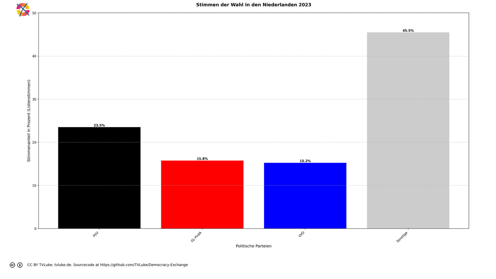

# Stimmen der Wahl in den Niederlanden 2023 nach US-amerikanischem Wahlrecht.
Year: 2023

## Election Statistics
- **Total Population**: 17,458,120
- **Total Citizens**: 16,585,208
- **Eligible Voters**: 13,399,296
- **Total Votes Cast**: 10,424,607
- **Turnout**: 77.80%
- **Parliament Size**: 150 seats

### Vote Summary

A total of 10,424,607 votes were cast, representing a turnout of 77.8% of the electorate.

| Party | Votes | Percentage |
|-------|--------|------------|
| PVV | 2,450,453 | 23.5% |
| GL-PvdA | 1,642,523 | 15.8% |
| VVD | 1,589,085 | 15.2% |
| NSC | 1,342,959 | 12.9% |
| D66 | 655,250 | 6.3% |
| BBB | 485,354 | 4.7% |
| CDA | 345,760 | 3.3% |
| SP | 328,166 | 3.1% |
| DENK | 246,748 | 2.4% |
| PvdD | 235,062 | 2.3% |
| FVD | 232,874 | 2.2% |
| SGP | 217,254 | 2.1% |
| CU | 212,068 | 2.0% |
| Volt | 178,747 | 1.7% |
| JA21 | 71,334 | 0.7% |
| BVNL | 52,856 | 0.5% |
| 50PLUS | 51,037 | 0.5% |
| Bij1 | 44,209 | 0.4% |
| Splinter | 12,823 | 0.1% |
| Piratenpartij | 9,107 | 0.1% |
| PLAN | 5,487 | 0.1% |
| Samen voor Nederland | 5,325 | 0.1% |
| LEF | 5,122 | 0.0% |
| PvdS | 3,966 | 0.0% |
| PPB | 1,038 | 0.0% |

**PVV** received the most votes with 2,450,453 votes (23.5% of total votes).

## Seat Calculation Process

# United States House of Representatives Electoral System
The US uses First-Past-The-Post (FPTP) voting where:
- Each congressional district elects one Representative
- The candidate with the most votes (plurality) in each district wins that seat
- No minimum vote threshold is required
- Districts are redrawn every 10 years following the census
- Each state is guaranteed at least one Representative

In this calculation:
- Number of districts: 19
- Target number of seats: 150

## Congressional District: Arnhem
This district demonstrates how First-Past-The-Post works in US House elections:

## Example Congressional District: Arnhem
This example shows how the Representative is determined:

Total votes cast: 983,108
- PVV: 213,507 votes (21.7%)
- VVD: 139,971 votes (14.2%)
- NSC: 137,796 votes (14.0%)
- GL-PvdA: 137,007 votes (13.9%)
- BBB: 69,882 votes (7.1%)
- D66: 54,342 votes (5.5%)
- SGP: 43,277 votes (4.4%)
- CDA: 38,824 votes (3.9%)
- CU: 33,325 votes (3.4%)
- SP: 27,147 votes (2.8%)
- FVD: 20,296 votes (2.1%)
- PvdD: 20,058 votes (2.0%)
- DENK: 14,383 votes (1.5%)
- Volt: 13,517 votes (1.4%)
- JA21: 6,059 votes (0.6%)
- BVNL: 4,415 votes (0.4%)
- 50PLUS: 3,971 votes (0.4%)
- Bij1: 2,132 votes (0.2%)
- Splinter: 1,038 votes (0.1%)
- Piratenpartij: 712 votes (0.1%)
- Samen voor Nederland: 546 votes (0.1%)
- PLAN: 494 votes (0.1%)
- LEF: 409 votes (0.0%)
- PvdS: 0 votes (0.0%)
- PPB: 0 votes (0.0%)

Winner determination:
- Highest vote count: PVV with 213,507 votes (21.7%)
- Second place: VVD with 139,971 votes (14.2%)
- Margin of victory: 73,536 votes (7.5% of total votes)

Result: PVV wins this district's seat in the House of Representatives.

## Congressional District: Haarlem
This district demonstrates how First-Past-The-Post works in US House elections:

## Example Congressional District: Haarlem
This example shows how the Representative is determined:

Total votes cast: 562,847
- VVD: 116,494 votes (20.7%)
- PVV: 115,220 votes (20.5%)
- GL-PvdA: 98,975 votes (17.6%)
- NSC: 61,026 votes (10.8%)
- D66: 48,721 votes (8.7%)
- SP: 15,826 votes (2.8%)
- PvdD: 15,379 votes (2.7%)
- CDA: 14,626 votes (2.6%)
- BBB: 13,936 votes (2.5%)
- FVD: 13,072 votes (2.3%)
- Volt: 12,466 votes (2.2%)
- DENK: 12,464 votes (2.2%)
- CU: 6,771 votes (1.2%)
- JA21: 4,178 votes (0.7%)
- BVNL: 3,166 votes (0.6%)
- 50PLUS: 3,124 votes (0.6%)
- Bij1: 2,332 votes (0.4%)
- SGP: 2,289 votes (0.4%)
- Splinter: 847 votes (0.2%)
- Piratenpartij: 553 votes (0.1%)
- PvdS: 401 votes (0.1%)
- PLAN: 389 votes (0.1%)
- LEF: 313 votes (0.1%)
- Samen voor Nederland: 279 votes (0.0%)
- PPB: 0 votes (0.0%)

Winner determination:
- Highest vote count: VVD with 116,494 votes (20.7%)
- Second place: PVV with 115,220 votes (20.5%)
- Margin of victory: 1,274 votes (0.2% of total votes)

Result: VVD wins this district's seat in the House of Representatives.

## Congressional District: Middelburg
This district demonstrates how First-Past-The-Post works in US House elections:

## Example Congressional District: Middelburg
This example shows how the Representative is determined:

Total votes cast: 230,768
- PVV: 55,151 votes (23.9%)
- VVD: 33,962 votes (14.7%)
- NSC: 28,102 votes (12.2%)
- GL-PvdA: 25,606 votes (11.1%)
- SGP: 22,384 votes (9.7%)
- BBB: 13,535 votes (5.9%)
- CDA: 10,015 votes (4.3%)
- D66: 9,537 votes (4.1%)
- SP: 7,068 votes (3.1%)
- CU: 6,799 votes (2.9%)
- FVD: 5,711 votes (2.5%)
- PvdD: 4,166 votes (1.8%)
- DENK: 1,818 votes (0.8%)
- Volt: 1,655 votes (0.7%)
- JA21: 1,612 votes (0.7%)
- BVNL: 1,434 votes (0.6%)
- 50PLUS: 1,297 votes (0.6%)
- Bij1: 327 votes (0.1%)
- Splinter: 185 votes (0.1%)
- Piratenpartij: 169 votes (0.1%)
- Samen voor Nederland: 143 votes (0.1%)
- LEF: 92 votes (0.0%)
- PLAN: 0 votes (0.0%)
- PvdS: 0 votes (0.0%)
- PPB: 0 votes (0.0%)

Winner determination:
- Highest vote count: PVV with 55,151 votes (23.9%)
- Second place: VVD with 33,962 votes (14.7%)
- Margin of victory: 21,189 votes (9.2% of total votes)

Result: PVV wins this district's seat in the House of Representatives.

## Scaling Process Explanation
The US House system needs to scale from 19 districts to 150 total seats.

This scaling maintains proportionality through these steps:
1. Calculate scaling factor: 150 seats ÷ 19 districts = 7.8947
2. Multiply each party's district seats by this factor
3. Take the integer part first (floor)
4. Distribute remaining seats by highest decimal remainder

This preserves the proportional relationship between parties while reaching the target seat count.

Original seat distribution (showing only parties that won seats):
{
  "GL-PvdA": "3 seats (15.8%)",
  "PVV": "15 seats (78.9%)",
  "VVD": "1 seats (5.3%)"
}

Final seat distribution after scaling:
{
  "GL-PvdA": 24,
  "PVV": 118,
  "VVD": 8
}

## Visualizations
### Parliament Seating

### Coalition Possibilities
![Possible coalition combinations that form a majority, sorted by ideological distance (smaller distance means parties are closer on the left-right spectrum): PVV with 118 seats (78.7%, ideological distance: 0.0); VVD + PVV with 126 seats (84.0%, ideological distance: 2.0); GL-PvdA + PVV with 142 seats (94.7%, ideological distance: 6.0). Die "Ideologische Distanz": Für die Darstellung in korrekter Reihenfolge hat jede Partei einen left_to_right-Wert, mit 1 für die Partei, welche üblicherweise im Parlament ganz links sitzt, dann aufsteigend: Dieser Wert wird hier auch einfach als Distanzwert gewertet, um wahrscheinliche Koalitionen darzustellen. Diese Berechnung ist natürlich stark vereinfachend und in vielen Fällen einfach falsch.  Beispiel für eine Einzelpartei-Mehrheit (PVV): PVV: left_to_right = 8 Ideologische Distanz = 0 (Einzelpartei)](../plots/netherlands2023_usa_coalitions.png)

### Vote vs Seat Distribution
![Bar chart comparing each party's vote percentage (darker bars) with their seat percentage (lighter bars). Parties with significant differences: PVV (23.5% votes vs 78.7% seats, Δ55.2%), VVD (15.2% votes vs 5.3% seats, Δ9.9%), NSC (12.9% votes vs 0.0% seats, Δ12.9%), D66 (6.3% votes vs 0.0% seats, Δ6.3%), BBB (4.7% votes vs 0.0% seats, Δ4.7%), CDA (3.3% votes vs 0.0% seats, Δ3.3%), SP (3.1% votes vs 0.0% seats, Δ3.1%), DENK (2.4% votes vs 0.0% seats, Δ2.4%), PvdD (2.3% votes vs 0.0% seats, Δ2.3%), FVD (2.2% votes vs 0.0% seats, Δ2.2%), SGP (2.1% votes vs 0.0% seats, Δ2.1%), CU (2.0% votes vs 0.0% seats, Δ2.0%), Volt (1.7% votes vs 0.0% seats, Δ1.7%). Total vote-seat difference: 110.8%. (Listenstimmen werden wie Mandatsstimmen gewertet)](../plots/netherlands2023_usa_vote_seat_distribution.png)

### Party Vote Distribution

## Detailed Results
| Party | Votes | Vote Share | Seats | Seat Share | Representation Gap |
|-------|--------|------------|-------|------------|-------------------|
| PVV | 2,450,453 | 23.51% | 118 | 78.67% | 55.16% |
| GL-PvdA | 1,642,523 | 15.76% | 24 | 16.00% | 0.24% |
| VVD | 1,589,085 | 15.24% | 8 | 5.33% | -9.91% |
| Bij1 | 44,209 | 0.42% | 0 | 0.00% | -0.42% |
| SP | 328,166 | 3.15% | 0 | 0.00% | -3.15% |
| PPB | 1,038 | 0.01% | 0 | 0.00% | -0.01% |
| PvdD | 235,062 | 2.25% | 0 | 0.00% | -2.25% |
| D66 | 655,250 | 6.29% | 0 | 0.00% | -6.29% |
| DENK | 246,748 | 2.37% | 0 | 0.00% | -2.37% |
| LEF | 5,122 | 0.05% | 0 | 0.00% | -0.05% |
| PLAN | 5,487 | 0.05% | 0 | 0.00% | -0.05% |
| Piratenpartij | 9,107 | 0.09% | 0 | 0.00% | -0.09% |
| PvdS | 3,966 | 0.04% | 0 | 0.00% | -0.04% |
| Samen voor Nederland | 5,325 | 0.05% | 0 | 0.00% | -0.05% |
| Splinter | 12,823 | 0.12% | 0 | 0.00% | -0.12% |
| Volt | 178,747 | 1.71% | 0 | 0.00% | -1.71% |
| 50PLUS | 51,037 | 0.49% | 0 | 0.00% | -0.49% |
| CDA | 345,760 | 3.32% | 0 | 0.00% | -3.32% |
| CU | 212,068 | 2.03% | 0 | 0.00% | -2.03% |
| NSC | 1,342,959 | 12.88% | 0 | 0.00% | -12.88% |
| BBB | 485,354 | 4.66% | 0 | 0.00% | -4.66% |
| LP | 0 | 0.00% | 0 | 0.00% | 0.00% |
| BVNL | 52,856 | 0.51% | 0 | 0.00% | -0.51% |
| JA21 | 71,334 | 0.68% | 0 | 0.00% | -0.68% |
| SGP | 217,254 | 2.08% | 0 | 0.00% | -2.08% |
| FVD | 232,874 | 2.23% | 0 | 0.00% | -2.23% |

## Analysis of Representation
### Most Over-represented Parties
- **PVV**: +55.16%
- **GL-PvdA**: +0.24%
- **LP**: +0.00%

### Most Under-represented Parties
- **NSC**: -12.88%
- **VVD**: -9.91%
- **D66**: -6.29%