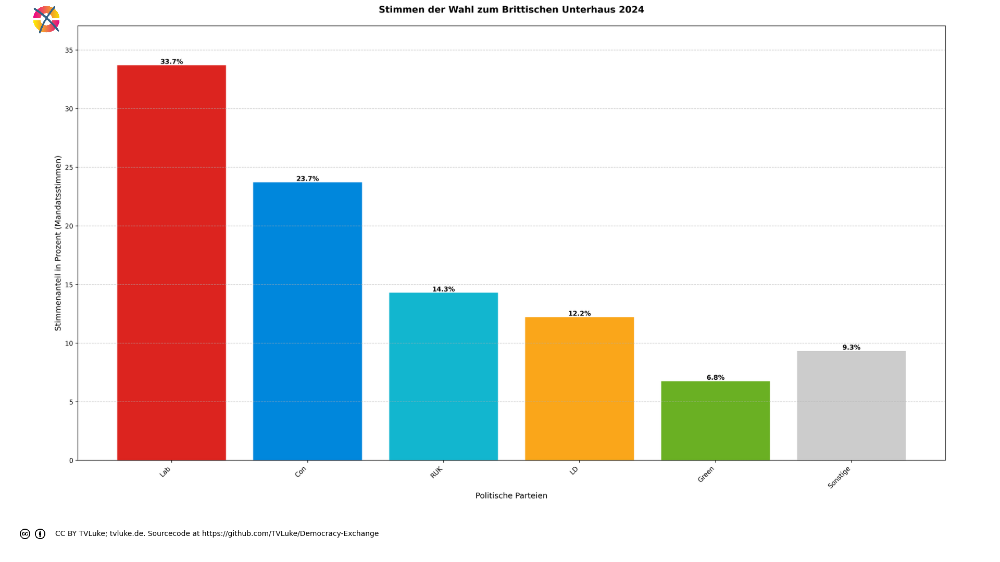

# Stimmen der Wahl zum Brittischen Unterhaus 2024 nach Österreichischem Wahlrecht.
Year: 2024

## Election Statistics
- **Total Population**: 67,595,581
- **Eligible Voters**: 48,253,193
- **Total Votes Cast**: 28,805,277
- **Turnout**: 59.70%
- **Parliament Size**: 650 seats

### Vote Summary

A total of 28,805,277 votes were cast, representing a turnout of 59.7% of the electorate.

| Party | Votes | Percentage |
|-------|--------|------------|
| Lab | 9,708,716 | 33.7% |
| Con | 6,828,925 | 23.7% |
| RUK | 4,117,610 | 14.3% |
| LD | 3,519,143 | 12.2% |
| Green | 1,944,501 | 6.8% |
| Ind | 1,044,459 | 3.6% |
| SNP | 724,758 | 2.5% |
| SF | 210,891 | 0.7% |
| PC | 194,811 | 0.7% |
| DUP | 172,058 | 0.6% |
| APNI | 117,191 | 0.4% |
| UUP | 94,779 | 0.3% |
| SDLP | 86,861 | 0.3% |
| Ind1 | 14,466 | 0.1% |
| Ind2 | 14,466 | 0.1% |
| TUV | 11,642 | 0.0% |

**Lab** received the most votes with 9,708,716 votes (33.7% of total votes).

## Seat Calculation Process

## Austrian Electoral System Explanation

This election is calculated using the Austrian three-tier proportional representation system:

1. **Regional Constituency Level (Regionalwahlkreise)**
   - In this election: 650 regional constituencies across 12 states
     (The Austrian system typically has 39 constituencies across 9 states)
   - First distribution of seats using the Hare quota
   - Only parties that reach 4% nationally can receive seats
   - Direct mandates are awarded at this level

2. **State Level (Landeswahlkreise)**
   - States in this election:
     - East Midlands: 47 constituencies
     - East of England: 61 constituencies
     - London: 75 constituencies
     - North East: 27 constituencies
     - North West: 73 constituencies
     - Northern Ireland: 18 constituencies
     - Scotland: 57 constituencies
     - South East: 91 constituencies
     - South West: 58 constituencies
     - Wales: 32 constituencies
     - West Midlands: 57 constituencies
     - Yorkshire and The Humber: 54 constituencies
   - Second distribution using state-level electoral numbers
   - Remaining seats distributed using D'Hondt method
   - Takes into account seats already won at regional level

3. **Federal Level (Bundesebene)**
   - Final distribution of remaining seats
   - Uses Hare quota at national level
   - Ensures overall proportional representation
   - Compensates for any disproportions from lower levels

Key Features:
- 4% threshold nationally or one direct mandate required
- 650 total seats to be distributed (Austrian National Council has 183)
- Seats first allocated to states based on citizen population

## Vote Type Used for Calculation

Using mandate votes (Erststimmen) for calculations since no list votes are available. In the Austrian system, list votes would typically be used if available.

## Initial Threshold Check

Total valid votes cast: 28,805,277
4% threshold: 1,152,211 votes

Party Results and Qualification Status:
- Lab: 9,708,716 votes (33.70%) - Qualified
  → Eligible for mandate distribution at all levels
- Con: 6,828,925 votes (23.71%) - Qualified
  → Eligible for mandate distribution at all levels
- RUK: 4,117,610 votes (14.29%) - Qualified
  → Eligible for mandate distribution at all levels
- LD: 3,519,143 votes (12.22%) - Qualified
  → Eligible for mandate distribution at all levels
- Green: 1,944,501 votes (6.75%) - Qualified
  → Eligible for mandate distribution at all levels
- Ind: 1,044,459 votes (3.63%) - Did not qualify
  → Can only receive direct mandates in regional constituencies
- SNP: 724,758 votes (2.52%) - Did not qualify
  → Can only receive direct mandates in regional constituencies
- SF: 210,891 votes (0.73%) - Did not qualify
  → Can only receive direct mandates in regional constituencies
- PC: 194,811 votes (0.68%) - Did not qualify
  → Can only receive direct mandates in regional constituencies
- DUP: 172,058 votes (0.60%) - Did not qualify
  → Can only receive direct mandates in regional constituencies
- APNI: 117,191 votes (0.41%) - Did not qualify
  → Can only receive direct mandates in regional constituencies
- UUP: 94,779 votes (0.33%) - Did not qualify
  → Can only receive direct mandates in regional constituencies
- SDLP: 86,861 votes (0.30%) - Did not qualify
  → Can only receive direct mandates in regional constituencies
- Ind1: 14,466 votes (0.05%) - Did not qualify
  → Can only receive direct mandates in regional constituencies
- Ind2: 14,466 votes (0.05%) - Did not qualify
  → Can only receive direct mandates in regional constituencies
- TUV: 11,642 votes (0.04%) - Did not qualify
  → Can only receive direct mandates in regional constituencies

## Example Regional Constituency: Aberafan Maesteg

This example shows how votes are counted at the regional constituency level:

Total votes cast: 35,755

Party Results:
- Lab: 17,838 votes (49.9%)
- RUK: 7,484 votes (20.9%)
- PC: 4,719 votes (13.2%)
- Con: 2,903 votes (8.1%)
- Green: 1,094 votes (3.1%)
- LD: 916 votes (2.6%)
- Ind: 801 votes (2.2%)
- SNP: 0 votes (0.0%)
- DUP: 0 votes (0.0%)
- SF: 0 votes (0.0%)
- SDLP: 0 votes (0.0%)
- UUP: 0 votes (0.0%)
- APNI: 0 votes (0.0%)

The Hare quota is used to determine direct mandates.
Parties must either win a direct mandate or reach the 4% national threshold.

## Example Regional Constituency: Aberdeen North

This example shows how votes are counted at the regional constituency level:

Total votes cast: 42,095

Party Results:
- SNP: 14,533 votes (34.5%)
- Lab: 12,773 votes (30.3%)
- Con: 5,881 votes (14.0%)
- RUK: 3,781 votes (9.0%)
- LD: 2,583 votes (6.1%)
- Green: 1,275 votes (3.0%)
- Ind: 1,269 votes (3.0%)
- PC: 0 votes (0.0%)
- DUP: 0 votes (0.0%)
- SF: 0 votes (0.0%)
- SDLP: 0 votes (0.0%)
- UUP: 0 votes (0.0%)
- APNI: 0 votes (0.0%)

The Hare quota is used to determine direct mandates.
Parties must either win a direct mandate or reach the 4% national threshold.

## Example Regional Constituency: Aberdeen South

This example shows how votes are counted at the regional constituency level:

Total votes cast: 46,345

Party Results:
- SNP: 15,213 votes (32.8%)
- Lab: 11,455 votes (24.7%)
- Con: 11,300 votes (24.4%)
- RUK: 3,199 votes (6.9%)
- LD: 2,921 votes (6.3%)
- Green: 1,609 votes (3.5%)
- Ind: 648 votes (1.4%)
- PC: 0 votes (0.0%)
- DUP: 0 votes (0.0%)
- SF: 0 votes (0.0%)
- SDLP: 0 votes (0.0%)
- UUP: 0 votes (0.0%)
- APNI: 0 votes (0.0%)

The Hare quota is used to determine direct mandates.
Parties must either win a direct mandate or reach the 4% national threshold.

## State Level Distribution

According to §1 of the Nationalrats-Wahlordnung, the 650 seats are distributed among the states based on their citizen population.

The process:
1. Calculate state-level electoral number (Wahlzahl)
   For each state, the Wahlzahl is calculated as: Total valid votes ÷ (Number of seats + 1)
   Example for a state with 100,000 votes and 4 seats:
   Wahlzahl = 100,000 ÷ (4 + 1) = 20,000

2. Calculate Verhältniszahl (proportional number)
   Total population value: 67,595,581
   Total seats: 650
   Verhältniszahl = 67,595,581 ÷ 650 = 103,993.20
   This number represents how many population one mandate represents.

3. Determine remaining seats after direct mandates
4. Use D'Hondt method for remaining seats
5. Take into account party threshold requirement

## Final Distribution Summary

After completing all three levels of calculation:
1. Regional constituency direct mandates
2. State-level D'Hondt distribution
3. Federal level compensation

Final Results:
- Lab: 242 seats (37.2%) from 9,708,716 votes (33.7%)
  → Qualified through 4% threshold
- Con: 170 seats (26.2%) from 6,828,925 votes (23.7%)
  → Qualified through 4% threshold
- RUK: 102 seats (15.7%) from 4,117,610 votes (14.3%)
  → Qualified through 4% threshold
- LD: 88 seats (13.5%) from 3,519,143 votes (12.2%)
  → Qualified through 4% threshold
- Green: 48 seats (7.4%) from 1,944,501 votes (6.8%)
  → Qualified through 4% threshold

This distribution reflects the principles of proportional representation while accounting for:
- The 4% threshold requirement or direct mandate qualification
- Regional constituency direct mandates
- State-level proportionality using D'Hondt method
- Federal level compensation to ensure overall proportionality

## Visualizations
### Parliament Seating

### Coalition Possibilities
![Possible coalition combinations that form a majority, sorted by ideological distance (smaller distance means parties are closer on the left-right spectrum): Lab + LD with 330 seats (50.8%, ideological distance: 1.0); Lab + Con with 412 seats (63.4%, ideological distance: 4.0); Lab + RUK with 344 seats (52.9%, ideological distance: 5.0); LD + Con + RUK with 360 seats (55.4%, ideological distance: 8.0). Die "Ideologische Distanz": Für die Darstellung in korrekter Reihenfolge hat jede Partei einen left_to_right-Wert, mit 1 für die Partei, welche üblicherweise im Parlament ganz links sitzt, dann aufsteigend: Dieser Wert wird hier auch einfach als Distanzwert gewertet, um wahrscheinliche Koalitionen darzustellen. Diese Berechnung ist natürlich stark vereinfachend und in vielen Fällen einfach falsch.  Beispiel für die Koalition LD-Con-RUK: LD: left_to_right = 4 Con: left_to_right = 7 RUK: left_to_right = 8 Ideologische Distanz = |4-7| + |4-8| + |7-8| = 8](../plots/uk2024_austria_coalitions.png)

### Vote vs Seat Distribution

### Party Vote Distribution

## Detailed Results
| Party | Votes | Vote Share | Seats | Seat Share | Representation Gap |
|-------|--------|------------|-------|------------|-------------------|
| Lab | 9,708,716 | 33.70% | 242 | 37.23% | 3.53% |
| Con | 6,828,925 | 23.71% | 170 | 26.15% | 2.45% |
| RUK | 4,117,610 | 14.29% | 102 | 15.69% | 1.40% |
| LD | 3,519,143 | 12.22% | 88 | 13.54% | 1.32% |
| Green | 1,944,501 | 6.75% | 48 | 7.38% | 0.63% |
| Ind | 1,044,459 | 3.63% | 0 | 0.00% | -3.63% |
| Ind1 | 14,466 | 0.05% | 0 | 0.00% | -0.05% |
| Ind2 | 14,466 | 0.05% | 0 | 0.00% | -0.05% |
| SF | 210,891 | 0.73% | 0 | 0.00% | -0.73% |
| SNP | 724,758 | 2.52% | 0 | 0.00% | -2.52% |
| PC | 194,811 | 0.68% | 0 | 0.00% | -0.68% |
| SDLP | 86,861 | 0.30% | 0 | 0.00% | -0.30% |
| APNI | 117,191 | 0.41% | 0 | 0.00% | -0.41% |
| UUP | 94,779 | 0.33% | 0 | 0.00% | -0.33% |
| DUP | 172,058 | 0.60% | 0 | 0.00% | -0.60% |
| TUV | 11,642 | 0.04% | 0 | 0.00% | -0.04% |

## Analysis of Representation
### Most Over-represented Parties
- **Lab**: +3.53%
- **Con**: +2.45%
- **RUK**: +1.40%

### Most Under-represented Parties
- **Ind**: -3.63%
- **SNP**: -2.52%
- **SF**: -0.73%

## Sources

### About the Electoral System
- [parlament.gv.at](https://www.parlament.gv.at/verstehen/demokratie-wahlen/parlament-wahlen/wahlen-nr/)