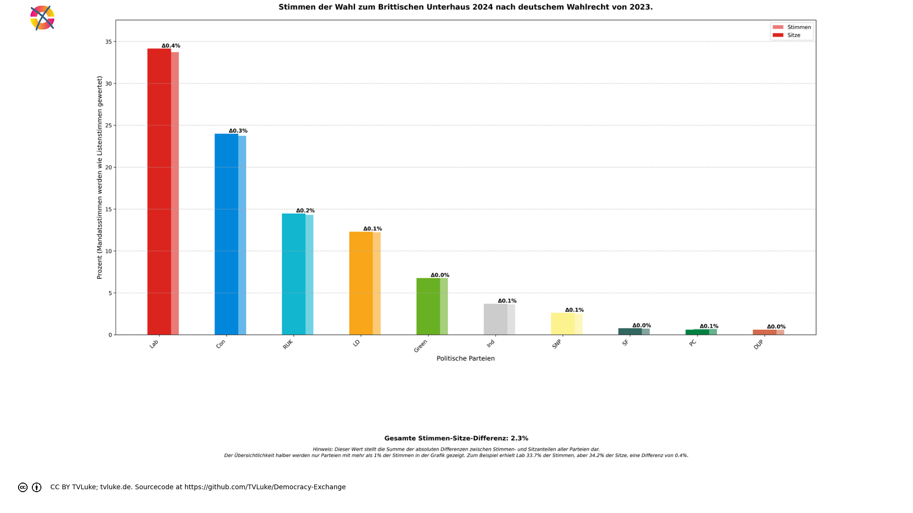

# Stimmen der Wahl zum Brittischen Unterhaus 2024 nach deutschem Wahlrecht von 2023.
Year: 2024

## Election Statistics
- **Total Population**: 67,595,581
- **Eligible Voters**: 48,253,193
- **Total Votes Cast**: 28,776,345
- **Turnout**: 59.64%
- **Parliament Size**: 650 seats

### Vote Summary

A total of 28,805,277 votes were cast, representing a turnout of 59.7% of the electorate.

| Party | Votes | Percentage |
|-------|--------|------------|
| Lab | 9,708,716 | 33.7% |
| Con | 6,828,925 | 23.7% |
| RUK | 4,117,610 | 14.3% |
| LD | 3,519,143 | 12.2% |
| Green | 1,944,501 | 6.8% |
| Ind | 1,044,459 | 3.6% |
| SNP | 724,758 | 2.5% |
| SF | 210,891 | 0.7% |
| PC | 194,811 | 0.7% |
| DUP | 172,058 | 0.6% |
| APNI | 117,191 | 0.4% |
| UUP | 94,779 | 0.3% |
| SDLP | 86,861 | 0.3% |
| Ind1 | 14,466 | 0.1% |
| Ind2 | 14,466 | 0.1% |
| TUV | 11,642 | 0.0% |

**Lab** received the most votes with 9,708,716 votes (33.7% of total votes).

## Visualizations
### Parliament Seating

### Coalition Possibilities
![Possible coalition combinations that form a majority, sorted by ideological distance (smaller distance means parties are closer on the left-right spectrum): Lab + Con with 378 seats (58.2%, ideological distance: 4.0); Green + Lab + LD with 346 seats (53.2%, ideological distance: 4.0); Ind + Lab + LD with 326 seats (50.2%, ideological distance: 8.0); LD + Con + RUK with 330 seats (50.8%, ideological distance: 8.0); Lab + SNP + RUK with 333 seats (51.2%, ideological distance: 10.0); Lab + LD + RUK with 396 seats (60.9%, ideological distance: 10.0); Green + Lab + RUK with 360 seats (55.4%, ideological distance: 12.0); Ind + Lab + SNP + LD with 343 seats (52.8%, ideological distance: 12.0); Ind + Lab + PC + LD with 330 seats (50.8%, ideological distance: 12.0); Ind + SF + Lab + LD with 331 seats (50.9%, ideological distance: 14.0). Die "Ideologische Distanz": Für die Darstellung in korrekter Reihenfolge hat jede Partei einen left_to_right-Wert, mit 1 für die Partei, welche üblicherweise im Parlament ganz links sitzt, dann aufsteigend: Dieser Wert wird hier auch einfach als Distanzwert gewertet, um wahrscheinliche Koalitionen darzustellen. Diese Berechnung ist natürlich stark vereinfachend und in vielen Fällen einfach falsch.  Beispiel für die Koalition Green-Lab-LD: Green: left_to_right = 2 Lab: left_to_right = 3 LD: left_to_right = 4 Ideologische Distanz = |2-3| + |2-4| + |3-4| = 4](../plots/uk2024_germany_coalitions.png)

### Vote vs Seat Distribution

### Party Vote Distribution

## Detailed Results
| Party | Votes | Vote Share | Seats | Seat Share | Representation Gap |
|-------|--------|------------|-------|------------|-------------------|
| Lab | 9,708,716 | 33.74% | 222 | 34.15% | 0.42% |
| Con | 6,828,925 | 23.73% | 156 | 24.00% | 0.27% |
| RUK | 4,117,610 | 14.31% | 94 | 14.46% | 0.15% |
| LD | 3,519,143 | 12.23% | 80 | 12.31% | 0.08% |
| Green | 1,944,501 | 6.76% | 44 | 6.77% | 0.01% |
| Ind | 1,044,459 | 3.63% | 24 | 3.69% | 0.06% |
| SNP | 724,758 | 2.52% | 17 | 2.62% | 0.10% |
| SF | 210,891 | 0.73% | 5 | 0.77% | 0.04% |
| PC | 194,811 | 0.68% | 4 | 0.62% | -0.06% |
| DUP | 172,058 | 0.60% | 4 | 0.62% | 0.02% |
| SDLP | 86,861 | 0.30% | 0 | 0.00% | -0.30% |
| APNI | 117,191 | 0.41% | 0 | 0.00% | -0.41% |
| UUP | 94,779 | 0.33% | 0 | 0.00% | -0.33% |
| TUV | 11,642 | 0.04% | 0 | 0.00% | -0.04% |

## Analysis of Representation
### Most Over-represented Parties
- **Lab**: +0.42%
- **Con**: +0.27%
- **RUK**: +0.15%

### Most Under-represented Parties
- **APNI**: -0.41%
- **UUP**: -0.33%
- **SDLP**: -0.30%

## Sources

### About the Electoral System
- [Das Wahlsystem (bundeswahlleiterin.de)](https://www.bundeswahlleiterin.de/bundestagswahlen/2025/informationen-waehler/wahlsystem.html#48635498-9ca6-4a2b-b374-969e5b8371ac)
- [Wahlsystem & Wahlrecht der Bundestagswahlen (bundestagswahl-bw.de)](https://www.bundestagswahl-bw.de/wahlsystem#c116523)