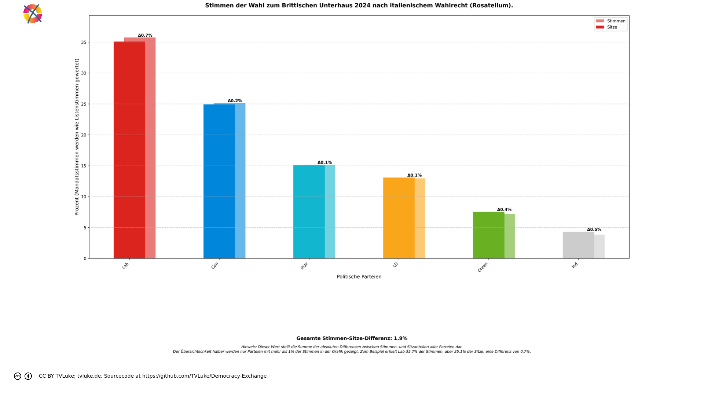
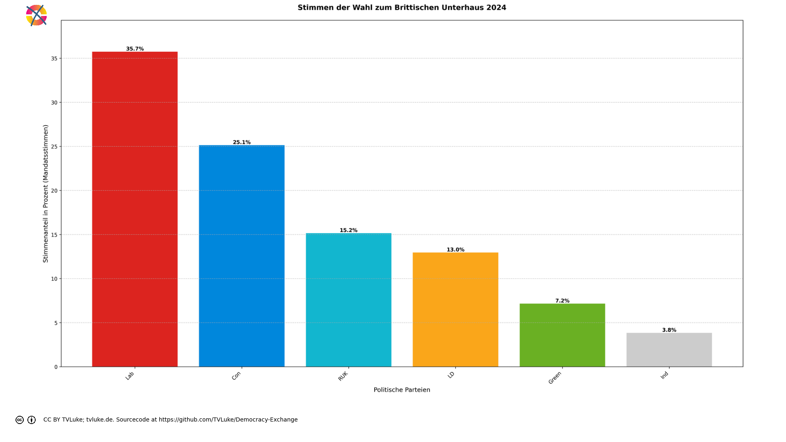

# Stimmen der Wahl zum Brittischen Unterhaus 2024 nach italienischem Wahlrecht (Rosatellum).
Year: 2024

## Election Statistics
- **Total Population**: 67,595,581
- **Eligible Voters**: 48,253,193
- **Total Votes Cast**: 27,163,354
- **Turnout**: 56.29%
- **Parliament Size**: 650 seats

### Vote Summary

A total of 28,805,277 votes were cast, representing a turnout of 59.7% of the electorate.

| Party | Votes | Percentage |
|-------|--------|------------|
| Lab | 9,708,716 | 33.7% |
| Con | 6,828,925 | 23.7% |
| RUK | 4,117,610 | 14.3% |
| LD | 3,519,143 | 12.2% |
| Green | 1,944,501 | 6.8% |
| Ind | 1,044,459 | 3.6% |
| SNP | 724,758 | 2.5% |
| SF | 210,891 | 0.7% |
| PC | 194,811 | 0.7% |
| DUP | 172,058 | 0.6% |
| APNI | 117,191 | 0.4% |
| UUP | 94,779 | 0.3% |
| SDLP | 86,861 | 0.3% |
| Ind1 | 14,466 | 0.1% |
| Ind2 | 14,466 | 0.1% |
| TUV | 11,642 | 0.0% |

**Lab** received the most votes with 9,708,716 votes (33.7% of total votes).

## Seat Calculation Process
## Electoral System Description

Das italienische Wahlsystem 'Rosatellum' für die Abgeordnetenkammer (Camera dei deputati):

Grundsätze:
- Gemischtes Wahlsystem mit zwei Komponenten:
  * 36% der Sitze durch Mehrheitswahl in Einerwahlkreisen (FPTP)
  * 64% der Sitze durch Verhältniswahl mit Parteilisten (PR)

Sperrklauseln:
- Einzelne Parteien: 3% der Gesamtstimmen
- Wahlbündnisse (Koalitionen): 10% der Gesamtstimmen
  * Mindestens eine Partei im Bündnis muss 3% erreichen

Besonderheiten:
- Eine Stimme zählt sowohl für Direkt- als auch Listenmandat
- Stimmen von Parteien zwischen 1-3% werden auf Koalitionspartner über 3% verteilt
- Parteien müssen Koalitionszugehörigkeit vor der Wahl erklären
- Verteilung der Verhältniswahlsitze nach dem Hare-Niemeyer-Verfahren
- Insgesamt 630 Sitze in der Abgeordnetenkammer

Ablauf der Sitzverteilung:
1. Direktmandate (36%):
   - In jedem Wahlkreis gewinnt der Kandidat mit den meisten Stimmen
   - 36% der Sitze werden durch Direktmandate vergeben (bei 630 Sitzen: 226 Sitze)

2. Verhältniswahlmandate (64%):
   - Nur Parteien über der Sperrklausel werden berücksichtigt
   - 404 Sitze nach Verhältniswahl mit Hare-Niemeyer
   - Restmandate nach größten Dezimalstellen

Dieses System wurde 2017 eingeführt und nach seinem Autor Ettore Rosato benannt.

Seat allocation:

Direct allocation seats (36%): 234

Proportional seats (64%): 416

=== Example Districts ===
Here are three randomly selected districts showing how votes are counted and allocated:

## District: Clwyd East
This district demonstrates how votes are split between direct mandate (36%) and proportional representation (64%):

Total votes cast: 47,822
- Lab: 18,484 votes (38.7%)
- Con: 13,862 votes (29.0%)
- RUK: 7,626 votes (15.9%)
- PC: 3,733 votes (7.8%)
- LD: 1,859 votes (3.9%)
- Green: 1,659 votes (3.5%)
- Ind: 599 votes (1.3%)
- SNP: 0 votes (0.0%)
- DUP: 0 votes (0.0%)
- SF: 0 votes (0.0%)
- SDLP: 0 votes (0.0%)
- UUP: 0 votes (0.0%)
- APNI: 0 votes (0.0%)

Direct mandate winner:
- Lab: 18,484 votes (38.7%)

Vote allocation:
- Direct votes (36%): 17,215 votes for FPTP allocation
- Proportional votes (64%): 30,606 votes for PR allocation

## District: Derbyshire Dales
This district demonstrates how votes are split between direct mandate (36%) and proportional representation (64%):

Total votes cast: 51,272
- Lab: 17,759 votes (34.6%)
- Con: 17,409 votes (34.0%)
- RUK: 7,728 votes (15.1%)
- LD: 4,860 votes (9.5%)
- Green: 2,830 votes (5.5%)
- Ind: 686 votes (1.3%)
- SNP: 0 votes (0.0%)
- PC: 0 votes (0.0%)
- DUP: 0 votes (0.0%)
- SF: 0 votes (0.0%)
- SDLP: 0 votes (0.0%)
- UUP: 0 votes (0.0%)
- APNI: 0 votes (0.0%)

Direct mandate winner:
- Lab: 17,759 votes (34.6%)

Vote allocation:
- Direct votes (36%): 18,457 votes for FPTP allocation
- Proportional votes (64%): 32,814 votes for PR allocation

## District: Thirsk and Malton
This district demonstrates how votes are split between direct mandate (36%) and proportional representation (64%):

Total votes cast: 49,797
- Con: 19,544 votes (39.2%)
- Lab: 11,994 votes (24.1%)
- RUK: 8,963 votes (18.0%)
- LD: 5,379 votes (10.8%)
- Green: 2,986 votes (6.0%)
- Ind: 931 votes (1.9%)
- SNP: 0 votes (0.0%)
- PC: 0 votes (0.0%)
- DUP: 0 votes (0.0%)
- SF: 0 votes (0.0%)
- SDLP: 0 votes (0.0%)
- UUP: 0 votes (0.0%)
- APNI: 0 votes (0.0%)

Direct mandate winner:
- Con: 19,544 votes (39.2%)

Vote allocation:
- Direct votes (36%): 17,926 votes for FPTP allocation
- Proportional votes (64%): 31,870 votes for PR allocation

=== Party Vote Totals ===

Con: 6,828,925 total votes
  - Direct votes (36%): 2,458,102
  - Proportional votes (64%): 4,370,212

Lab: 9,708,716 total votes
  - Direct votes (36%): 3,494,823
  - Proportional votes (64%): 6,213,286

LD: 3,519,143 total votes
  - Direct votes (36%): 1,266,584
  - Proportional votes (64%): 2,251,954

RUK: 4,117,610 total votes
  - Direct votes (36%): 1,482,046
  - Proportional votes (64%): 2,634,971

Green: 1,944,501 total votes
  - Direct votes (36%): 699,713
  - Proportional votes (64%): 1,244,181

SNP: 724,758 total votes
  - Direct votes (36%): 260,887
  - Proportional votes (64%): 463,819

PC: 194,811 total votes
  - Direct votes (36%): 70,117
  - Proportional votes (64%): 124,665

DUP: 172,058 total votes
  - Direct votes (36%): 61,935
  - Proportional votes (64%): 110,108

SF: 210,891 total votes
  - Direct votes (36%): 75,913
  - Proportional votes (64%): 134,964

SDLP: 86,861 total votes
  - Direct votes (36%): 31,260
  - Proportional votes (64%): 55,583

UUP: 94,779 total votes
  - Direct votes (36%): 34,111
  - Proportional votes (64%): 60,652

APNI: 117,191 total votes
  - Direct votes (36%): 42,181
  - Proportional votes (64%): 74,992

Ind: 1,044,459 total votes
  - Direct votes (36%): 375,739
  - Proportional votes (64%): 668,192

Ind1: 14,466 total votes
  - Direct votes (36%): 5,207
  - Proportional votes (64%): 9,257

Ind2: 14,466 total votes
  - Direct votes (36%): 5,207
  - Proportional votes (64%): 9,257

TUV: 11,642 total votes
  - Direct votes (36%): 4,191
  - Proportional votes (64%): 7,450

Direct vote counts (36% of total votes):

Lab: 3,494,823 votes (33.7%)

Con: 2,458,102 votes (23.7%)

RUK: 1,482,046 votes (14.3%)

LD: 1,266,584 votes (12.2%)

Green: 699,713 votes (6.7%)

Ind: 375,739 votes (3.6%)

SNP: 260,887 votes (2.5%)

SF: 75,913 votes (0.7%)

PC: 70,117 votes (0.7%)

DUP: 61,935 votes (0.6%)

APNI: 42,181 votes (0.4%)

UUP: 34,111 votes (0.3%)

SDLP: 31,260 votes (0.3%)

Ind1: 5,207 votes (0.1%)

Ind2: 5,207 votes (0.1%)

TUV: 4,191 votes (0.0%)

=== DIRECT SEAT ALLOCATION (36% = 234 seats) ===

Using 36% of member votes (if available) or list votes

Direct votes (36% of total votes):

Lab: 3,494,823 votes (33.70%)

Con: 2,458,102 votes (23.70%)

RUK: 1,482,046 votes (14.29%)

LD: 1,266,584 votes (12.21%)

Green: 699,713 votes (6.75%)

Ind: 375,739 votes (3.62%)

SNP: 260,887 votes (2.52%)

SF: 75,913 votes (0.73%)

PC: 70,117 votes (0.68%)

DUP: 61,935 votes (0.60%)

APNI: 42,181 votes (0.41%)

UUP: 34,111 votes (0.33%)

SDLP: 31,260 votes (0.30%)

Ind1: 5,207 votes (0.05%)

Ind2: 5,207 votes (0.05%)

TUV: 4,191 votes (0.04%)

Initial direct seat allocation:

Lab: 78 seats (fair share: 78.864, remainder: 0.864)

Con: 55 seats (fair share: 55.469, remainder: 0.469)

RUK: 33 seats (fair share: 33.444, remainder: 0.444)

LD: 28 seats (fair share: 28.582, remainder: 0.582)

Green: 15 seats (fair share: 15.790, remainder: 0.790)

Ind: 8 seats (fair share: 8.479, remainder: 0.479)

SNP: 5 seats (fair share: 5.887, remainder: 0.887)

SF: 1 seats (fair share: 1.713, remainder: 0.713)

PC: 1 seats (fair share: 1.582, remainder: 0.582)

DUP: 1 seats (fair share: 1.398, remainder: 0.398)

APNI: 0 seats (fair share: 0.952, remainder: 0.952)

UUP: 0 seats (fair share: 0.770, remainder: 0.770)

SDLP: 0 seats (fair share: 0.705, remainder: 0.705)

Ind1: 0 seats (fair share: 0.118, remainder: 0.118)

Ind2: 0 seats (fair share: 0.118, remainder: 0.118)

TUV: 0 seats (fair share: 0.095, remainder: 0.095)

Distributing 9 remaining direct seats by largest remainder:

APNI: +1 seat (remainder was 0.952)

SNP: +1 seat (remainder was 0.887)

Lab: +1 seat (remainder was 0.864)

Green: +1 seat (remainder was 0.790)

UUP: +1 seat (remainder was 0.770)

SF: +1 seat (remainder was 0.713)

SDLP: +1 seat (remainder was 0.705)

PC: +1 seat (remainder was 0.582)

LD: +1 seat (remainder was 0.582)

Final direct seat allocation:

Lab: 79 seats (33.76% of seats, 33.70% of direct votes)

Con: 55 seats (23.50% of seats, 23.70% of direct votes)

RUK: 33 seats (14.10% of seats, 14.29% of direct votes)

LD: 29 seats (12.39% of seats, 12.21% of direct votes)

Green: 16 seats (6.84% of seats, 6.75% of direct votes)

Ind: 8 seats (3.42% of seats, 3.62% of direct votes)

SNP: 6 seats (2.56% of seats, 2.52% of direct votes)

SF: 2 seats (0.85% of seats, 0.73% of direct votes)

PC: 2 seats (0.85% of seats, 0.68% of direct votes)

DUP: 1 seats (0.43% of seats, 0.60% of direct votes)

APNI: 1 seats (0.43% of seats, 0.41% of direct votes)

UUP: 1 seats (0.43% of seats, 0.33% of direct votes)

SDLP: 1 seats (0.43% of seats, 0.30% of direct votes)

Proportional vote counts (64% of total votes):

Lab: 6,213,286 votes (33.7%)

Con: 4,370,212 votes (23.7%)

RUK: 2,634,971 votes (14.3%)

LD: 2,251,954 votes (12.2%)

Green: 1,244,181 votes (6.7%)

Ind: 668,192 votes (3.6%)

SNP: 463,819 votes (2.5%)

SF: 134,964 votes (0.7%)

PC: 124,665 votes (0.7%)

DUP: 110,108 votes (0.6%)

APNI: 74,992 votes (0.4%)

UUP: 60,652 votes (0.3%)

SDLP: 55,583 votes (0.3%)

Ind1: 9,257 votes (0.1%)

Ind2: 9,257 votes (0.1%)

TUV: 7,450 votes (0.0%)

Vote shares and thresholds:

Total proportional votes: 18,435,049

Con:

  Proportional votes: 4,370,212 (23.71%)

  ELIGIBLE: Above 3% threshold

Lab:

  Proportional votes: 6,213,286 (33.70%)

  ELIGIBLE: Above 3% threshold

LD:

  Proportional votes: 2,251,954 (12.22%)

  ELIGIBLE: Above 3% threshold

RUK:

  Proportional votes: 2,634,971 (14.29%)

  ELIGIBLE: Above 3% threshold

Green:

  Proportional votes: 1,244,181 (6.75%)

  ELIGIBLE: Above 3% threshold

SNP:

  Proportional votes: 463,819 (2.52%)

  NOT ELIGIBLE: Below 3% threshold

PC:

  Proportional votes: 124,665 (0.68%)

  NOT ELIGIBLE: Below 3% threshold

DUP:

  Proportional votes: 110,108 (0.60%)

  NOT ELIGIBLE: Below 3% threshold

SF:

  Proportional votes: 134,964 (0.73%)

  NOT ELIGIBLE: Below 3% threshold

SDLP:

  Proportional votes: 55,583 (0.30%)

  NOT ELIGIBLE: Below 3% threshold

UUP:

  Proportional votes: 60,652 (0.33%)

  NOT ELIGIBLE: Below 3% threshold

APNI:

  Proportional votes: 74,992 (0.41%)

  NOT ELIGIBLE: Below 3% threshold

Ind:

  Proportional votes: 668,192 (3.62%)

  ELIGIBLE: Above 3% threshold

Ind1:

  Proportional votes: 9,257 (0.05%)

  NOT ELIGIBLE: Below 3% threshold

Ind2:

  Proportional votes: 9,257 (0.05%)

  NOT ELIGIBLE: Below 3% threshold

TUV:

  Proportional votes: 7,450 (0.04%)

  NOT ELIGIBLE: Below 3% threshold

Eligible parties: ['Con', 'Lab', 'LD', 'RUK', 'Green', 'Ind']

FPTP Seats (36%): 234
Proportional Seats (64%): 416

FPTP allocation (234 seats):

Total eligible votes: 17,382,796

Con: 58 seats (25.1% of votes)

Lab: 83 seats (35.7% of votes)

LD: 30 seats (13.0% of votes)

RUK: 35 seats (15.2% of votes)

Green: 16 seats (7.2% of votes)

Ind: 8 seats (3.8% of votes)

Distributing 4 remaining FPTP seats:

Ind: +1 seat (remainder was 0.995)

Con: +1 seat (remainder was 0.830)

Green: +1 seat (remainder was 0.749)

Lab: +1 seat (remainder was 0.641)

Final FPTP allocation:

Lab: 84 seats (35.9% of seats, 35.7% of votes)

Con: 59 seats (25.2% of seats, 25.1% of votes)

RUK: 35 seats (15.0% of seats, 15.2% of votes)

LD: 30 seats (12.8% of seats, 13.0% of votes)

Green: 17 seats (7.3% of seats, 7.2% of votes)

Ind: 9 seats (3.8% of seats, 3.8% of votes)

Total FPTP seats allocated: 234 of 234

=== PROPORTIONAL ALLOCATION (64% = 416 seats) ===

Proportional votes (64% of total votes):

Lab: 6,213,286 votes (33.70%)

Con: 4,370,212 votes (23.71%)

RUK: 2,634,971 votes (14.29%)

LD: 2,251,954 votes (12.22%)

Green: 1,244,181 votes (6.75%)

Ind: 668,192 votes (3.62%)

Initial proportional seat allocation:

Lab: 140 seats (fair share: 140.207, remainder: 0.207)

Con: 98 seats (fair share: 98.617, remainder: 0.617)

RUK: 59 seats (fair share: 59.460, remainder: 0.460)

LD: 50 seats (fair share: 50.817, remainder: 0.817)

Green: 28 seats (fair share: 28.076, remainder: 0.076)

Ind: 15 seats (fair share: 15.078, remainder: 0.078)

Distributing 26 remaining proportional seats:

LD: +1 seat (remainder was 0.817)

Con: +1 seat (remainder was 0.617)

RUK: +1 seat (remainder was 0.460)

Lab: +1 seat (remainder was 0.207)

Ind: +1 seat (remainder was 0.078)

Green: +1 seat (remainder was 0.076)

LD: +1 seat (remainder was 0.817)

Con: +1 seat (remainder was 0.617)

RUK: +1 seat (remainder was 0.460)

Lab: +1 seat (remainder was 0.207)

Ind: +1 seat (remainder was 0.078)

Green: +1 seat (remainder was 0.076)

LD: +1 seat (remainder was 0.817)

Con: +1 seat (remainder was 0.617)

RUK: +1 seat (remainder was 0.460)

Lab: +1 seat (remainder was 0.207)

Ind: +1 seat (remainder was 0.078)

Green: +1 seat (remainder was 0.076)

LD: +1 seat (remainder was 0.817)

Con: +1 seat (remainder was 0.617)

RUK: +1 seat (remainder was 0.460)

Lab: +1 seat (remainder was 0.207)

Ind: +1 seat (remainder was 0.078)

Green: +1 seat (remainder was 0.076)

LD: +1 seat (remainder was 0.817)

Con: +1 seat (remainder was 0.617)

Final proportional allocation:

Lab: 144 seats (34.6% of seats, 33.7% of proportional votes)

Con: 103 seats (24.8% of seats, 23.7% of proportional votes)

RUK: 63 seats (15.1% of seats, 14.3% of proportional votes)

LD: 55 seats (13.2% of seats, 12.2% of proportional votes)

Green: 32 seats (7.7% of seats, 6.7% of proportional votes)

Ind: 19 seats (4.6% of seats, 3.6% of proportional votes)

Total proportional seats allocated: 416 of 416

Final party allocations:

Green: 49 seats (7.5% of seats, 6.7% of votes)

Ind: 28 seats (4.3% of seats, 3.6% of votes)

RUK: 98 seats (15.1% of seats, 14.3% of votes)

Con: 162 seats (24.9% of seats, 23.7% of votes)

LD: 85 seats (13.1% of seats, 12.2% of votes)

Lab: 228 seats (35.1% of seats, 33.7% of votes)

Total allocated seats: 650 of 650

=== FINAL SEAT DISTRIBUTION SUMMARY ===
- Total seats allocated: 650 of 650 (100.0%)
- FPTP seats: 234 of 234 (100.0%)
- Proportional seats: 416 of 416 (100.0%)
- Number of parties represented: 6

Party-by-Party Breakdown:
- Lab : 228 seats (35.1%)
- Con : 162 seats (24.9%)
- RUK : 98 seats (15.1%)
- LD : 85 seats (13.1%)
- Green : 49 seats (7.5%)
- Ind : 28 seats (4.3%)

Threshold Effects:
- Independent parties needed 3% of total votes
- Coalitions needed 10% of total votes collectively
- Parties in coalitions above 10% needed only 1% individually
- Parties in coalitions below 10% needed 3% individually

System Details:
- Direct mandate seats: 36% of total seats
- Proportional seats: 64% of total seats
- Threshold for representation: 3% of total votes (or 1% if in coalition above 10%)
- Coalition threshold: 10% of total votes

==================================================

## Visualizations
### Parliament Seating

### Coalition Possibilities
![Possible coalition combinations that form a majority, sorted by ideological distance (smaller distance means parties are closer on the left-right spectrum): Lab + Con with 390 seats (60.0%, ideological distance: 4.0); Green + Lab + LD with 362 seats (55.7%, ideological distance: 4.0); Lab + RUK with 326 seats (50.2%, ideological distance: 5.0); Ind + Lab + LD with 341 seats (52.5%, ideological distance: 8.0); LD + Con + RUK with 345 seats (53.1%, ideological distance: 8.0); Lab + LD + RUK with 411 seats (63.2%, ideological distance: 10.0); Green + Lab + RUK with 375 seats (57.7%, ideological distance: 12.0); Ind + Lab + RUK with 354 seats (54.5%, ideological distance: 16.0); Ind + Green + Con + RUK with 337 seats (51.8%, ideological distance: 29.0). Die "Ideologische Distanz": Für die Darstellung in korrekter Reihenfolge hat jede Partei einen left_to_right-Wert, mit 1 für die Partei, welche üblicherweise im Parlament ganz links sitzt, dann aufsteigend: Dieser Wert wird hier auch einfach als Distanzwert gewertet, um wahrscheinliche Koalitionen darzustellen. Diese Berechnung ist natürlich stark vereinfachend und in vielen Fällen einfach falsch.  Beispiel für die Koalition Green-Lab-LD: Green: left_to_right = 2 Lab: left_to_right = 3 LD: left_to_right = 4 Ideologische Distanz = |2-3| + |2-4| + |3-4| = 4](../plots/uk2024_italy_coalitions.png)

### Vote vs Seat Distribution

### Party Vote Distribution

## Detailed Results
| Party | Votes | Vote Share | Seats | Seat Share | Representation Gap |
|-------|--------|------------|-------|------------|-------------------|
| Lab | 9,708,716 | 35.74% | 228 | 35.08% | -0.67% |
| Con | 6,828,925 | 25.14% | 162 | 24.92% | -0.22% |
| RUK | 4,117,610 | 15.16% | 98 | 15.08% | -0.08% |
| LD | 3,519,143 | 12.96% | 85 | 13.08% | 0.12% |
| Green | 1,944,501 | 7.16% | 49 | 7.54% | 0.38% |
| Ind | 1,044,459 | 3.85% | 28 | 4.31% | 0.46% |

## Analysis of Representation
### Most Over-represented Parties
- **Ind**: +0.46%
- **Green**: +0.38%
- **LD**: +0.12%

### Most Under-represented Parties
- **Lab**: -0.67%
- **Con**: -0.22%
- **RUK**: -0.08%

## Sources

### About the Electoral System
- [polyas.de](https://www.polyas.de/blog/de/online-wahlen/wahlsystem-italien)