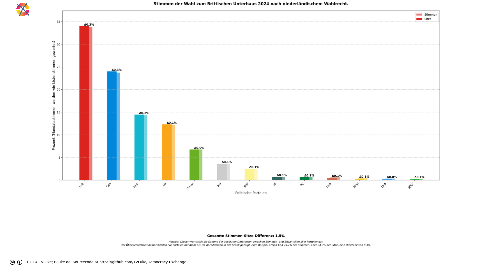

# Stimmen der Wahl zum Brittischen Unterhaus 2024 nach niederländischem Wahlrecht.
Year: 2024

## Election Statistics
- **Total Population**: 67,595,581
- **Eligible Voters**: 48,253,193
- **Total Votes Cast**: 28,776,345
- **Turnout**: 59.64%
- **Parliament Size**: 650 seats

### Vote Summary

A total of 57,610,554 votes were cast, representing a turnout of 119.4% of the electorate.

| Party | Votes | Percentage |
|-------|--------|------------|
| Lab | 19,417,432 | 33.7% |
| Con | 13,657,850 | 23.7% |
| RUK | 8,235,220 | 14.3% |
| LD | 7,038,286 | 12.2% |
| Green | 3,889,002 | 6.8% |
| Ind | 2,088,918 | 3.6% |
| SNP | 1,449,516 | 2.5% |
| SF | 421,782 | 0.7% |
| PC | 389,622 | 0.7% |
| DUP | 344,116 | 0.6% |
| APNI | 234,382 | 0.4% |
| UUP | 189,558 | 0.3% |
| SDLP | 173,722 | 0.3% |
| Ind1 | 28,932 | 0.1% |
| Ind2 | 28,932 | 0.1% |
| TUV | 23,284 | 0.0% |

**Lab** received the most votes with 19,417,432 votes (33.7% of total votes).

## Seat Calculation Process

## French Electoral System Explanation

This election uses the French two-round voting system (scrutin uninominal majoritaire à deux tours):

1. **First Round**
   - All candidates can participate
   - If a candidate receives >50% of votes AND ≥25% of registered voters, they win immediately
   - Otherwise, qualified candidates proceed to second round

2. **Second Round Qualification**
   - Candidates need ≥12.5% of votes to qualify
   - If no candidates reach 12.5%, top two advance
   - When no second round data is provided, votes are simulated:
     * 80% of votes from eliminated parties go to parties with same left-right position
     * 30% of remaining votes go to parties within 1 position on left-right scale
     * Other votes are considered lost/abstentions

Key Features:
- 650 total seats to be distributed
- Single-member constituencies
- Two rounds if no absolute majority in first round

3. **Seat Scaling**
   When the required number of seats (650) differs from the number of districts (650),
   we use proportional scaling to maintain fair representation:
   - First calculate results for all districts
   - Then multiply each party's seats by (total_seats / number_of_districts)
   - Round to nearest whole number while preserving total seats
   - This maintains the proportional representation from the district results
   
   Example: If we have 100 districts but need 200 seats:
   - Party A wins 60 districts → scaled to 120 seats (60 * 200/100)
   - Party B wins 40 districts → scaled to 80 seats (40 * 200/100)
   The relative strength of each party remains the same.

## Example Districts

To illustrate how the French two-round system works in practice, here are three example districts:

### Example 1: Airdrie and Shotts

**First Round Results:**
- Total votes cast: 36,666
- Registered voters: 73,332

**Party Results:**
- Lab: 18,871 votes (51.5% of votes, 25.7% of registered)
- SNP: 11,324 votes (30.9% of votes, 15.4% of registered)
- RUK: 2,971 votes (8.1% of votes, 4.1% of registered)
- Con: 1,696 votes (4.6% of votes, 2.3% of registered)
- Ind: 1,079 votes (2.9% of votes, 1.5% of registered)
- LD: 725 votes (2.0% of votes, 1.0% of registered)
- Green: 0 votes (0.0% of votes, 0.0% of registered)
- PC: 0 votes (0.0% of votes, 0.0% of registered)
- DUP: 0 votes (0.0% of votes, 0.0% of registered)
- SF: 0 votes (0.0% of votes, 0.0% of registered)
- SDLP: 0 votes (0.0% of votes, 0.0% of registered)
- UUP: 0 votes (0.0% of votes, 0.0% of registered)
- APNI: 0 votes (0.0% of votes, 0.0% of registered)

**Result:** Lab wins in first round with absolute majority and ≥25% of registered voters

### Example 2: Aberafan Maesteg

**First Round Results:**
- Total votes cast: 35,755
- Registered voters: 71,510

**Party Results:**
- Lab: 17,838 votes (49.9% of votes, 24.9% of registered)
- RUK: 7,484 votes (20.9% of votes, 10.5% of registered)
- PC: 4,719 votes (13.2% of votes, 6.6% of registered)
- Con: 2,903 votes (8.1% of votes, 4.1% of registered)
- Green: 1,094 votes (3.1% of votes, 1.5% of registered)
- LD: 916 votes (2.6% of votes, 1.3% of registered)
- Ind: 801 votes (2.2% of votes, 1.1% of registered)
- SNP: 0 votes (0.0% of votes, 0.0% of registered)
- DUP: 0 votes (0.0% of votes, 0.0% of registered)
- SF: 0 votes (0.0% of votes, 0.0% of registered)
- SDLP: 0 votes (0.0% of votes, 0.0% of registered)
- UUP: 0 votes (0.0% of votes, 0.0% of registered)
- APNI: 0 votes (0.0% of votes, 0.0% of registered)

**Second Round:** Parties qualifying (≥12.5%):
- PC: 4,719 votes (13.2%)
- Lab: 17,838 votes (49.9%)
- RUK: 7,484 votes (20.9%)

**Vote Redistribution Simulation:**
Vote Transfers:
- Con → RUK: 87 votes
- Con: 2,816 votes lost/abstained
- LD → Lab: 13 votes
- LD → PC: 13 votes
- LD: 890 votes lost/abstained
- Green → Lab: 65 votes
- Green → PC: 65 votes
- Green: 964 votes lost/abstained
- SNP → Lab: 0 votes
- SNP → PC: 0 votes
- DUP → RUK: 0 votes
- SDLP → Lab: 0 votes
- SDLP → PC: 0 votes
- APNI → Lab: 0 votes
- APNI → PC: 0 votes
- Ind: 801 votes lost/abstained

**Final Second Round Result:**
- Lab: 17,916 votes (50.1%)
- RUK: 7,571 votes (21.2%)
- PC: 4,797 votes (13.4%)

**Result:** Lab wins the simulated second round

### Example 3: Alloa and Grangemouth

**First Round Results:**
- Total votes cast: 41,201
- Registered voters: 82,402

**Party Results:**
- Lab: 18,039 votes (43.8% of votes, 21.9% of registered)
- SNP: 11,917 votes (28.9% of votes, 14.5% of registered)
- RUK: 3,804 votes (9.2% of votes, 4.6% of registered)
- Con: 3,127 votes (7.6% of votes, 3.8% of registered)
- Ind: 1,742 votes (4.2% of votes, 2.1% of registered)
- Green: 1,421 votes (3.4% of votes, 1.7% of registered)
- LD: 1,151 votes (2.8% of votes, 1.4% of registered)
- PC: 0 votes (0.0% of votes, 0.0% of registered)
- DUP: 0 votes (0.0% of votes, 0.0% of registered)
- SF: 0 votes (0.0% of votes, 0.0% of registered)
- SDLP: 0 votes (0.0% of votes, 0.0% of registered)
- UUP: 0 votes (0.0% of votes, 0.0% of registered)
- APNI: 0 votes (0.0% of votes, 0.0% of registered)

**Second Round:** Parties qualifying (≥12.5%):
- SNP: 11,917 votes (28.9%)
- Lab: 18,039 votes (43.8%)

**Vote Redistribution Simulation:**
Vote Transfers:
- Con: 3,127 votes lost/abstained
- LD → Lab: 17 votes
- LD → SNP: 17 votes
- LD: 1,117 votes lost/abstained
- RUK: 3,804 votes lost/abstained
- Green → Lab: 85 votes
- Green → SNP: 85 votes
- Green: 1,251 votes lost/abstained
- PC → Lab: 0 votes
- PC → SNP: 0 votes
- SDLP → Lab: 0 votes
- SDLP → SNP: 0 votes
- APNI → Lab: 0 votes
- APNI → SNP: 0 votes
- Ind: 1,742 votes lost/abstained

**Final Second Round Result:**
- Lab: 18,141 votes (44.0%)
- SNP: 12,019 votes (29.2%)

**Result:** Lab wins the simulated second round

## Visualizations
### Parliament Seating
![Parliament seating arrangement with 650 total seats. Parties from left to right: Ind with 23 seats (3.5%), SF with 4 seats (0.6%), Green with 44 seats (6.8%), Lab with 221 seats (34.0%), SNP with 16 seats (2.5%), PC with 4 seats (0.6%), SDLP with 1 seats (0.2%), LD with 80 seats (12.3%), APNI with 2 seats (0.3%), UUP with 2 seats (0.3%), Con with 156 seats (24.0%), DUP with 3 seats (0.5%), RUK with 94 seats (14.5%). Hinweis: Mandatsstimmen (Erststimmen) werden (auch) wie Listenstimmen (Zweitstimmen) gewertet](../plots/uk2024_netherlands_parliament.png)

### Coalition Possibilities
![Possible coalition combinations that form a majority, sorted by ideological distance (smaller distance means parties are closer on the left-right spectrum): Lab + Con with 377 seats (58.0%, ideological distance: 4.0); Green + Lab + LD with 345 seats (53.1%, ideological distance: 4.0); LD + Con + RUK with 330 seats (50.8%, ideological distance: 8.0); Lab + SNP + RUK with 331 seats (50.9%, ideological distance: 10.0); Lab + LD + RUK with 395 seats (60.8%, ideological distance: 10.0); Green + Lab + RUK with 359 seats (55.2%, ideological distance: 12.0); Ind + Lab + SNP + LD with 340 seats (52.3%, ideological distance: 12.0); Ind + Lab + PC + LD with 328 seats (50.5%, ideological distance: 12.0); Ind + Lab + LD + APNI with 326 seats (50.2%, ideological distance: 13.0); Ind + SF + Lab + LD with 328 seats (50.5%, ideological distance: 14.0). Die "Ideologische Distanz": Für die Darstellung in korrekter Reihenfolge hat jede Partei einen left_to_right-Wert, mit 1 für die Partei, welche üblicherweise im Parlament ganz links sitzt, dann aufsteigend: Dieser Wert wird hier auch einfach als Distanzwert gewertet, um wahrscheinliche Koalitionen darzustellen. Diese Berechnung ist natürlich stark vereinfachend und in vielen Fällen einfach falsch.  Beispiel für die Koalition Green-Lab-LD: Green: left_to_right = 2 Lab: left_to_right = 3 LD: left_to_right = 4 Ideologische Distanz = |2-3| + |2-4| + |3-4| = 4](../plots/uk2024_netherlands_coalitions.png)

### Vote vs Seat Distribution

### Party Vote Distribution

## Detailed Results
| Party | Votes | Vote Share | Seats | Seat Share | Representation Gap |
|-------|--------|------------|-------|------------|-------------------|
| Lab | 9,708,716 | 33.74% | 221 | 34.00% | 0.26% |
| Con | 6,828,925 | 23.73% | 156 | 24.00% | 0.27% |
| RUK | 4,117,610 | 14.31% | 94 | 14.46% | 0.15% |
| LD | 3,519,143 | 12.23% | 80 | 12.31% | 0.08% |
| Green | 1,944,501 | 6.76% | 44 | 6.77% | 0.01% |
| Ind | 1,044,459 | 3.63% | 23 | 3.54% | -0.09% |
| SNP | 724,758 | 2.52% | 16 | 2.46% | -0.06% |
| SF | 210,891 | 0.73% | 4 | 0.62% | -0.12% |
| PC | 194,811 | 0.68% | 4 | 0.62% | -0.06% |
| DUP | 172,058 | 0.60% | 3 | 0.46% | -0.14% |
| APNI | 117,191 | 0.41% | 2 | 0.31% | -0.10% |
| UUP | 94,779 | 0.33% | 2 | 0.31% | -0.02% |
| SDLP | 86,861 | 0.30% | 1 | 0.15% | -0.15% |
| TUV | 11,642 | 0.04% | 0 | 0.00% | -0.04% |

## Analysis of Representation
### Most Over-represented Parties
- **Con**: +0.27%
- **Lab**: +0.26%
- **RUK**: +0.15%

### Most Under-represented Parties
- **SDLP**: -0.15%
- **DUP**: -0.14%
- **SF**: -0.12%

## Sources

### About the Electoral System
- [Wahlrecht](https://www.wahlrecht.de/ausland/kieswet.html)